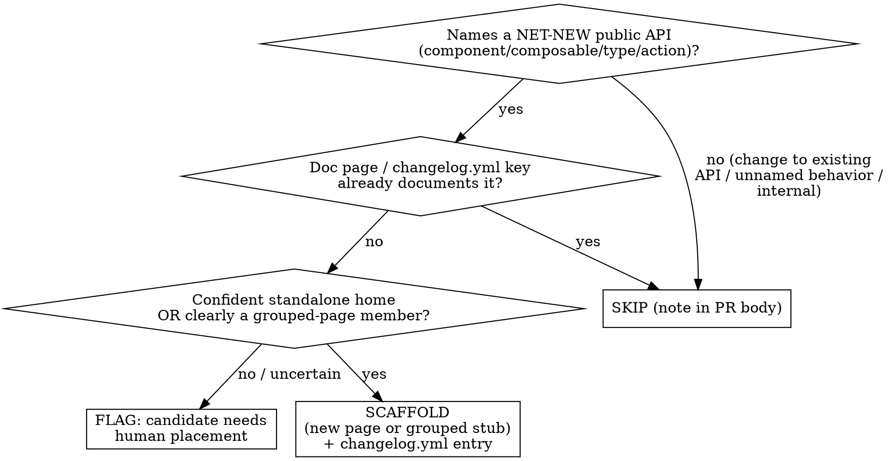

# Docs API Page Scaffold

## Overview

After the daily changelog sync advances the product changelog pages
(`content/0.getting-started/5.Changelogs/{frontend,ui,orchestr,cli}-changelog.md`),
some `### Added` bullets announce a **brand-new public API** that has no doc page yet.
This skill turns only those into a **pull request** that scaffolds draft pages, appends
stub sections to grouped reference pages, and adds `changelog.yml` entries.

**Core principle: only add genuinely new APIs from THIS run, and never invent what you
cannot read.** The input is the *diff* the sync just produced, not a scan of the whole
changelog — that is what keeps it from backfilling old, never-documented APIs. When you
cannot determine an API's identity, home, or contents with confidence, **flag it in the PR
body instead of guessing.** A missing page a human places correctly beats a fabricated one.

This skill owns the **judgment and orchestration**. It does **not** restate prose, page
structure, or changelog-entry rules — it delegates those to the docs repo's writing skills.

## When to use

- Inside the scheduled `docs-api-scaffold` run, after `daily-changelog-sync` has committed.
- When a release introduced a new component / composable / value type / action that needs a page.

**Not for:** editing prose of existing pages, rewording, fixing typos, backfilling docs for
APIs that shipped in earlier releases, or populating `changelog.yml` for already-documented
APIs (that is `populating-changelog-yml`).

## Inputs — read the diff, not the file

1. Determine the pre-run high-water-mark per product (the newest version already documented
   *before* this run). Use `git -C "$DOCS" diff <pre-sync-rev>..HEAD -- <changelog pages>` to
   get exactly the lines this run added.
2. Consider **only `### Added` bullets in version sections strictly newer than the pre-run
   high-water-mark.** Anything in a backfilled older section is NOT new — ignore it, even if
   no doc page exists for it. (Backfill is a separate, human-decided task.)

## Decide per Added bullet

### Classification — the fidelity line

This table only classifies the bullet. **"net-new" is necessary, not sufficient** — a net-new
API is still SKIPPED if it already has a page, and FLAGGED (not scaffolded) if its home is
uncertain. Classification answers "could this be scaffolded?", the existence + home checks
decide whether it actually is.

| Added bullet | Classification |
|---|---|
| `BlockProductDetailEnergyLabel` — a new block | **net-new** → run existence + home checks |
| `Countdown` component + `useCountdown` composable | **net-new** → run the checks (co-document the composable on the component page if scaffolded) |
| `CalendarDate` value type, `addBundleToCart` action | **net-new**, member of a grouped page → append a stub `###` section if its grouped home is unambiguous |
| `target?` prop added to `LinkTile`, `NavigationMenuTextItem`, … | **change to existing APIs** → SKIP. Note it for the `populating-changelog-yml` workflow; do NOT touch `changelog.yml` |
| "Pages now render referenced global sections" | **unnamed behavior change**, no public API identifier → SKIP (belongs in a guide / release notes) |

If the only thing you can write is what the changelog note already says, that is fine — write
exactly that as a draft. If you would have to invent capabilities, props, or use-cases to fill
a page, you are past the fidelity line. Stop.

## Home resolution — never invent structure

**REQUIRED SUB-SKILL: `technical-writing-structure`** to decide where a page lives. Check the
real `.navigation.yml` files and existing category directories. Do **not** create a new
category folder or a path you have not verified exists. If no existing category clearly fits,
the item is a **flag**, not a new file.

## Writing the scaffold — delegate, mark as draft

Write the minimum that is faithful, and label generated prose as draft so a human verifies it.

- **UI / UI Kit component page** → **REQUIRED SUB-SKILL: `technical-writing-ui-components`**.
  Seed `## Overview` from the changelog note only. Leave `::component-code` story IDs as a
  `<!-- TODO: storyId -->` (you cannot know them). End with `::component-meta{:name="X"}`.
- **Frontend / Orchestr API page or grouped stub** → **REQUIRED SUB-SKILL:
  `technical-writing-api-reference`**.
- All prose obeys the hygiene rules in **`technical-writing`**. If you dispatch a subagent to
  write a page, subagents do not inherit skills — paste the mandatory prose-hygiene block from
  `technical-writing` into the subagent prompt verbatim.
- Top of every scaffolded page/section, add an HTML comment:
  `<!-- DRAFT scaffolded from changelog <product> <version>; verify against source before merge -->`.

## changelog.yml — net-new only

**REQUIRED SUB-SKILL: `populating-changelog-yml`** for each net-new API you scaffold: add a
`type: added` entry (version, `changelog` short-name, note from the bullet) and set the page's
`changelogKeys` to match. Add entries **only** for the APIs you are scaffolding — never for
existing pages affected by prop/option changes.

## Version-marker rule — headless means do NOT add `::since-version`

The repo rule `.claude/rules/since-version-component.md` says **ask** the user before adding a
`::since-version` marker and **never add it silently**. This run is headless and cannot ask, so
**do not add `::since-version`.** Instead, in the PR body, list each scaffolded API with a
suggested marker (`::since-version{version="X" packages="@laioutr-…" changelog="…"}`) for the
reviewer to place. `changelogKeys` + the `changelog.yml` entry remain the markers you do add.

## Output — one PR, never push

Branch `docs/api-scaffold-<date>`; open a PR (do **not** push to the default branch — these
need human review). PR body has two sections:
1. **Scaffolded** — each new page / grouped stub + changelog.yml entry, with the source bullet.
2. **Candidates needing human placement** — flagged items, skipped changes-to-existing (point to
   `populating-changelog-yml`), and suggested `::since-version` markers.
Empty run (nothing net-new) → no branch, no PR; emit a one-line "nothing to scaffold" note.

## Rationalizations — STOP

| Excuse | Reality |
|---|---|
| "This old API has no page, I'll add one" | Below the high-water-mark = not new. Ignore. Backfill is a separate human task. |
| "A new prop is an update, I'll add a changelog.yml entry" | That is `populating-changelog-yml`'s job, on the existing page. Flag it; don't write it here. |
| "No category fits, I'll make one" | Inventing structure is guessing. Flag for human placement. |
| "I'll write a fuller Overview so the page looks complete" | Anything beyond the changelog note is fabricated. Draft only what the note states. |
| "A `::since-version` marker would be helpful" | The rule forbids adding it without asking. Headless can't ask → suggest it in the PR body only. |
| "I'll push since the sync pushes" | Scaffolds need review. PR only, never push to main. |

## Red flags

- You scaffolded a page for an API whose section is below the pre-run high-water-mark.
- You edited `changelog.yml` for a page you did not create (a change to an existing API).
- You created a directory/category you did not verify in `.navigation.yml`.
- An Overview/stub describes props, behavior, or use-cases not in the changelog note.
- You added a `::since-version` marker.
- You pushed to the default branch instead of opening a PR.
