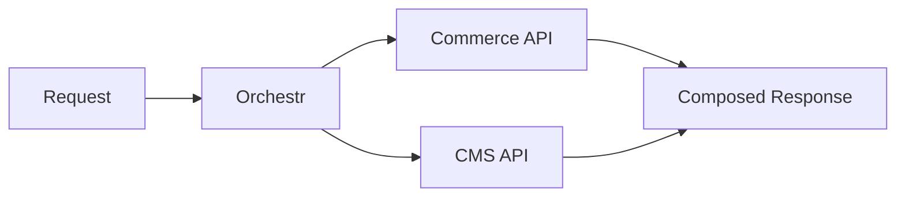

# Documentation Visualization

Create interactive documentation visualizations when Mermaid or existing components aren't sufficient. Bridges documentation needs with the `frontend-design:frontend-design` skill for building new Vue components.

## When to Use

- Mermaid diagram is too limited for the visualization needed
- Interactive elements needed (click to navigate, hover for details)
- Architecture diagram with clickable nodes
- Dependency graph showing package relationships
- Complex data flow that needs custom layout

## When NOT to Use

- Simple flowcharts, sequences, or ER diagrams - use Mermaid
- Static comparison tables - use markdown tables or `::field-group`
- Feature lists - use `::features` component
- State progressions - use `::steps` component

## Decision Tree

```
Need a visual?
+-- Simple flowchart/sequence/ER -> Mermaid (already available)
+-- Data model relationships -> Mermaid erDiagram
+-- Static architecture overview -> Mermaid flowchart
+-- Comparison table -> markdown table or ::field-group
+-- Feature list -> ::features component
+-- State progression -> ::steps component
+-- Anything beyond the above -> Build a custom Vue component
```

**Building custom Vue components is the normal path here.** This skill exists precisely for cases where Mermaid and existing MDC components fall short. If the visualization needs interactivity, custom layout, domain-specific rendering, or anything Mermaid can't express well, create a new component in `app/components/content/`. Use `frontend-design:frontend-design` for the implementation.

## Mermaid (Already Available)

Use for simple diagrams. The docs site has a Mermaid client plugin.

```markdown

```

| Mermaid Type | Use When |
|---|---|
| `flowchart` | Processes, decision trees, data flow |
| `sequenceDiagram` | API call flows, component interactions |
| `erDiagram` | Data model relationships |
| `classDiagram` | Type hierarchies |
| `stateDiagram-v2` | State machines, lifecycle |

## Vue Flow (Interactive Diagrams)

For interactive node-based diagrams with clickable nodes, hover tooltips, and custom styling.

Components live in `app/components/content/` and are usable via MDC:

```markdown
::flow-diagram
---
nodes:
  - id: frontend
    label: Laioutr Frontend
    type: custom
  - id: orchestr
    label: Orchestr
    type: custom
  - id: commerce
    label: Commerce API
    type: custom
edges:
  - source: frontend
    target: orchestr
  - source: orchestr
    target: commerce
layout: dagre
---
::
```

**When to use Vue Flow over Mermaid:**
- Nodes need click handlers (navigate to docs page)
- Custom node styling needed (icons, badges, status indicators)
- Diagram needs zoom/pan interaction
- Complex layouts that Mermaid renders poorly

**REQUIRED:** Use `frontend-design:frontend-design` skill to build new Vue Flow components.

## Recommended Libraries

| Library | Use Case | Bundle Size |
|---|---|---|
| **Vue Flow** (`@vue-flow/core`) | Interactive node diagrams, architecture with clickable nodes | ~60-70 kB gzipped |
| **v-network-graph** | Dependency graphs, package relationship visualization | Lighter than Vue Flow |
| **D3.js** (modular imports) | Highly custom one-off visualizations | ~15-80 kB depending on modules |

Full library reference: see `reference/diagram-libraries.md`

## Common Mistakes

- **Hesitating to create new components.** If the visualization need doesn't fit Mermaid or an existing component, build a new one. That's the whole point of this skill.
- **Using Vue Flow for a simple flowchart.** If Mermaid can do it, use Mermaid. Vue Flow adds bundle size and complexity.
- **Not making diagrams responsive.** Doc pages are viewed on different screen sizes. Test diagram layout at narrow widths.
- **Missing accessibility.** Interactive diagrams need keyboard navigation and screen reader support.
- **Forgetting to invoke frontend-design skill.** New Vue components in `app/components/content/` should follow the frontend-design skill's conventions.
