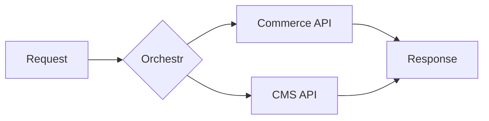
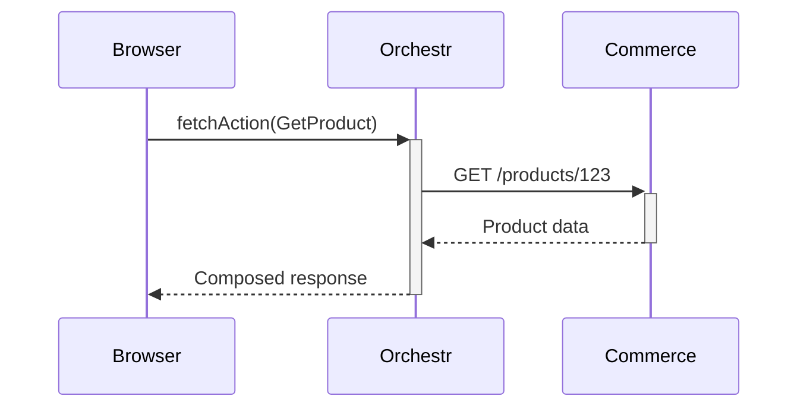
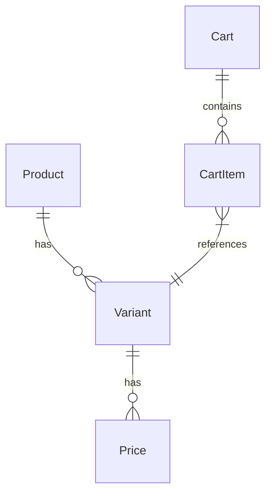
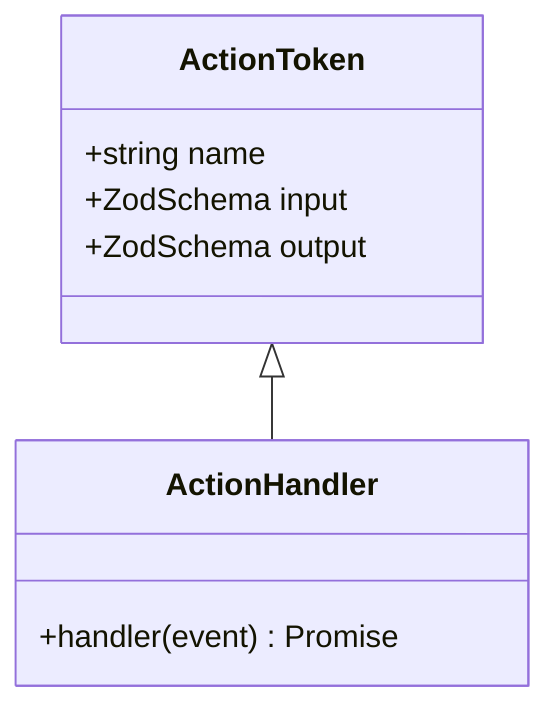
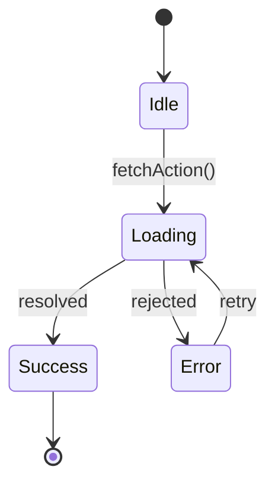

# Diagram Libraries Reference

Reference for interactive visualization libraries available for Laioutr documentation. All components live in `app/components/content/` and are usable via MDC syntax.

## Vue Flow (`@vue-flow/core`)

Interactive node-based diagrams with dragging, zooming, panning, and custom node types.

**Install:**
```bash
pnpm add @vue-flow/core @vue-flow/layout
```

**Bundle size:** ~60-70 kB gzipped

**Use when:** Architecture diagrams with clickable nodes, interactive data flow, anything needing zoom/pan/drag.

### Basic Vue Component

```vue
<script setup>
import { VueFlow, useVueFlow } from '@vue-flow/core';
import '@vue-flow/core/dist/style.css';
import '@vue-flow/core/dist/theme-default.css';

const nodes = ref([
  { id: 'frontend', position: { x: 0, y: 0 }, data: { label: 'Laioutr Frontend' } },
  { id: 'orchestr', position: { x: 200, y: 100 }, data: { label: 'Orchestr' } },
]);

const edges = ref([
  { id: 'e1', source: 'frontend', target: 'orchestr', animated: true },
]);
</script>

<template>
  <VueFlow :nodes="nodes" :edges="edges" fit-view-on-init />
</template>
```

### Custom Node Types

```vue
<script setup>
import { Handle, Position } from '@vue-flow/core';

defineProps(['data']);
</script>

<template>
  <div class="custom-node">
    <Handle type="target" :position="Position.Top" />
    <div class="label">{{ data.label }}</div>
    <Handle type="source" :position="Position.Bottom" />
  </div>
</template>
```

Register custom nodes via the `node-types` prop on `<VueFlow>`.

### Auto-Layout with Dagre

```bash
pnpm add @vue-flow/layout
```

```vue
<script setup>
import { useLayout } from '@vue-flow/layout';

const { layout } = useLayout();
const { nodes: layoutNodes, edges: layoutEdges } = layout(nodes, edges, 'TB');
</script>
```

### MDC Integration Pattern

Create `app/components/content/FlowDiagram.vue` to use via MDC:

```markdown
::flow-diagram
---
nodes:
  - id: frontend
    label: Laioutr Frontend
    type: custom
  - id: orchestr
    label: Orchestr
    type: custom
edges:
  - source: frontend
    target: orchestr
layout: dagre
---
::
```

### Key Props & Events

| Prop/Event | Purpose |
|---|---|
| `nodes` | Array of node objects (`id`, `position`, `data`, `type`) |
| `edges` | Array of edge objects (`id`, `source`, `target`, `animated`) |
| `fit-view-on-init` | Auto-fit diagram to container on mount |
| `@node-click` | Handle when user clicks a node |
| `@edge-click` | Handle when user clicks an edge |
| `@pane-click` | Handle when user clicks the background |

---

## v-network-graph

Lightweight graph visualization for dependency and relationship diagrams.

**Install:**
```bash
pnpm add v-network-graph
```

**Bundle size:** Lighter than Vue Flow

**Use when:** Package dependency graphs, relationship visualization, simpler node-edge diagrams without complex interaction needs.

### Basic Usage

```vue
<script setup>
import { VNetworkGraph } from 'v-network-graph';
import 'v-network-graph/lib/style.css';

const nodes = {
  orchestr: { name: 'Orchestr' },
  shopify: { name: 'Shopify App' },
  commerce: { name: 'Adobe Commerce App' },
};

const edges = {
  e1: { source: 'orchestr', target: 'shopify' },
  e2: { source: 'orchestr', target: 'commerce' },
};
</script>

<template>
  <VNetworkGraph :nodes="nodes" :edges="edges" />
</template>
```

### Key Differences from Vue Flow

| Feature | Vue Flow | v-network-graph |
|---|---|---|
| Custom node rendering | Full custom components | Label-based, limited custom |
| Layout algorithms | Dagre, elk (via plugins) | Force-directed built-in |
| Bundle size | Larger | Smaller |
| Best for | Architecture diagrams | Dependency graphs |
| Drag & drop | Full support | Basic support |

---

## Mermaid (Already Available)

Static diagrams rendered by the existing Mermaid client plugin. No additional installation needed.

**Use when:** Simple flowcharts, sequences, ER diagrams, class diagrams, state machines.

### Diagram Types

#### Flowchart


#### Sequence Diagram


#### ER Diagram


#### Class Diagram


#### State Diagram


---

## D3.js (Modular)

Highly custom one-off visualizations. Import only the modules you need.

**Bundle size:** ~15-80 kB depending on modules

**Use when:** Highly custom visualizations that don't fit node-graph or flowchart patterns.

### Common Modules

| Module | Purpose | Import |
|---|---|---|
| `d3-selection` | DOM manipulation | `import { select } from 'd3-selection'` |
| `d3-scale` | Scale functions | `import { scaleLinear } from 'd3-scale'` |
| `d3-shape` | SVG shapes | `import { line, arc } from 'd3-shape'` |
| `d3-hierarchy` | Tree layouts | `import { tree, hierarchy } from 'd3-hierarchy'` |
| `d3-force` | Force-directed layouts | `import { forceSimulation } from 'd3-force'` |

---

## Markmap

Mind maps rendered from markdown headings.

**Install:**
```bash
pnpm add markmap-lib markmap-view
```

**Bundle size:** ~100 kB

**Use when:** Visualizing a hierarchy of concepts as a mind map.

### Basic Usage

```ts
import { Markmap } from 'markmap-view';
import { Transformer } from 'markmap-lib';

const transformer = new Transformer();
const { root } = transformer.transform(`
# Laioutr
## Frontend
### Orchestr
### Components
## Apps
### Shopify
### Adobe Commerce
## Cloud
### Hosting
### CDN
`);

Markmap.create('#markmap', null, root);
```
