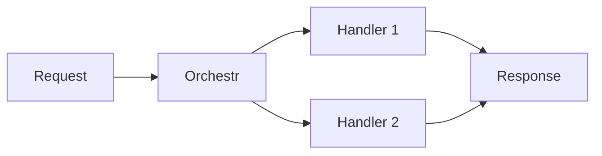

# Diataxis Document Type Templates

Templates, checklists, and example intros for each document type. Referenced by the main `technical-writing` skill during Step 3 (Classification).

## Tutorial

**Definition:** A lesson that takes the reader through a series of steps to complete a project. The author is responsible for the learner's success.

### Template

```markdown
---
title: Build a [Thing] with [Technology]
description: Learn how to [outcome] step by step
---

## What you'll build

[1-2 sentences describing the end result. Include a screenshot or diagram if possible.]

## Before you start

::note
You'll need:
- [Prerequisite 1]
- [Prerequisite 2]
::

## Steps

::steps{level="3"}

### Create the project

[Instruction with code example]

### Add the data source

[Instruction with code example]

### Configure the handler

[Instruction with code example]

### Test your setup

[Instruction showing expected output]

::

## What you've learned

[Recap of key concepts covered. Link to related how-to guides for specific tasks.]

## Next steps

- [How-to guide for a related task](/path)
- [Explanation of underlying concept](/path)
```

### Checklist

- [ ] Hands-on - reader builds something real
- [ ] Numbered steps with `::steps` component
- [ ] Each step has a code example
- [ ] Prerequisites listed upfront
- [ ] Expected output shown after each major step
- [ ] Celebrates completion ("Your storefront is now live!")
- [ ] Links to how-to guides for individual tasks
- [ ] Works end-to-end when followed exactly

### Common Mistakes

- **Too much explanation mid-step.** Save "why" for explanation pages. Tutorials are about doing.
- **Steps that can fail silently.** Always show expected output so the reader knows they're on track.
- **Missing prerequisites.** Nothing kills a tutorial faster than an undeclared dependency.

### Example Intro

```markdown
You're building a storefront that needs to display products from Shopify and
prices from your custom pricing service. By the end of this tutorial, you'll
have a working Orchestr setup that composes both data sources into a single
page load.
```

---

## How-to Guide

**Definition:** A guide that helps the reader accomplish a specific goal. Assumes competence - the reader knows what they want, they need to know how.

### Template

```markdown
---
title: [Verb] [thing] [context]
description: How to [accomplish specific goal]
---

[Scenario-based intro: 1-2 sentences describing when you'd need this]

```typescript
// Quick code example showing the end result
```

## Prerequisites

[Only if non-obvious. Keep brief.]

## Steps

::steps{level="3"}

### [Action verb] the [thing]

[Instruction + code]

### [Action verb] the [thing]

[Instruction + code]

::

## Variations

[Optional: alternative approaches for different scenarios]

## Troubleshooting

::accordion
:::accordion-item{label="Error: [common error message]"}
[Cause and fix]
:::
::

## Related

- [Explanation of underlying concept](/path)
- [Related how-to guide](/path)
```

### Checklist

- [ ] Title names the problem it solves ("Add webhook authentication", not "Webhook authentication guide")
- [ ] Assumes reader competence - no concept explanations
- [ ] Focused on ONE problem
- [ ] Code example within first 3 paragraphs
- [ ] Steps are goal-oriented (verbs, not nouns)
- [ ] Includes troubleshooting for common failures
- [ ] Links to explanation page for "why" questions

### Common Mistakes

- **Explaining concepts.** Link to the explanation page. How-to guides answer "how", not "why".
- **Title is a noun phrase.** "Webhook Configuration" vs "Configure Webhooks" - use the verb form.
- **Trying to cover every variation.** One guide per problem. Create separate guides for different scenarios.

### Example Intro

```markdown
Your Orchestr action needs to validate incoming webhook payloads before processing
them. Here's how to add HMAC signature verification to your webhook handler.
```

---

## Explanation

**Definition:** A discussion that helps the reader understand a concept. Answers "why?" and provides context.

### Template

```markdown
---
title: [Concept Name]
description: Understanding [concept] and how it works in Laioutr
---

[Scenario or analogy that makes the concept relatable]

## How [concept] works

[High-level explanation with an analogy or diagram]



## Why [concept] matters

[Practical implications - what happens with and without this concept]

## [Concept] in practice

[How this concept manifests in Laioutr specifically]

## Key takeaways

- [Takeaway 1]
- [Takeaway 2]

## Related

- [How to do X with this concept](/path) (how-to guide)
- [Tutorial using this concept](/path) (tutorial)
```

### Checklist

- [ ] Concept-first - doesn't jump to implementation
- [ ] Uses analogies or diagrams to build understanding
- [ ] Answers "why?" not "how?"
- [ ] Links to related how-to guides for practical application
- [ ] No step-by-step instructions (that's a how-to guide)
- [ ] Provides context about design decisions

### Common Mistakes

- **Turning into a how-to guide.** If you're writing steps, you've switched types. Link to a how-to instead.
- **Too abstract.** Ground every concept in a Laioutr-specific example.
- **No diagram.** Most concepts benefit from a visual. Use Mermaid.

### Example Intro

```markdown
Think of Orchestr like a kitchen's prep station. Before a dish goes out, every
ingredient needs to be ready - sliced, seasoned, measured. Orchestr does the
same for your frontend: it gathers data from all your sources, prepares it, and
serves it as a single composed response. No round-trips from the browser needed.
```

---

## Quickstart

**Definition:** The fastest path to a first working result. Under 5 minutes, copy-paste friendly.

### Template

```markdown
---
title: [Technology] Quickstart
description: Get [outcome] in under 5 minutes
---

[One sentence: what you'll have at the end]

## Install

::code-group
```bash [pnpm]
pnpm add @laioutr-core/[package]
```
```bash [npm]
npm install @laioutr-core/[package]
```
::

## Configure

```typescript
// Minimal configuration - copy and paste
```

## Run

```bash
pnpm dev
```

You should see:

```
[Expected output]
```

## What's next

- [Full tutorial](/path) for a deeper walkthrough
- [Configuration reference](/path) for all options
- [How-to guides](/path) for specific tasks
```

### Checklist

- [ ] Completable in under 5 minutes
- [ ] Every code block is copy-pasteable
- [ ] Minimal explanation - just enough to follow
- [ ] Shows expected output after each major step
- [ ] Uses `::code-group` for install commands
- [ ] Links to tutorial and reference at the end
- [ ] No tangents or optional steps

### Common Mistakes

- **Too many options.** A quickstart has ONE path. Put alternatives in how-to guides.
- **Explaining why.** The reader wants speed, not understanding. Link to explanations.
- **More than 5 minutes.** If it takes longer, you're writing a tutorial.

### Example Intro

```markdown
Get a Laioutr frontend running with Shopify product data in under 5 minutes.
```
