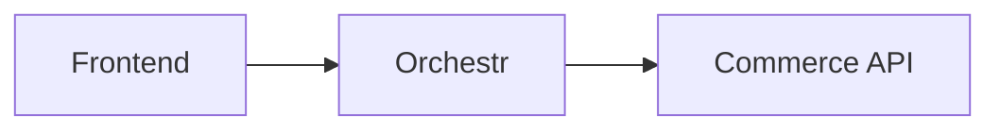

# Docus MDC Component Reference

Complete MDC syntax reference for all components available in the Laioutr documentation site. Covers Docus built-in components, Nuxt UI prose components, and Laioutr custom components.

## MDC Syntax Basics

- **Inline components:** `:component-name{prop="value"}` (single colon, for inline use)
- **Block components:** `::component-name` ... `::` (double colon, for block-level)
- **Nested components:** `:::component-name` ... `:::` (triple colon, when nesting inside another block component)
- **Props:** `{prop="value" :bound-prop="expression" flag}` after component name

---

## Callouts

### Note (background context)

```markdown
::note
Orchestr composes data server-side before the page loads.
::
```

### Tip (helpful advice)

```markdown
::tip
Use `::code-group` to show npm and pnpm commands side by side.
::
```

### Warning (important caveat)

```markdown
::warning
Changing the action token name will break existing frontend calls.
::
```

### Caution (dangerous action)

```markdown
::caution
This operation deletes all cached data. It cannot be undone.
::
```

All callouts support an optional title:

```markdown
::warning{title="Breaking Change"}
The `v2` API removes the `legacyMode` option.
::
```

---

## Layout Components

### Steps (sequential instructions)

Use with heading-level markers inside. The `level` prop sets which heading level marks each step.

```markdown
::steps{level="3"}

### Install the package

```bash
pnpm add @laioutr-core/orchestr
```

### Create your first action handler

```typescript
export default defineOrchestr.actionHandler(...)
```

### Test the action

```bash
curl -X POST http://localhost:3000/api/orchestr/action/...
```

::
```

### Tabs (tabbed content)

```markdown
::tabs
  :::tabs-item{label="Shopify"}
  Configure your Shopify app credentials in the Cockpit.
  :::

  :::tabs-item{label="Adobe Commerce"}
  Set up your Adobe Commerce API keys in the environment config.
  :::
::
```

### Card Group (navigation cards)

```markdown
::card-group
  :::card{title="Quickstart" to="/getting-started/quickstart" icon="i-heroicons-rocket-launch"}
  Get your first Laioutr frontend running in 5 minutes.
  :::

  :::card{title="Orchestr" to="/frontend/orchestr" icon="i-heroicons-cube-transparent"}
  Learn how Orchestr composes data from multiple sources.
  :::
::
```

### Accordion (collapsible sections)

```markdown
::accordion
  :::accordion-item{label="What if my build fails?"}
  Check the build logs in the Cockpit for error details.
  :::

  :::accordion-item{label="How do I roll back a deployment?"}
  Use the deployment history in the Cockpit to redeploy a previous version.
  :::
::
```

---

## Code Components

### Code Group (multi-tab code blocks)

```markdown
::code-group
```bash [pnpm]
pnpm add @laioutr-core/orchestr
```
```bash [npm]
npm install @laioutr-core/orchestr
```
```bash [yarn]
yarn add @laioutr-core/orchestr
```
::
```

Labels in `[brackets]` become tab names.

### Code Collapse (long code blocks)

Wraps a code block with expand/collapse functionality.

```markdown
::code-collapse
```typescript
// Long configuration file...
export default defineNuxtConfig({
  // ... many lines
});
```
::
```

### Code Preview (code with live preview)

Shows a preview slot above the code.

```markdown
::code-preview
<!-- Preview slot shows rendered result -->

#code
```vue
<template>
  <LButton label="Click me" />
</template>
```
::
```

---

## API Documentation Components

### Field Group / Field (parameter tables)

```markdown
::field-group
  :::field{name="productId" type="string" required}
  The unique identifier of the product.
  :::

  :::field{name="quantity" type="number"}
  Number of items. Default: `1`.
  :::

  :::field{name="options" type="object"}
  Optional configuration.

  ::field-group
    :::field{name="options.color" type="string"}
    Product color variant.
    :::
  ::
  :::
::
```

Field props:
- `name` - parameter name
- `type` - type annotation (displayed as badge)
- `required` - flag to mark as required
- Nested `::field-group` inside a `:::field` for nested objects

### Action Meta (Orchestr action auto-docs)

```markdown
::action-meta{:name="AddToCart"}
::
```

Auto-generates documentation from the action's TypeScript types: input schema, output schema, description. The `:name` prop takes the action handler name.

### Query Meta (Orchestr query auto-docs)

```markdown
::query-meta{:name="GetProductDetails"}
::
```

Auto-generates query documentation from TypeScript types.

### Entity Component Meta (entity schema docs)

```markdown
::entity-component-meta{entity="Product" component="ProductCard"}
::
```

Auto-generates schema documentation for entity-component relationships.

---

## UI Component Documentation

### Component Code (Storybook preview + code)

Shows a live Storybook preview above the source code.

```markdown
::component-code
---
:name: LButton
:story-height: 100px
story-id: components-lbutton--primary
title: Primary Button
---
```vue-template
<LButton label="Add to cart" />
```
::
```

Props:
- `:name` - component name (for code highlighting)
- `:story-height` - iframe preview height
- `story-id` - Storybook story ID from storybook.laioutr.cloud
- `title` - display title

### Component Meta (auto-generated API)

```markdown
::component-meta{:name="LButton"}
::
```

Auto-generates complete API documentation: props with types and defaults, slots, emits/events. Uses `nuxt-component-meta` under the hood.

---

## Content Components

### Features (feature list)

```markdown
::features
---
items:
  - title: Server-Side Composition
    description: Orchestr composes data before the page loads
    icon: i-heroicons-server
  - title: Type Safety
    description: End-to-end TypeScript types from API to frontend
    icon: i-heroicons-code-bracket
---
::
```

### Badge

```markdown
:badge[v2.0]{color="green"}
:badge[Deprecated]{color="red"}
:badge[Beta]{color="yellow"}
```

---

## Diagrams

### Mermaid (static diagrams)

````markdown

````

Supported types: `flowchart`, `sequenceDiagram`, `erDiagram`, `classDiagram`, `stateDiagram-v2`

### Flow Diagram (interactive - requires custom component)

```markdown
::flow-diagram
---
nodes:
  - id: frontend
    label: Laioutr Frontend
    type: custom
edges:
  - source: frontend
    target: orchestr
layout: dagre
---
::
```

Requires `app/components/content/FlowDiagram.vue` built with Vue Flow. See `technical-writing-visualization` skill.

---

## Prose Components (Nuxt Content Built-in)

These are automatically applied to standard markdown elements:

| Markdown | Rendered Component |
|---|---|
| `# Heading` | `ProseH1` through `ProseH6` |
| Paragraph text | `ProseP` |
| `[link](url)` | `ProseA` |
| `` `inline code` `` | `ProseCode` |
| Code blocks | `ProsePre` (customized in Laioutr docs) |
| `**bold**` | `ProseStrong` |
| `*italic*` | `ProseEm` |
| Tables | `ProseTable`, `ProseTh`, `ProseTd`, `ProseTr` |
| Lists | `ProseUl`, `ProseOl`, `ProseLi` |
| `> blockquote` | `ProseBlockquote` |
| `---` | `ProseHr` |
| `` | `ProseImg` |

The Laioutr docs override `ProsePre` for custom code block rendering (copy button, filename display, twoslash support).
