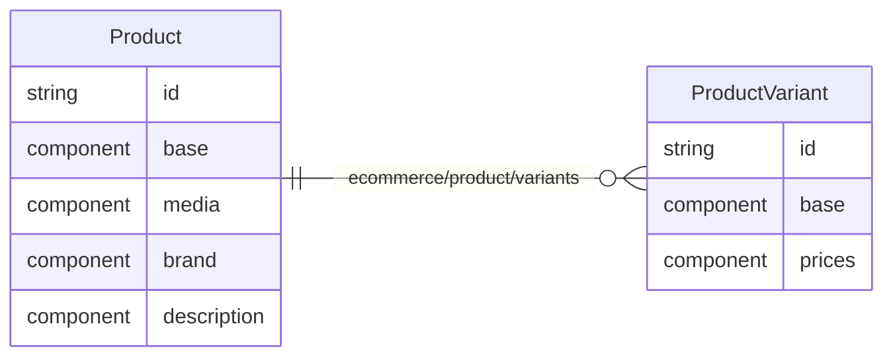

##

Data in Laioutr is organized into normalized entities. You can think of entities as rows in a database table. Each entity has a unique id and a type. Entities can have components, which are like columns in a database table. Besides that entities can have links to other entities.

Structuring entities into separate components which hold data about the entity is important for two reasons:

1. **Granularity**: Request only the data you need in the frontend.
2. **Composition**: Load data from multiple sources and combine it into a single entity.

An example of a data model is the following:

### Entity Components

A entity can have zero or more components. Each component has a unique name and a schema. The schema is a zod type that describes the data that the component will contain.

There is no single file, describing what an entity is, as they are in effect just the sum of all their components. This distributed approach to data modelling is inspired by the [Entity-Component-System](https://en.wikipedia.org/wiki/Entity_component_system) pattern and allows for flexible extension and composition of entities.

### Entity Links

You can see that the [`Product`](/canonical-types/entities/product) entity has a link to the [`ProductVariant`](/canonical-types/entities/product-variant) entity, called `ecommerce/product/variants`. This means that you can load a `Product` entity and get all its variants in a single request.

Links work only in one direction. The `ecommerce/product/variants` link only describes a relation from a `Product` to its `ProductVariant`s. It cannot be used the other way around.

### Granularity

When requesting Product data, you might not always need all of the component-data available. E.g. when displaying product-tiles, you probably don't need the `description` component, which contains the full HTML-description of a product.

To achieve this, you can request only the components you need. So if your product-tiles only need the `base` and `media` components, you can request only those components.

### Composition

Most of the time, your data about a product probably comes from a single source like your shop-system, e.g. Shopify or Adobe Commerce. But sometimes you might need to combine data from multiple sources.

For example, you might want to display a product-tile with the product-name, price and image from your shop-system, but the description from a PIM system like Akeneo. Or your product-prices should always be loaded from your ERP system, while the rest of the product-data comes from your shop-system.
