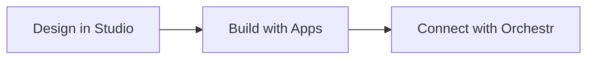

## What is Laioutr

You have a commerce backend, a CMS, a search engine, maybe a personalization service. Now you need a frontend that ties them all together: fast, flexible, and manageable by your whole team. That is what **Laioutr** does.

Laioutr is a **Composable Frontend Management Platform** that sits between your backend systems and the user-facing experience. Every Laioutr frontend is a standard **Nuxt.js application**. You keep full framework access while Laioutr handles the integration, composition, and management layers.

```bash
# Start a new Laioutr project -- it's a Nuxt app under the hood
npx @laioutr/cli init my-storefront
cd my-storefront
pnpm dev
```

## How It Works

Building with Laioutr follows three steps:



1. **Design in Studio.** Use the visual page editor to compose pages from sections, blocks, and slots. No code required for layout changes.
2. **Build with Apps.** Install apps (Nuxt modules) that provide UI components, integrations, and data connectors. Apps are npm packages with no vendor lock-in on your component code.
3. **Connect with Orchestr.** Orchestr pulls data from your commerce engine, CMS, search provider, and any other API into a single, normalized data layer your frontend consumes.

## Our Products

::card-group
  :::card{title="Frontend" to="/frontend"}
  A Nuxt-based storefront with built-in performance optimizations, SEO features, and e-commerce primitives. Your team writes standard Vue components with full access to the Nuxt ecosystem.
  :::

  :::card{title="Cockpit" to="https://cockpit.laioutr.cloud/o/_/p/_/settings"}
  The admin hub for your project. Manage API keys, environments, team permissions, and deployment settings from a single dashboard.
  :::

  :::card{title="Checkout" to="/checkout"}
  A pre-built, conversion-optimized checkout flow that connects to your commerce backend. Handles cart, shipping, payment, and order confirmation out of the box.
  :::

  :::card{title="Cloud" to="/cloud"}
  Managed hosting purpose-built for Laioutr frontends. Automated deployments, edge caching, and infrastructure you do not have to think about.
  :::
::

## Unified Data Layer

At the heart of the platform is **Orchestr**, a data-composition framework that consolidates data from multiple backend systems into one standardized interface. Your frontend interacts with a consistent data structure regardless of whether data comes from Shopify, commercetools, a PIM, or a custom API.

This means you can swap your commerce backend without rewriting your frontend. It also means a single product page can combine pricing from your ERP, descriptions from your CMS, and recommendations from an AI service, all through one unified query.

Read more about how data flows through Orchestr in the [Data Model](/getting-started/key-concepts/data-model) and [Orchestr](/frontend/orchestr) documentation.

## Apps Without Lock-In

**Apps are Nuxt modules distributed as npm packages.** That single fact eliminates most lock-in concerns: your component code lives in standard npm packages that you own and control.

- Pre-built integrations for headless commerce platforms, CMSs, search and recommendations, personalization, analytics, and more
- Modular by design; add, remove, or swap apps as your business needs change without touching unrelated parts of your frontend
- Open ecosystem: publish your own apps to npm or the Laioutr registry, or use community-contributed extensions

Browse available apps in the [Apps](/apps) section, or learn to [create your own](/getting-started/next-steps/create-custom-app).

## Extending Laioutr

Laioutr is built for customization at every level:

- Custom sections and blocks: build bespoke UI elements using Laioutr UI components or your own Vue components, then make them available in Studio
- Visual logic and hooks: add dynamic behavior to pages through configurable logic without redeploying code
- APIs and custom apps: integrate any service, analytics tool, or business logic directly into the frontend layer

For details, see the [Extensibility](/getting-started/key-concepts/extensibility) guide.

## Summary

Laioutr is a complete platform for managing the customer-facing layer of modern digital products. It unifies design, data, commerce integrations, deployment, and third-party services so your team can ship better experiences faster while keeping the full power and flexibility of Nuxt.js under the hood.
