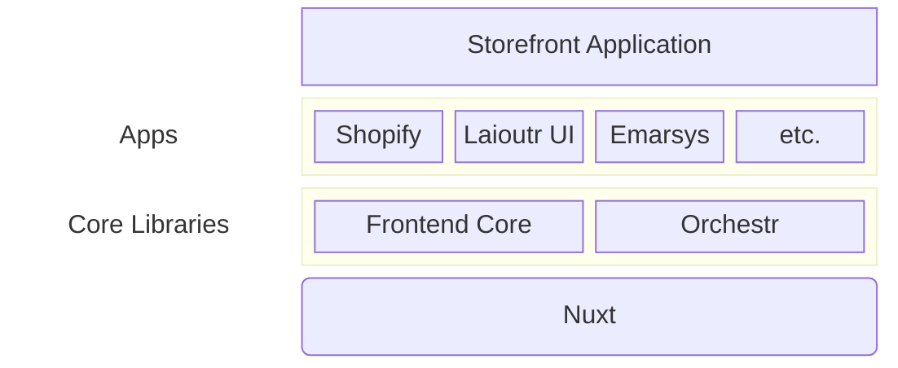
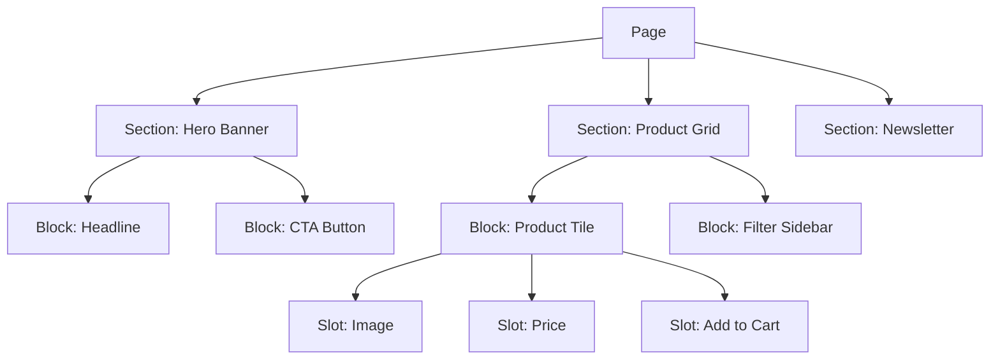
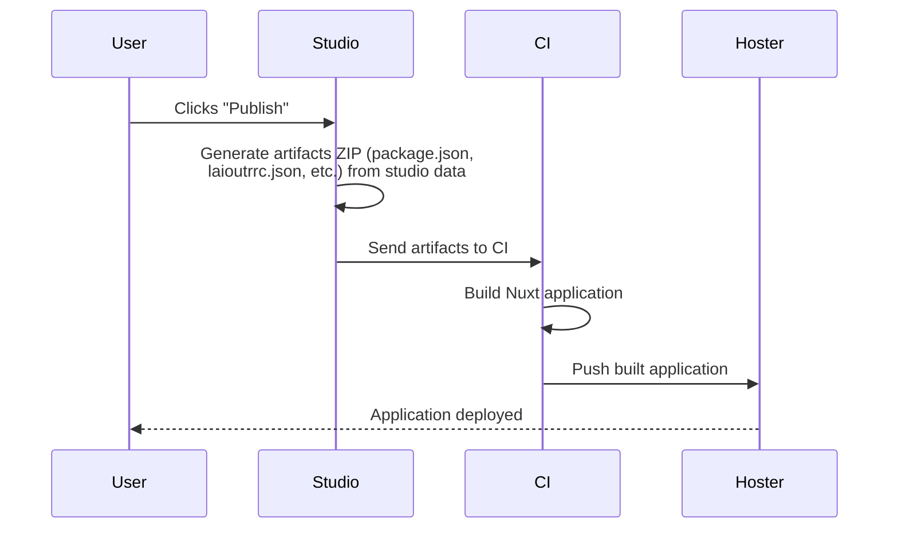

## The Big Picture

A Laioutr frontend has a lot of moving parts, but they fall into **three intuitive buckets**:

| Bucket | What it does | Key pieces |
|--------|-------------|------------|
| **Manage** | Configure, compose pages, control settings | Studio, Cockpit |
| **Build** | Provide UI components, sections, and integrations | Laioutr UI, Apps |
| **Connect** | Fetch and normalize data from external systems | Orchestr |

Everything else (Nuxt, Vue, Tailwind) is the standard web platform underneath. You never lose access to it.

### Manage: Studio and Cockpit

**Studio** is the visual page editor where your team composes pages from sections, blocks, and slots. It is not a CMS; it manages frontend structure and page composition. Your CMS (Contentful, Storyblok, etc.) remains the source for content entities; Studio controls how and where that content appears on the page.

**Cockpit** is the admin dashboard at [cockpit.laioutr.cloud](https://cockpit.laioutr.cloud/o/_/p/_/settings). It handles project settings, API keys, team permissions, environment configuration, and deployment triggers. Think of Studio as "what the page looks like" and Cockpit as "how the project is configured."

### Build: UI and Apps

**Laioutr UI** is the component library that ships production-ready, themeable sections and blocks. A **Laioutr theme** is a set of design tokens (CSS custom properties), not a page template. You control the visual identity without overriding layout logic.

**Apps** are the building blocks of your project. Each app is a Nuxt module published as an npm package, either to the public npm registry or the private Laioutr registry. Apps can provide any combination of:

- Data connectors (products from Shopify, content from Storyblok)
- UI sections and blocks configurable in Studio
- Third-party integrations (analytics, newsletters, accounts)
- Media library connections for Studio

Because apps are npm packages, you install them with `pnpm add`, version them normally, and can replace them without touching the rest of your project. No vendor lock-in on your component code.

::card{title="Create your own app" to="/getting-started/next-steps/create-custom-app"}
Learn how to build and publish a custom Laioutr app.
::

### Connect: Orchestr

**Orchestr** is the data-composition framework that connects your frontend to external systems. It normalizes data from commerce APIs, CMSs, search engines, and custom backends into a unified entity model your components consume.

Rather than writing fetch calls scattered across your codebase, you define **queries** and **component resolvers** that Orchestr executes server-side. The result is a clean, typed data layer with built-in caching.

::card{title="Learn more about Orchestr" to="/frontend/orchestr"}
Queries, component resolvers, caching, and the wire format.
::

## Storefront Application

Under the hood, a Laioutr project is a **Nuxt application**. The core libraries and your installed apps are layered on top of Nuxt as modules:

You have full access to everything Nuxt provides: server-side rendering, static generation, middleware, plugins, and the entire Vue ecosystem.

::card{title="Learn more about Nuxt" to="https://nuxt.com"}
The Vue-based framework that powers every Laioutr frontend.
::

## The laioutrrc.json File

Every Laioutr project has a **`laioutrrc.json`** file at its root. This is the declarative snapshot of your entire frontend project: it captures page structures, section configurations, slot assignments, app settings, and routing rules in a single file.

You can think of it as the compiled output of Studio. When someone clicks "Publish" in Studio, the editor serializes its state into `laioutrrc.json`, which the Nuxt application reads at build time and runtime to know what to render.

::tip
Because `laioutrrc.json` is a plain JSON file checked into your repository, you can inspect, diff, and even edit it manually. This is especially useful during development and code review.
::

## Sections, Blocks, and Slots

Pages in Laioutr are composed from a three-level hierarchy:

- **Sections** are the top-level layout units on a page (hero banner, product grid, footer). They define structure and spacing.
- **Blocks** live inside sections and represent discrete UI elements (a product tile, a CTA button, a filter panel).
- **Slots** are the data-binding points inside blocks. They are the specific places where content or entity data gets injected.

Studio lets non-developers compose pages by arranging sections and configuring blocks visually. Developers define the available sections, blocks, and slots when building apps.

## Publish Flow

When a team member clicks "Publish" in Studio, the following sequence runs:

All static project data your storefront needs lives in `laioutrrc.json`. Dynamic data (products, content, search results) comes from external systems connected through apps via [Orchestr](/frontend/orchestr).

For more on the deployment pipeline, see [CI/CD Pipeline](/getting-started/key-concepts/ci-cd-pipeline).
