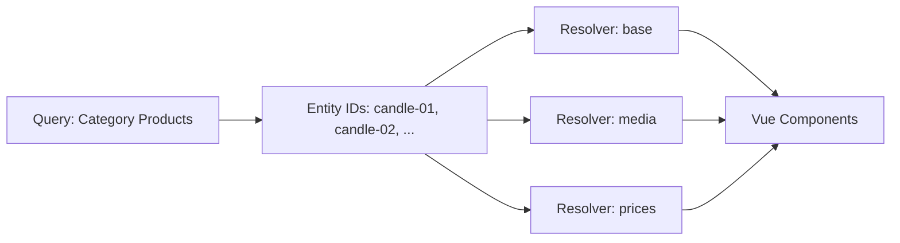
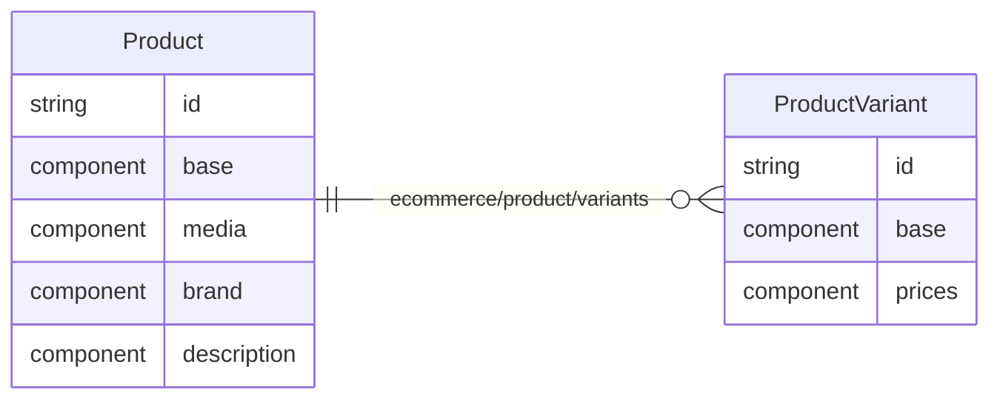
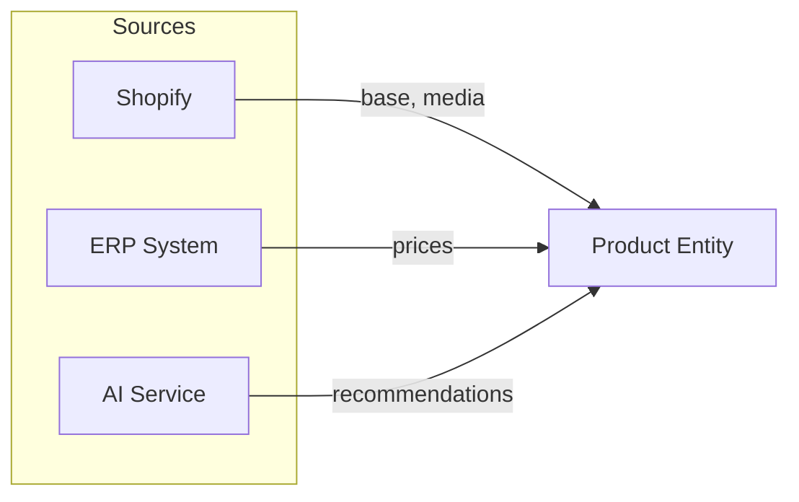

## From Query to Screen

Imagine you are building a "Christmas Candles" category page. A customer lands on the page, and your frontend needs to show a grid of candle products with images, prices, and names. Here is what happens under the hood:

1. A **query** runs to fetch the category and returns a list of product entity IDs
2. **Component resolvers** load the specific data (base info, media, prices) for each product entity
3. Your Vue components receive typed, normalized data and render the product tiles



This two-step pattern (**query returns IDs, resolvers load components**) is the foundation of Laioutr's data model.

## Entities and Entity Components

Data in Laioutr is organized into normalized **entities**. Each entity has a unique ID and a type (like `Product`, `Category`, or `BlogPost`). Entities hold their data in **entity components**: named, typed chunks of data attached to an entity.

::warning
Do not confuse **entity components** (data) with **Vue components** (UI). An entity component is a piece of data attached to an entity, like a product's pricing information. A Vue component is a `.vue` file that renders UI. They share the name "component" but are entirely different concepts.
::

Here is what a typical product entity looks like:



There is no single file that defines what a `Product` is. An entity is the sum of all its registered components. This distributed approach is inspired by the [Entity-Component-System](https://en.wikipedia.org/wiki/Entity_component_system) pattern and is what makes multi-source composition possible.

### Entity Links

The `Product` entity above has a link called `ecommerce/product/variants` pointing to its `ProductVariant` entities. Links let you traverse related entities in a single request. Load a product and get all its variants at once.

Links are **unidirectional**. The `ecommerce/product/variants` link describes a relation from `Product` to `ProductVariant`. To go the other direction, you would need a separate link definition.

## Granularity: Request Only What You Need

When you display product tiles in a grid, you probably need the `base` and `media` components but not the full `description` (which might contain heavy HTML). Laioutr lets you request exactly the components you need:

```ts
// In your query, request only the components the product tile needs
const products = await useOrchestr().query('ecommerce/category/products', {
  components: ['base', 'media'],
  // 'description' is NOT loaded -- saving bandwidth and resolver time
});
```

This granularity means your category page loads fast because it skips data it does not render. Your product detail page can request `description`, `brand`, and other components when it actually needs them.

## Composition: Data from Multiple Sources

Here is where the entity-component model really shines. Your product's `base` info and `media` might come from Shopify, but you want `prices` from your ERP and `recommendations` from an AI service. Each data source provides its own component resolver, and Orchestr composes the results into a single entity:



Your Vue components do not know or care where the data came from. They receive a typed `Product` entity with all requested components attached. If you later move from Shopify to commercetools, you swap the resolver; the frontend code stays the same.

## Extending the Data Model

Because entities are just the sum of their components, you can extend any entity by adding new components. No core changes needed. Define a **component token** (name + Zod schema) and write a **component resolver** that fetches the data.

For example, to add loyalty-point data to products:

```ts twoslash
// Define the component token
import { z } from 'zod/v4';
import { defineEntityComponentToken } from '@laioutr-core/core-types/orchestr';

export const ProductLoyalty = defineEntityComponentToken('loyalty', {
  entityType: 'Product',
  schema: z.object({
    points: z.number(),
    tier: z.enum(['bronze', 'silver', 'gold']).optional(),
  }),
});
```

Then write a component resolver that provides this data from your loyalty backend. Orchestr automatically discovers the resolver, and the new `loyalty` component becomes requestable alongside built-in components like `base` or `prices`.

This works for extending existing entities and for creating entirely new entity types. See [Component Resolvers](/frontend/orchestr/component-resolvers) for a full walkthrough.

## Orchestr vs. GraphQL

If you have used GraphQL, Orchestr's approach will feel familiar. Both let you request exactly the fields you need. The key difference is that **Orchestr is server-side only**. Queries and resolvers run on your Nuxt server, not in the browser. This means:

- **No client-side data fetching waterfalls.** Everything resolves server-side before the page reaches the browser.
- **Backend credentials stay on the server.** API keys for your commerce platform, ERP, or CMS are never exposed.
- **Built-in caching.** Orchestr caches resolved components, so repeated requests for the same product data across different pages are fast.

::tip
You do not need to learn a query language. Orchestr queries and resolvers are written in TypeScript with full type inference. Your IDE gives you autocompletion for entity types, component names, and resolved data shapes.
::

Read more about queries, resolvers, and caching in the [Orchestr documentation](/frontend/orchestr).
