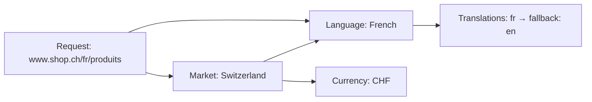

Your storefront needs to serve customers in different countries, currencies, and languages, often from a single codebase. Laioutr handles this with two concepts: **markets** and **languages**.

### Markets

A **market** represents a region you sell in. Each market has:

- A **currency** (e.g. CHF for Switzerland, EUR for Germany)
- One or more **domains**, each mapping a host and optional path to a language (e.g. `www.shop.ch` = German, `www.shop.ch/fr` = French)
- Optional **region codes** for region-specific behaviour

You create and manage markets in [Cockpit → Markets](https://cockpit.laioutr.cloud/o/_/p/_/settings/markets). A single market can cover one country or span an entire continent.

### Languages

A **language** is identified by a [BCP 47](https://en.wikipedia.org/wiki/IETF_language_tag) code (e.g. `de`, `de-CH`, `fr-FR`). Each language can define **fallbacks**: for example, `de-CH` (Swiss German) can fall back to `de` (German), so you only translate what actually differs.

You manage languages in [Cockpit → Translations](https://cockpit.laioutr.cloud/o/_/p/_/settings/translations).

### The customer context

The combination of market and language is the **context** a customer browses in. When someone visits your storefront, Laioutr resolves the market and language from the request's host and path. Everything downstream (currency, measurement system, content, available pages) follows from this context.

### Learn more

::card-group
  :::card{title="Multi-market" to="/frontend/features/multi-market"}
  Domain configuration, market-scoped pages, and developer APIs.
  :::

  :::card{title="Multi-language support" to="/frontend/features/multi-language-support"}
  Localized paths, language switchers, fallback chains, and nuxt-i18n integration.
  :::

  :::card{title="Currencies" to="/frontend/features/currencies"}
  Currency formatting and display.
  :::
::
