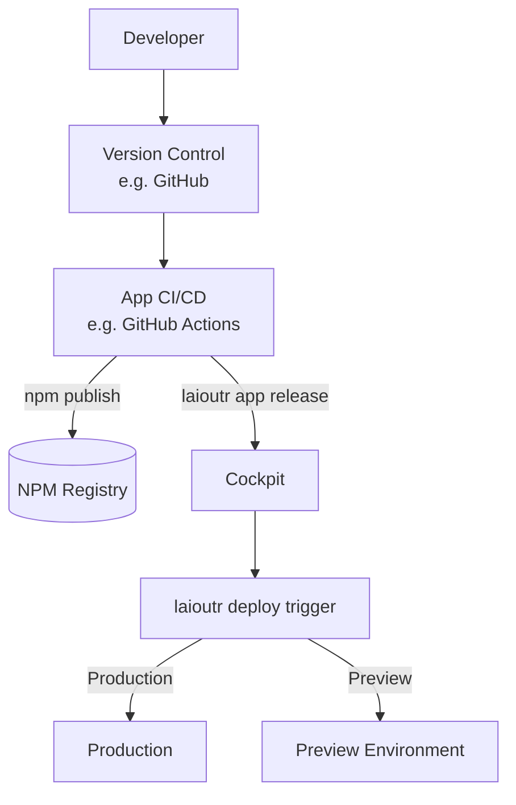

## What this covers

This document describes how a Laioutr app moves from local development through CI/CD into production. An "app" is a Laioutr Nuxt module distributed as an npm package.

## System overview

1. A developer builds or updates an app locally.
2. The app is published as an npm package via the team's CI/CD pipeline.
3. The version is registered with the Laioutr platform via the CLI.
4. A deployment is triggered — either to production or a preview environment.



The **app pipeline** (owned by the customer/team) handles building and publishing. Deployment is triggered via the Laioutr CLI, which orchestrates the build and deploy through the platform's hosting infrastructure.

## 1. App development

Start with the official [App Starter](/apps/app-development/app-starter) and follow the [Local Development Setup](/getting-started/next-steps/local-setup) guide to configure your environment.

An app provides:

- A Nuxt module entry point (`src/module.ts`)
- Orchestr handlers — queries, actions, links, resolvers, and query templates — under `src/runtime/server/orchestr/`
- Sections and blocks under `src/runtime/app/sections/` and `src/runtime/app/blocks/`

The `package.json` `"name"` defines the package identity and is used as the config key in `laioutrrc.json`.

## 2. Building and publishing the npm package

Each team owns their app CI/CD pipeline. It typically runs in your Git provider (GitHub Actions, GitLab CI, Azure DevOps, etc.) and should:

1. **Trigger** on pushes to main or on release branches/tags.
2. **Install dependencies and build** the Nuxt module (`pnpm install`, `pnpm build`, or equivalents).
3. **Enforce quality gates** — linting, tests, optional type-check and bundle size checks.
4. **Version** the package (manual or via tools such as Changesets).
5. **Publish** to an npm registry — `npm.laioutr.cloud` for private packages, or `npmjs.org` for public packages.

## 3. Registering versions with Laioutr

After publishing the npm package, register the new version with the platform:

```bash
laioutr app release --key orgKey_xxx
```

This extracts the config schema from `src/module.ts`, reads version and peer dependencies from `package.json`, and registers the version in the Cockpit. Pre-release versions are assigned to the `testing` channel automatically.

Run this as a CI/CD step after `npm publish`, or manually from the package directory.

## 4. Project configuration

Apps are configured per-project in `laioutrrc.json`. Each entry specifies the package name, version, and app-specific configuration:

```json
{
  "apps": [
    {
      "name": "@laioutr-app/ui",
      "version": "latest",
      "config": {
        "theme": "sunny"
      }
    },
    {
      "name": "@laioutr-app/shopify",
      "version": "latest",
      "config": {
        "shopId": "84306067782",
        "storeDomain": "my-store.myshopify.com",
        "publicAccessKey": "074478fbce..."
      }
    },
    {
      "name": "@laioutr-org/acme__my-app",
      "version": "latest",
      "config": {}
    }
  ]
}
```

Configuration can also be managed through the Cockpit UI under project settings.

## 5. Deploying

Trigger production or preview deployments using the Laioutr CLI:

```bash
# Production deployment; waits for completion by default
laioutr deploy trigger --project org/project --key orgKey_xxx

# Named preview deployment
laioutr deploy trigger \
  --project org/project \
  --key orgKey_xxx \
  --preview my-feature
```

Use `--logs` to stream build output instead of displaying a spinner while the command waits:

```bash
laioutr deploy trigger --project org/project --key orgKey_xxx --logs
```

For asynchronous CI jobs, use `--no-wait` and inspect the deployment later using the returned deployment ID:

```bash
# Trigger without waiting
laioutr deploy trigger --project org/project --key orgKey_xxx --no-wait

# Inspect the deployment afterward
laioutr deploy status \
  --project org/project \
  --key orgKey_xxx \
  --deployment-id dep_abc123

laioutr deploy logs \
  --project org/project \
  --key orgKey_xxx \
  --deployment-id dep_abc123
```

List recent deployments when you do not have a deployment ID, optionally increasing the default result limit of 20:

```bash
laioutr deploy list --project org/project --key orgKey_xxx --limit 50
```

Preview deployments create isolated environments for testing without affecting production. Pass a name to `--preview` so the deployment is easy to identify in later status and list output.

## Example: shipping a new app from scratch

Assuming you have created an app using the [App Starter](/apps/app-development/app-starter) and developed it locally:

```bash
# 1. Push your code
git push origin main

# 2. CI/CD builds and publishes (e.g. in GitHub Actions)
pnpm install && pnpm build && npm publish

# 3. Register the version with Laioutr
laioutr app release --key orgKey_xxx

# 4. Deploy a named preview for QA and stream its logs
laioutr deploy trigger \
  --project acme/storefront \
  --key orgKey_xxx \
  --preview test-my-app \
  --logs

# 5. Once tested, deploy to production
laioutr deploy trigger --project acme/storefront --key orgKey_xxx --logs
```
