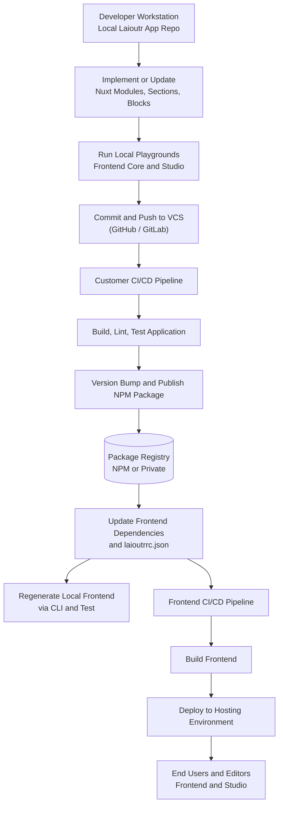

## System overview

This page explains, at a high level, how developers ship changes from their local machine into a **Laioutr frontend** using **Nuxt modules** (Laioutr apps) published as **packages** (for example to **npm**). :br
It focuses on:

- Creating and evolving a Laioutr app locally.
- Making the app testable in the local Laioutr frontend and Studio.
- Building and publishing new package versions via your own CI/CD pipeline.
- Consuming those packages in the Laioutr frontend, both locally and in production.

Throughout this document, **"app"** means a Laioutr **Nuxt module** that is distributed as an npm **package**.

## End-to-end overview

From a developer's perspective, the flow looks like this:



The rest of the page walks through each part in more detail, with concrete expectations for day-to-day development.

## 1. Local development: creating and extending a Nuxt module

- **Start from the App Starter**:br
  Use the official [App Starter](/apps/app-development/app-starter) to create a new Laioutr app. :br This gives you:
  - A Nuxt **module entry** (`src/module.ts`) that registers your app with Laioutr.
  - A place for **orchestr** handlers (queries, actions, links, resolvers).
  - Folders for **sections** and **blocks** that become available in Studio.
  - Two playgrounds (`playground/` and `orchestr-playground/`) for local testing.
- **Treat the app as a package from day one**:br
  In `package.json`, the `name` field defines your **package identity** (for example `@your-org/laioutr-app-example`). :br
  Laioutr uses the same name as the **config key** when wiring configuration from `laioutrrc.json` into your module.
- **Implement frontend and orchestr pieces**:br Add or modify:
  - **Orchestr handlers** under `src/runtime/server/orchestr/…` to talk to your backend systems.
  - **Sections and blocks** under `src/runtime/app/sections/` and `src/runtime/app/blocks/` so editors can place them in pages.
  - Optional **page wrappers** or additional components if your app needs them.

## 2. Local Laioutr frontend & Studio: using your app in practice

A key goal is that developers can **use their app exactly as editors and end‑users will**, but locally.

- **Run the app playgrounds**:br From your app’s repository:
  - Install dependencies (for example with `pnpm install`).
  - Fetch or configure `laioutrrc.json` so the playground reflects your real project.
  - Run the UI playground (`pnpm dev`) to see your sections/blocks inside Frontend Core.
  - Run the orchestr playground (`pnpm orchestr-dev`) to test queries and actions.
- **Connect Studio to local frontend**:br When supported by your project configuration, use Studio’s developer options (for example a “use localhost” command) so:
  - Editors can load the local frontend.
  - Your new sections and blocks show up in Studio’s component library.
  - You can try real flows (preview pages, publish changes) without deploying.
- **Regenerate the local Laioutr frontend via CLI (future)**:br
  In the Laioutr frontend project, there will be a CLI command (for example:

```bash
laioutr frontend generate
```

or a similar subcommand) that:

- Reads `package.json` and `laioutrrc.json`.
- Installs or updates all configured Laioutr apps (Nuxt modules) and their versions.
- Regenerates any derived code (routes, type mappings, orchestr wiring, etc.).

In daily work this means:

- After publishing a new package version of your app, you run the CLI in the **frontend repo**.
- The frontend picks up the new version and you can test it locally immediately.

## 3. Customer CI/CD: building and publishing the app package

Each customer (or team) owns their **integration pipeline** for their apps. :br
The pipeline typically runs in your Git provider (GitHub Actions, GitLab CI, Azure DevOps, …) and should:

1. **Trigger** on pushes to main and/or on release branches/tags.
2. **Install dependencies** and **build**the Nuxt module:
   - `pnpm install`
   - `pnpm lint`, `pnpm test`, `pnpm build` (or equivalents)
3. **Enforce quality gates**:
   - Linting and formatting checks.
   - Unit/integration tests for orchestr handlers and components.
   - Optional type‑check and bundle size checks.
4. **Version and publish the package**:
   - Bump the version in `package.json` (manual or via tools such as Changesets).
   - Publish to a **package registry**, preferably **npm** (public or private), or an alternative registry compatible with npm.
   - Ensure the Laioutr frontend has read access to this registry (for example via an `.npmrc` with tokens).

When the pipeline finishes successfully, your app is available as a **versioned npm package** that any Laioutr frontend can depend on.

## 4. Consuming apps in the Laioutr frontend

Once your app is published, it becomes part of the Laioutr frontend in two places:

- **Frontend project dependencies**:br In the Laioutr frontend repository:
  - Add your app package to `dependencies` in `package.json` (for example `@your-org/laioutr-app-example`).
  - The Nuxt config (or a central Laioutr frontend config file) includes your module in the `modules` list so Nuxt loads it.
- **Project configuration (`laioutrrc.json`)**:br
  In `laioutrrc.json`:
  - Add an entry under `apps` with `name` equal to your package name and the desired `version`.
  - Provide per‑app configuration (`config` object) that is passed into your module.
- **Updating to a new version**:br To roll out a new app release:
  1. Update the version in `package.json` and/or `laioutrrc.json`.
  2. Run the **frontend CLI generate command** locally to refresh the project.
  3. Commit the version change and any generated files.
  4. Let the **frontend CI/CD pipeline** build and deploy the updated frontend.

## 5. Frontend CI/CD: from repository to production

The Laioutr frontend has its own CI/CD pipeline, which should:

1. **Install dependencies**:br
   Use the same package manager and registry configuration as local development so it can resolve all Laioutr apps.
2. **Generate frontend code (CLI)**:br
   Run the Laioutr CLI command to regenerate the frontend from `laioutrrc.json` and installed apps. :br
   This ensures the pipeline uses the same app versions and configuration as developers do locally.
3. **Build and test the frontend**
   - Run the Nuxt build and any unit/e2e tests.
   - Optionally run visual regression or performance checks.
4. **Deploy**:br
   Deploy the built frontend to your hosting provider or edge platform. :br Once live:
   - Editors see new sections and blocks in Studio.
   - End‑users see the updated frontend behavior powered by your latest app version.

## 6. Day‑to‑day workflow for developers

In practice, a typical developer loop looks like this:

1. **Develop locally in the app repo**
   - Implement or update orchestr handlers, sections, blocks, and configuration.
   - Use the play­grounds and Studio connected to localhost to validate behavior.
2. **Publish a new version of the app**
   - Push changes and let the CI/CD pipeline build, test, and publish to npm.
3. **Update the Laioutr frontend**
   - Bump the package version and/or `laioutrrc.json` entry in the frontend repo.
   - Run the Laioutr CLI **frontend generate** command locally.
   - Test the integrated frontend + Studio on your machine.
4. **Deploy**
   - Commit changes and push.
   - Let the frontend CI/CD pipeline build and deploy to production.

Following this pattern keeps **local development**, **integration testing**, and **production deployments** aligned around the same Nuxt modules and npm packages, while giving each team full control over their own integration pipeline.
