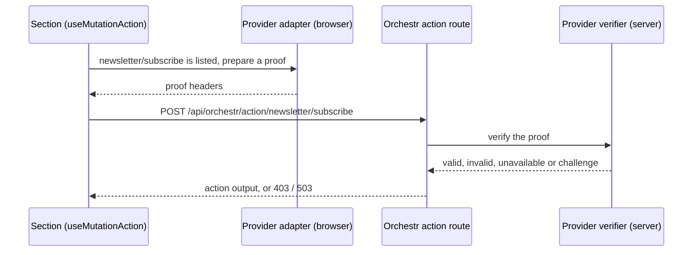

## Protect an action from bots

Your newsletter form fills up with sign-ups from addresses nobody owns, or a script tries passwords against the login a thousand times an hour. You want the server to refuse these requests, and you want real visitors to notice nothing.

Bot protection works like [consent management](/frontend/features/consent-management): frontend-core owns the mechanism, and one installed **provider app** answers the vendor-specific question "did a person send this?". You pick the actions to protect in the project config:

```jsonc [laioutrrc.json]
{
  "config": {
    "botProtection": {
      "actions": ["newsletter/subscribe", "ecommerce/auth/login"],
      "whenUnavailable": "open"
    }
  }
}
```

The server then checks every request to `newsletter/subscribe` and `ecommerce/auth/login` with the provider, and rejects the ones it does not verify. Every other action runs as before: an action that is not listed is never checked.

## How a protected request is checked

The provider has a client half that attaches a proof to the request, and a server half that checks the proof before the action handler runs.



The check runs before the request body is read and before any initware or handler runs, so a rejected bot costs you no call to your commerce backend. The server decides on its own: the list of protected actions is public in the browser bundle, and a bot that reads it gains nothing from it.

## Set up bot protection

### Install a provider app

A project installs **one** provider app:

::card-group
  :::card{target="_self" title="Vercel BotID" to="/apps/app-docs/botid"}
  Invisible bot detection for storefronts hosted on Vercel.
  :::

  :::card{target="_self" title="Cloudflare Turnstile" to="/apps/app-docs/turnstile"}
  Bot checks with your own Turnstile widget, on any host. Shows a challenge only when Cloudflare asks.
  :::

  :::card
  ---
  target: _self
  title: Build your own provider
  to: /apps/app-development/bot-protection-providers
  ---
  Wrap reCAPTCHA, hCaptcha or a proof-of-work service in a Laioutr app.
  :::
::

### List the protected actions

Add `botProtection` to the `config` block of `laioutrrc.json`, as shown above.

::field-group
  :::field
  ---
  required: true
  name: actions
  type: string[]
  ---
  The [action tokens](/frontend/orchestr/actions) to protect, such as `newsletter/subscribe`. An app can also declare its own route under an id you list here; its documentation names that id.
  :::

  :::field{name="whenUnavailable" type="'open' | 'closed'"}
  What happens when the provider cannot answer, for example during a vendor outage. See [When the provider is down](#when-the-provider-is-down). Default: `open`.
  :::
::

Without an installed provider, every listed action is rejected, and both the build and the server warn about it. Nothing checks the ids themselves, so copy each token from the [API reference](/frontend/api-reference): a misspelled token protects nothing.

### Show a message when a request is rejected

A rejected request reaches your section as a thrown error, like any failed action. `botProtectionErrorOf(error)` tells you whether bot protection caused it:

| Return value    | Cause                                                                                      |
| --------------- | ------------------------------------------------------------------------------------------ |
| `'rejected'`    | The provider did not verify the request (HTTP 403).                                        |
| `'unavailable'` | The provider could not answer and the project uses `whenUnavailable: 'closed'` (HTTP 503). |
| `'cancelled'`   | The visitor closed an interactive challenge. No request was sent.                          |
| `undefined`     | The error has another cause.                                                               |

A newsletter section that stays silent when the visitor cancels and asks everyone else to retry:

```vue
<script setup lang="ts">
import { botProtectionErrorOf } from '#frontend/bot-protection';
import { SubscribeAction } from '@laioutr-core/canonical-types/newsletter';

const subscribe = useMutationAction(SubscribeAction);
const toaster = useToasterStore();

const onSubmit = async (email: string) => {
  try {
    await subscribe.mutateAsync({ email, source: 'footer' });
  } catch (error) {
    const reason = botProtectionErrorOf(error);
    if (reason === 'cancelled') return;

    toaster.addToast({
      title: reason === 'unavailable' ? 'Sign-up is paused for a moment. Please try again shortly.' : 'We could not sign you up. Please try again.',
      variant: 'error',
      orientation: 'horizontal',
    });
    return;
  }

  toaster.addToast({ title: 'Thanks for subscribing!', variant: 'success', orientation: 'horizontal' });
};
</script>
```

The response never says why the provider refused. Find the reason on the request's trace, in `laioutr.bot_protection.reason`.

## When the provider is down

`whenUnavailable` applies only when the provider **cannot answer**, for example when its service fails or gives no verdict within 5 seconds. `open` (default) runs the action and logs a warning, so real customers can still sign up and log in. `closed` answers 503, for an action where letting a bot through is worse than turning everyone away.

A missing or rejected proof is refused under either value.

## Actions that run during server-side rendering

Only a browser can produce a proof. A protected action that runs during server-side rendering, for example through `useQueryAction` in a section's setup, sends no proof, and the server rejects it. In development, the server logs a warning naming the action.

Protect actions that a visitor triggers, such as form submits and button clicks. An action that a page needs to render is the wrong candidate.
