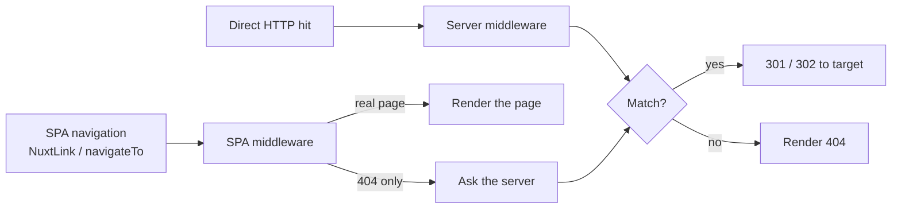

## What this page covers

You relaunched the store, the URL scheme moved from `/old-page` to `/new-page`, and you don't want every external link to drop visitors on a 404. You add a redirect in [Cockpit](https://cockpit.laioutr.cloud/o/_/p/_/settings/redirects), deploy, and the next hit on `/old-page` lands on `/new-page` with a 301.

This page explains what the storefront does once that redirect is in your `laioutrrc.json`. For the management UI (table, CSV import, bulk actions), see [Cockpit: Redirects](/cockpit/features/redirects).

---

## How a redirect reaches the site

Redirects you save in Cockpit are projected into `rcProject.redirects` at deploy time, the same way pages and markets are. The frontend reads that list and applies it in two places:



The server middleware handles direct hits: bookmarks, crawlers, hard reloads, links from email. The SPA middleware covers `<NuxtLink>` clicks and `navigateTo()` calls for paths Vue Router can't match to a built page.

The browser never receives the redirect list. Even projects with tens of thousands of rules don't ship them to the client bundle.

---

## What gets matched

### Exact paths

`/old-page → /new-page` matches `/old-page` and nothing else.

### Pattern paths

Source paths can use `:param` segments, and the captured values are substituted into the target:

```text
/p/:slug          →  /product/:slug
/c/:cat/p/:slug   →  /category/:cat/product/:slug
```

`/p/sneaker` resolves to `/product/sneaker`. Exact matches take priority over patterns automatically.

### Trailing slashes

`/old/` and `/old` resolve the same way. The root path `/` is the one exception and is always matched literally.

### Disabled redirects

Toggling **Enabled** off in Cockpit takes the rule out of the live matcher on the next deploy. The matcher only ever sees enabled rules.

---

## Permanent vs temporary

Each row in Cockpit carries its own **Permanent** flag.

| Cockpit field | HTTP status | When to use it                                                             |
| ------------- | ----------- | -------------------------------------------------------------------------- |
| Permanent on  | `301`       | Final URL move. Browsers and search engines cache it.                      |
| Permanent off | `302`       | Temporary swap, A/B test, holiday landing page, anything you might revert. |

Both layers honor the same flag, so direct hits and in-app navigations produce the same status code.

---

## Query strings and absolute targets

The original request's query string is appended to the target on both layers, so UTM tags and other marketing parameters survive the redirect:

```text
/old-page?utm_source=newsletter  →  /new-page?utm_source=newsletter
```

Targets that start with `http://` or `https://` are treated as external URLs. The redirect leaves your domain entirely, which is what you want for sunset pages or handing traffic to a partner.

::warning
External targets are open redirects by design: anyone with write access can send visitors to an arbitrary URL. Manage access through the **projectRedirects** permission in Cockpit.
::

---

## Ordering with locale and built routes

Two interactions are worth knowing about:

**Locale prefixes.** Redirects fire before [market detection](/frontend/features/multi-market). Write your targets in their canonical form without a locale prefix; market detection adds the prefix on the next hop.

**Real pages.** On the server, redirects win unconditionally. On the client, a path that resolves to a built page is never redirected. Avoid configuring redirect sources that shadow real pages, since direct hits and in-app clicks would then go to different places.

---

## Related

::card-group
  :::card{title="Cockpit: Redirects" to="/cockpit/features/redirects"}
  Create, edit, import, and export redirects from the project settings UI.
  :::

  :::card{title="Routing" to="/frontend/features/routing"}
  How URLs map to pages, page types, and route parameters.
  :::

  :::card{title="Multi-market" to="/frontend/features/multi-market"}
  Locale and region prefixes, and why redirects fire first while locale correction follows.
  :::
::
