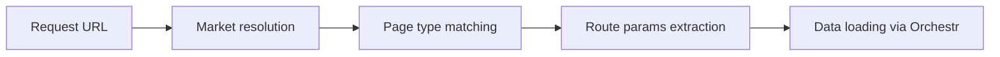

## Controlling your storefront URLs

You want your product pages at `/products/blue-sneaker`, your categories at `/shop/shoes`, and your home page at `/`. In Laioutr, **routing is driven by page types**. Instead of manually creating route files, you define page types with URL patterns, and the platform generates all routes at build time from the pages configured in Studio.



This page explains how that process works and how you can customize it.

---

## How routes are generated

Every page in your project is stored in `laioutrrc.json` as an **RC page**. Each RC page has a `type` field that references a [page type](/frontend/features/pagetypes) token (e.g. `ecommerce/product-detail-page`) and a `path` that defines its URL.

At build time, Laioutr reads all RC pages and generates Nuxt routes from them. The page type's metadata determines what route parameters are expected and what data queries run when the route is matched. You never write `pages/` directory route files for Studio-managed pages — the platform handles this.

---

## Default URL patterns

Page types declare their URL shape through **`pathConstraints`**. When a content manager creates a new page of a given type in Studio, the default path is suggested automatically. Common defaults from built-in apps:

| Page type | Default pattern | Example URL |
|---|---|---|
| Home | `/` | `/` |
| Product Detail (PDP) | `/products/:slug+` | `/products/blue-sneaker` |
| Product Listing (PLP) | `/categories/:slug+` | `/categories/shoes` |
| Search Results | `/search` | `/search?q=sneaker` |
| Content Page | `/pages/:slug+` | `/pages/about-us` |
| Landing Page | (custom per page) | `/summer-sale` |

The `:slug+` syntax means the slug can contain multiple segments (e.g. `/categories/men/shoes`). This is standard Nuxt dynamic route syntax.

---

## Customizing URL patterns

You control URL patterns by setting `pathConstraints` on your page type token:

```ts
export const ProductDetailPage = definePageTypeToken('ecommerce/product-detail-page', {
  kind: 'dynamic',
  pathConstraints: {
    requiredParams: ['slug'],
    default: '/shop/product/:slug+',
  },
  // ...
})
```

The three options inside `pathConstraints` are:

- **`exact`** — a fixed path with no parameters. Use this for pages like Home (`/`) or a single search page (`/search`).
- **`default`** — the path pattern Studio suggests when a content manager adds a new page of this type. Content managers can override it per page.
- **`requiredParams`** — parameter names that must appear in the path. Studio validates that any custom path a content manager enters includes these parameters.

::tip
If you omit `pathConstraints`, the platform derives a path from the page type name and any required parameters. Explicit constraints give you full control over your URL structure.
::

---

## Static vs. dynamic page types

The page type's **`kind`** affects routing behaviour:

**Dynamic page types** (e.g. Product Detail, Category Listing) typically have **one page definition** that matches many URLs via route parameters. A single Product Detail page with path `/products/:slug+` handles every product URL. The `:slug` parameter is extracted from the URL and passed to the page's data queries.

**Static page types** (e.g. Landing Page, Content Page) produce **one route per page**. Each page has its own fixed path set in Studio. A landing page at `/summer-sale` is a distinct route from another at `/black-friday`.

```ts
// Dynamic: one page handles all product URLs
definePageTypeToken('ecommerce/product-detail-page', {
  kind: 'dynamic',
  pathConstraints: { requiredParams: ['slug'], default: '/products/:slug+' },
  // ...
})

// Static: each page gets its own unique path
definePageTypeToken('my-app/landing-page', {
  kind: 'static',
  studio: { label: 'Landing Page', group: 'Marketing', icon: 'megaphone' },
})
```

For more detail on defining page types, see the [Page Types](/frontend/features/pagetypes) documentation.

---

## How markets affect routing

When your project serves [multiple markets](/frontend/features/multi-market), routing gains an extra layer. Each market has one or more **domains**, and each domain can have a **path prefix** for a specific language.

The resolution flow is:

1. **Domain matching** — the request's hostname determines the market (e.g. `www.shop.ch` resolves to Switzerland, `www.shop.de` resolves to Germany).
2. **Path prefix matching** — if the domain has a path prefix for a language (e.g. `/fr` for French), it is stripped before page type matching.
3. **Page type matching** — the remaining path is matched against the generated routes.

This means the same page type can produce different URLs per market:

| Market | Domain | Language prefix | Full URL |
|---|---|---|---|
| Switzerland | `www.shop.ch` | (none, German default) | `www.shop.ch/products/sneaker` |
| Switzerland | `www.shop.ch` | `/fr` | `www.shop.ch/fr/products/sneaker` |
| Germany | `www.shop.de` | (none) | `www.shop.de/products/sneaker` |

Pages can also be **scoped to specific markets** via `marketIds` in Studio. A page limited to the Switzerland market will not generate routes on `www.shop.de`. See [Multi-market](/frontend/features/multi-market) for configuration details.

---

## Path validation in Studio

Studio uses the page type's `pathConstraints` to validate paths that content managers enter. If a page type declares `requiredParams: ['slug']`, Studio will not allow saving a path like `/products` — it must include `:slug` (e.g. `/products/:slug`).

This prevents broken routes where a dynamic page type expects a parameter that the URL does not provide. The `default` path is pre-filled when adding a new page, so content managers only need to change it if they want a custom URL structure.

---

## Redirects and routing

Laioutr's routing system generates routes from page types, but you may also need to handle old URLs, campaign short-links, or structural URL migrations. These are covered by Nuxt's redirect mechanisms. See [Redirects](/frontend/features/redirects) for the full guide.

For information on how URLs work across languages, including the language switcher and localized slugs, see [Multi-language support](/frontend/features/multi-language-support).
