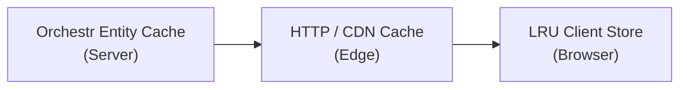
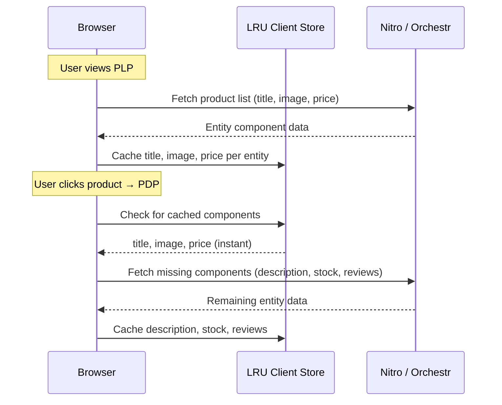

The Laioutr frontend is a Nuxt 3 app with **SSR enabled by default** and **no HTTP caching configured out of the box**. The server renders HTML for every request, hydrates on the client, and you opt in to CDN caching by adding route rules.

---

## Caching pipeline overview

Data passes through **three caching layers** before reaching the user:



| Layer                     | Where                     | What it caches                                                  | Configured via                                                                                      |
| ------------------------- | ------------------------- | --------------------------------------------------------------- | --------------------------------------------------------------------------------------------------- |
| **Orchestr Entity Cache** | Nitro server (in-process) | Query, link, and component resolver results at the entity level | Per-handler `strategy`, `ttl`, `buildCacheKey` (see [Orchestr Caching](/frontend/orchestr/caching)) |
| **HTTP / CDN Cache**      | CDN edge or reverse proxy | Full HTML responses and API JSON responses                      | `Cache-Control` headers via `routeRules` or middleware                                              |
| **LRU Client Store**      | Browser (Pinia-backed)    | Entity component data already loaded during the session         | Automatic; no configuration needed                                                                  |

::note
Orchestr's cache operates at the **entity component level**, not at the HTTP request level. Two different pages referencing the same product entity share cached component data on the server. This is separate from Nuxt's built-in `useFetch` / `useAsyncData` caching.
::

---

## Actions and SSR

When you call a server action via **useFetchAction**, the action runs **once on the server** during SSR and the result is **transferred to the client** via the serialized payload. The action does not re-execute on client hydration.

---

## Enabling CDN caching

To have a CDN cache SSR responses, send **Cache-Control** headers via **route rules**. A typical starting point:

```ts
// nuxt.config.ts
export default defineNuxtConfig({
  routeRules: {
    // Default: short CDN TTL for HTML, no browser cache
    '/**': {
      headers: { 'Cache-Control': 'public, max-age=0, s-maxage=15, must-revalidate' },
    },
    // Don't cache session-specific pages
    '/checkout/**': { headers: { 'Cache-Control': 'private, no-store, no-cache' } },
    '/cart': { headers: { 'Cache-Control': 'private, no-store, no-cache' } },
    '/login': { headers: { 'Cache-Control': 'private, no-store, no-cache' } },
  },
});
```

::tip
You can also define the same rules under `nitro.routeRules` if you prefer to keep Nitro config separate. The behaviour is identical.
::

**TTL guidance:**

- **HTML** — keep TTL short (15-60 seconds) so new deploys propagate quickly and users don't get stale asset references.
- **Static assets** (JS, CSS, images) — long TTL (1 year) with cache-busting filenames; Nuxt handles this automatically.

### Caching API responses

API routes (`/api/orchestr/...` or your own server routes) can also be cached by the CDN. Add `routeRules` for those paths with appropriate `Cache-Control` and `Vary` headers. Do not cache mutation endpoints or routes that return user-specific data.

### Overriding from a module

In your module's setup, extend `nuxt.options.routeRules` to add cache rules for routes your module registers. Merge with existing rules rather than overwriting the whole object so other modules' rules are preserved.

---

## Multi-market and locale cache keys

If your frontend serves **multiple markets, languages, or domains**, the CDN must store separate cached entries for each variant. Without this, a German user could receive HTML cached from a French request.

### Using `Vary` headers

Add a `Vary` header so the CDN keys on the relevant request headers:

```ts
// nuxt.config.ts
export default defineNuxtConfig({
  routeRules: {
    '/**': {
      headers: {
        'Cache-Control': 'public, max-age=0, s-maxage=30, must-revalidate',
        'Vary': 'Accept-Language, X-Market',
      },
    },
  },
});
```

If your setup passes market or currency information through custom headers (e.g. `X-Market`, `X-Currency`), include those in `Vary`. Be aware that each unique combination of varied headers creates a separate cache entry, so avoid varying on high-cardinality headers.

### Locale-prefixed routes

When locales are part of the URL path (e.g. `/de/products/...`, `/fr/products/...`), the CDN naturally caches them as separate entries since the URL differs. You can still define per-locale route rules:

```ts
// nuxt.config.ts
export default defineNuxtConfig({
  routeRules: {
    '/de/**': {
      headers: { 'Cache-Control': 'public, max-age=0, s-maxage=60, must-revalidate' },
    },
    '/fr/**': {
      headers: { 'Cache-Control': 'public, max-age=0, s-maxage=60, must-revalidate' },
    },
  },
});
```

### Domain-based multi-market

When each market is served from a different domain (e.g. `shop.de`, `shop.fr`), most CDNs key on the `Host` header automatically. Verify this with your CDN provider. If you use a single CDN distribution across domains, add `Host` to your `Vary` header or configure CDN-level cache policies per origin domain.

---

## Handling personalized and time-sensitive content

For CDN caching to work, the SSR HTML for a given URL (and locale/market) must be the same for every user. Move personalized or session-specific content to the client:

- Wrap personalized UI (cart count, wishlist, "Hello, {name}") in `<ClientOnly>` or guard it with `import.meta.client` / `onMounted`.
- Show a **skeleton placeholder** with matching dimensions to avoid layout shift.
- For **time-sensitive data** (stock levels, live prices), either shorten the TTL for those routes or fetch the data client-side after hydration so the cached HTML stays stable.

---

## LRU client-side store

The third caching layer lives in the browser. When Orchestr returns entity data during a page load, resolved **entity components** are stored in a **Pinia-backed LRU cache**.

### How it works

Consider a typical shopping flow. You browse a **product listing page** where each product card loads entity components (title, image, price). When you click through to a **product detail page**, the LRU store already has those components cached. They render immediately while the PDP fetches remaining components (description, stock, reviews).



**Key characteristics:**

- **Automatic** — no configuration needed.
- **Entity-component granularity** — cache key is entity identifier + component type. Pages sharing the same entity share cached data.
- **Session-scoped** — lives in browser memory, not persisted to storage.
- **LRU eviction** — bounded memory; least recently used entries are evicted first.

::tip
Design your sections to use the same canonical component types (e.g. `product-title`, `product-image`) across listing and detail pages to maximize cache hits.
::

---

## Quick reference

| What                        | Where                                             | Default                                            |
| --------------------------- | ------------------------------------------------- | -------------------------------------------------- |
| **SSR**                     | `nuxt.config.ts` → `ssr`                          | `true` (Nuxt default)                              |
| **HTML caching**            | `routeRules` → `headers['Cache-Control']`         | Not set                                            |
| **API response caching**    | `routeRules` for `/api/**` or per-handler headers | Not set                                            |
| **Multi-market cache keys** | `Vary` header or URL-based locale prefixes        | Not set                                            |
| **Orchestr data cache**     | Per-handler `strategy`, `ttl`, `buildCacheKey`    | See [Orchestr Caching](/frontend/orchestr/caching) |
| **Client store**            | Automatic LRU                                     | Always on                                          |
