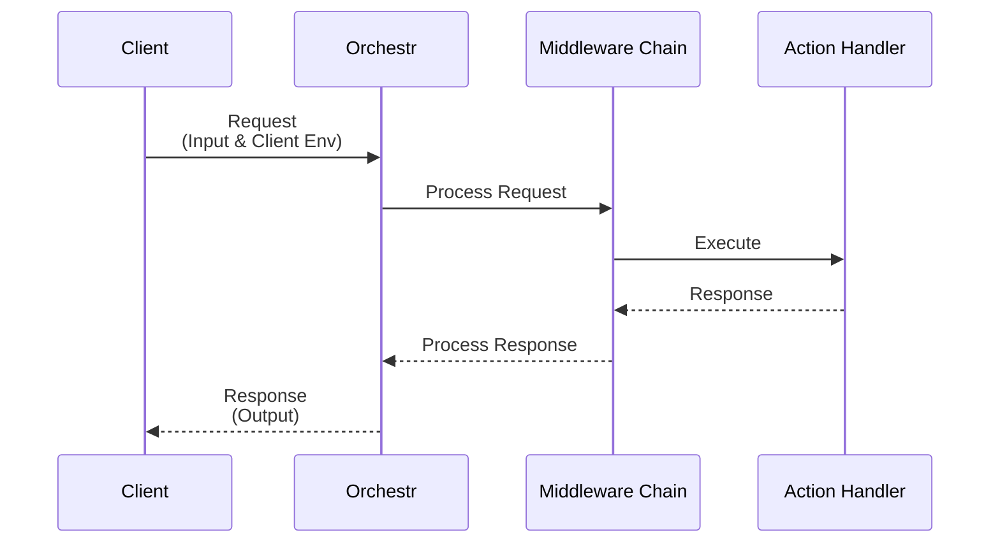

Orchestr actions are the core building blocks for interacting with external services. They can be used to subscribe to newsletters, create orders, or any other action that requires interaction with an external service.

## Tokens

An action-token is a string that uniquely identifies an action. Additionally, it contains type-metadata for the action like the input and output-types. In practice this makes the action-token a contract between the frontend and the backend for executing a server-side request.

Each action-token can be implemented in an app-package by an [Action Handler](#action-handler) and can be used in frontend components using the action-composables (See [Frontend Usage](#frontend-usage)).

### Canonical Tokens

A canonical action-token is a pre-defined token that is part of the `@laioutr-core/canonical-types` package. This package contains action-tokens for common actions like subscribing to a newsletter, creating an order, or retrieving customer orders.

You can find a list of canonical action-tokens on the [Canonical Actions](/frontend/api-reference/ecommerce/actions) page.

### Custom Tokens

Sometimes you might want to create a custom action-token that is not part of the canonical-types package. This can be done by creating a new action-token and implementing an [Action Handler](#action-handler) for it.

Input and output of an action are defined using the `zod` library. This allows for type-safety and validation of the input and output data. Both input and output are optional and will default to `undefined`.

```typescript [shared/tokens/newsletter/custom.action.ts] twoslash
// @errors: 2589 2345
import { z } from 'zod/v4';
import { defineActionToken } from '@laioutr-core/core-types/orchestr';

// It is recommended to use a namespace like `my-package/` to avoid conflicts with other packages.
export const CustomAction = defineActionToken('my-package/newsletter/custom-action', {
  input: z.object({
    email: z.string(),
  }),
  output: z.object({
    status: z.enum(['success', 'error']),
  }),
});
```

::tip
Place token files in `src/runtime/shared/` so both server handlers and frontend code can import the same token reference. See [Runtime layout](/apps/app-development/coding-standards#runtime-layout) for the full directory convention.
::

## Action Handler

Orchestr actions are defined using the `defineOrchestr.actionHandler` method. This method takes an action-token for type-safety and a handler function that will be called when the action is executed. The handler function will receive the input-data of the action-token and must return the output-data of the action-token.

```typescript [server/orchestr/newsletter/subscribe.ts] twoslash
import { defineOrchestrMock as defineOrchestr } from '@laioutr-core/orchestr/types';
declare const subscribeToNewsletter: (email: string) => Promise<void>;
// ---cut---
import { SubscribeAction } from '@laioutr-core/canonical-types/newsletter';

// Export the return-value as default to register it automatically
export default defineOrchestr.actionHandler(SubscribeAction, async ({ input }) => {
    await subscribeToNewsletter(input.email);
    return { status: 'success' as const };
});
```

Technically, each registered action acts as an http POST handler on the server. The path is computed, using the action-token name. E.g. `ecommerce/auth/register` will be available at `POST /api/orchestr/action/ecommerce/auth/register`.

The action response is encoded as a [turbo-stream](https://github.com/jacob-ebey/turbo-stream) response, which is a superset of JSON. This means that any data-type supported by turbo-stream can be returned. This includes regular objects and arrays but also Dates, Maps, Sets, etc.

The client adds `clientEnv` to every request. This object contains information about the client environment (like locale or currency). You can modify it with the [`orchestr:client-env:modify` hook](/frontend/features/hooks#client-environment).

```typescript [server/orchestr/newsletter/subscribe.ts] twoslash
import { defineActionHandlerMock as defineActionHandler } from '@laioutr-core/orchestr/types';
declare const getLanguageByLocale: (locale: string) => string;
// ---cut---
import { AuthRegisterAction } from '@laioutr-core/canonical-types/ecommerce';

// Alternatively, you can use the shortcut `defineActionHandler`
export default defineActionHandler(AuthRegisterAction, async ({ clientEnv }) => {
  const userLanguage = getLanguageByLocale(clientEnv.locale);
  // ...
});
```

### Middleware

Middleware is a way to intercept and modify the input, output or context of an action. It is a way to add additional functionality to an action without having to modify the action-handler.

See [Middleware](middleware) for more information.

### Error Handling

If executing an action on the server fails, an error should be thrown. You can either just throw a generic `Error` object or use one of the error-classes from the `@laioutr-core/orchestr/*` package.

```typescript [server/orchestr/cart/add-items.ts] twoslash
import { defineActionHandlerMock as defineActionHandler } from '@laioutr-core/orchestr/types';
// ---cut---
import { CartAddItemsAction, ProductNotFoundError } from '@laioutr-core/canonical-types/ecommerce';

export default defineActionHandler(CartAddItemsAction, async ({ input }) => {
  throw new ProductNotFoundError('product-123');
});
```

For custom actions, you can also create your own error-classes using the [`ebec`](https://github.com/tada5hi/ebec/tree/master/packages/ebec) or supplementary [`@ebec/http`](https://github.com/tada5hi/ebec/tree/master/packages/http) package.

::tip
For the pattern of mapping raw backend errors (Shopify `userErrors`, Shopware error payloads) into canonical Laioutr errors before throwing, see the [Translating vendor errors](/frontend/orchestr/recipes/translating-vendor-errors) recipe.
::

::code-group
```typescript [ActionHandler.ts] twoslash
import { defineActionHandlerMock as defineActionHandler } from '@laioutr-core/orchestr/types';

import { BaseError } from 'ebec';
import { NotFoundError } from '@ebec/http';

declare class CustomNotFoundError extends NotFoundError {}
declare class CustomGeneralError extends BaseError {}
// ---cut---
import { CartAddItemsAction } from '@laioutr-core/canonical-types/ecommerce';
import { PreconditionFailedError } from '@ebec/http';

export default defineActionHandler(CartAddItemsAction, async ({ input }) => {
  throw new CustomNotFoundError('product-123');
  // => 404 Not Found
  
  throw new CustomGeneralError();
  // => 500 Internal Server Error

  throw new PreconditionFailedError('Custom message');
  // => 412 Precondition Failed

  throw new Error('Regular error object');
  // => 500 Internal Server Error
});
```

```typescript [CustomNotFoundError.ts] twoslash
// @useDefineForClassFields: false
// ---cut---
import { NotFoundError } from '@ebec/http';

/** A custom error-class, returning a 404 response. Accepts a productId as data. */
export class CustomNotFoundError extends NotFoundError {
  override data!: { productId: string };
  constructor(productId: string){
    super({ message: 'My custom not found error' });
    this.data = { productId };
  }
}
```

```typescript [CustomGeneralError.ts] twoslash
import { BaseError } from 'ebec';

/** A custom error-class, returning a 500 response. */
export class CustomGeneralError extends BaseError {
  constructor(){
    super({ message: 'Something unknown went wrong here' })
  }
}
```
::

## Frontend Usage

Actions can be called from the frontend using the `useQueryAction` or `useMutationAction` composables. These use [pinia-colada](https://pinia-colada.esm.dev/) under the hood. You can observe and react to their lifecycle using [Nuxt runtime hooks](/frontend/features/hooks#orchestr-client-hooks).

### Query

Uses pinia-colada's [`useQuery`](https://pinia-colada.esm.dev/guide/queries.html) method. You will have access to typed data through the `data` property. All other properties from the pinia-colada's `useQuery` method are available as well. You can pass a second argument to pass typed input to the action.

Queries are executed immediately when the component is mounted or when the input changes.

```typescript [app/get-customer-orders.ts] twoslash
import { useQueryActionMock as useQueryAction } from '@laioutr-core/orchestr/types';
// ---cut---
import { AddressGetAllAction } from '@laioutr-core/canonical-types/ecommerce';

// Hover over `data` to see the type of the data
const { data, isLoading } = useQueryAction(AddressGetAllAction);
```

### Mutation

Uses pinia-colada's [`useMutation`](https://pinia-colada.esm.dev/guide/mutations.html) method.

Mutations are preferred over queries when you want to execute an action on an event like a button click.

```vue [app/components/newsletter-form.vue] twoslash
<script setup lang="ts">
import { ref } from 'vue';
import { useMutationActionMock as useMutationAction } from '@laioutr-core/orchestr/types';
// ---cut---
import { SubscribeAction } from '@laioutr-core/canonical-types/newsletter';

const { mutate: subscribeNewsletter, isLoading } = useMutationAction(SubscribeAction);
const email = ref('')
</script>

<template>
  <form @submit.prevent="subscribeNewsletter({ email })">
    <input v-model="email" />
    <button :disabled="isLoading">
      Subscribe to newsletter
    </button>
  </form>
</template>
```

### Other Composables

#### fetchAction

The `fetchAction` function is the bare-bone function that makes a post-request to orchestr to execute an action. It returns the decoded response or throws on error. There is no caching or other features built-in.

```typescript twoslash
import { fetchActionMock as fetchAction } from '@laioutr-core/orchestr/types';
import { SubscribeAction } from '@laioutr-core/canonical-types/newsletter';
// ---cut---
const response = await fetchAction(SubscribeAction, {
  email: 'test@example.com'
});
```

#### useFetchAction

The `useFetchAction` composable is a wrapper around the [`fetchAction`](#fetchaction) function. It provides the same functionality as the `fetchAction` function but uses the [`useAsyncData`](https://nuxt.com/docs/api/composables/use-async-data) composable under the hood in order to fetch data only once when running on the server.

```typescript twoslash
import { useFetchActionMock as useFetchAction } from '@laioutr-core/orchestr/types';
import { SubscribeAction } from '@laioutr-core/canonical-types/newsletter';
// ---cut---
const { data, error } = await useFetchAction(SubscribeAction, {
  email: 'test@example.com'
});
```

## Action Flow

The following diagram shows how an action flows through the system:


