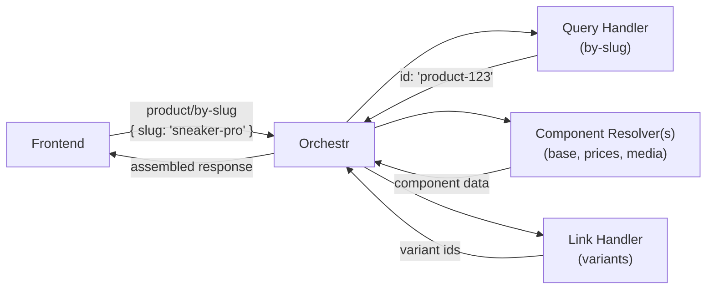

A product page needs to load a product by its URL slug. A category page needs to list products belonging to that category. A cart needs to show the items it contains. **Queries** and **links** are how you teach Orchestr to fetch this data from your backend.



## Queries

A **query** takes structured input and returns one or more entity IDs. Orchestr then passes those IDs to [component resolvers](/frontend/orchestr/component-resolvers) to fetch the actual data.

### Defining a Query Token

Every query starts with a **token** — the contract between your app and the frontend. It declares the query name, entity type, input schema, and whether it returns a single entity or a list.

```ts twoslash
// src/runtime/shared/tokens/store-locator.ts
import { z } from 'zod/v4';
import { defineQueryToken } from '@laioutr-core/core-types/orchestr';

export const StoreBySlugQuery = defineQueryToken('store-locator/store/by-slug', {
  entity: 'StoreLocation',
  type: 'single',
  label: 'Store by slug',
  input: z.object({
    slug: z.string(),
  }),
});
```

For queries that return lists, set `type: 'multi'` and optionally provide a `defaultLimit` for pagination:

```ts twoslash
import { z } from 'zod/v4';
import { defineQueryToken } from '@laioutr-core/core-types/orchestr';
// ---cut---
export const StoreSearchQuery = defineQueryToken('store-locator/store/search', {
  entity: 'StoreLocation',
  type: 'multi',
  label: 'Store search',
  input: z.object({
    query: z.string(),
    radius: z.number().optional(),
  }),
  defaultLimit: 20,
});
```

#### Query token fields

| Field          | Required | Description                                                                                     |
| -------------- | -------- | ----------------------------------------------------------------------------------------------- |
| `entity`       | yes      | The entity type this query returns (e.g. `'Product'`, `'Category'`).                            |
| `type`         | yes      | `'single'` for one result, `'multi'` for paginated lists.                                       |
| `label`        | yes      | Human-readable name, shown in Orchestr DevTools and Studio.                                     |
| `input`        | no       | Zod schema for the query input. Omit for queries with no parameters.                            |
| `defaultLimit` | no       | Default page size for `multi` queries. When set, `pagination` is always defined in the handler. |
| `description`  | no       | Longer description for documentation and tooling.                                               |

### Writing a Query Handler

A query handler is a file in your app's `orchestr/` directory. It implements a query token and returns entity IDs.

Here is a single-entity query:

```ts
// src/runtime/server/orchestr/StoreLocation/by-slug.query.ts
import { StoreBySlugQuery } from '../../shared/tokens/store-locator';
import { defineMyAppQuery } from '../../middleware/defineMyApp';

export default defineMyAppQuery(
  StoreBySlugQuery,
  async ({ input, context }) => {
    const store = await context.storeApi.getBySlug(input.slug);

    if (!store) {
      throw createError({ statusCode: 404, message: `Store not found: ${input.slug}` });
    }

    return { id: store.id };
  },
);
```

And a multi-entity query with pagination, sorting, and filters:

```ts
// src/runtime/server/orchestr/StoreLocation/search.query.ts
import { StoreSearchQuery } from '../../shared/tokens/store-locator';
import { defineMyAppQuery } from '../../middleware/defineMyApp';

export default defineMyAppQuery({
  implements: StoreSearchQuery,
  run: async ({ input, context, pagination, sorting, filter }) => {
    const result = await context.storeApi.search({
      query: input.query,
      radius: input.radius,
      limit: pagination.limit,
      offset: pagination.offset,
      sorting,
      filter,
    });

    return {
      ids: result.stores.map((store) => store.id),
      total: result.total,
      availableSortings: [
        { key: 'distance', label: 'Distance' },
        { key: 'name', label: 'Name A-Z' },
      ],
      sorting: sorting ?? 'distance',
    };
  },
});
```

::tip
There are two syntax forms for `defineMyAppQuery`. The short form passes `(token, handlerFn)` directly — use it for simple handlers. The object form with `{ implements, run }` gives you access to additional options like `cache` and `order`.
::

### Handler arguments

| Argument              | Available       | Description                                                                               |
| --------------------- | --------------- | ----------------------------------------------------------------------------------------- |
| `input`               | always          | Parsed and validated query input, typed from the token's Zod schema.                      |
| `pagination`          | `multi` queries | `{ limit, offset, page }`. Always defined when the token sets `defaultLimit`.             |
| `sorting`             | `multi` queries | The requested sorting key, if any.                                                        |
| `filter`              | `multi` queries | Selected filters from the frontend.                                                       |
| `requestedComponents` | always          | Which components the frontend needs. Use this to skip expensive API fields.               |
| `requestedLinks`      | always          | Which links (and their nested components) the frontend needs.                             |
| `shouldLoad`          | always          | Helper to check if a component or link path is requested. Accepts a string or path array. |
| `passthrough`         | always          | Store for passing raw data to component resolvers, avoiding duplicate API calls.          |
| `context`             | always          | Middleware-provided context (API clients, config, etc.).                                  |
| `$entity`             | always          | Type-safe entity builder, same as in component resolvers.                                 |

### Returning results

**Single queries** return `{ id }` — the ID of the matching entity:

```ts
return { id: 'store-123' };
```

**Multi queries** return `{ ids, total? }` — an array of entity IDs and optionally the total count for pagination:

```ts
return {
  ids: ['store-1', 'store-2', 'store-3'],
  total: 42,
  availableSortings: [{ key: 'distance', label: 'Distance' }],
  availableFilters: [{ id: 'city', label: 'City', type: 'list', presentation: 'text', values: [{ id: 'berlin', label: 'Berlin', count: 12 }] }],
  sorting: 'distance',
};
```

Each `availableSortings` entry is `{ key: string, label?: string }`, where `key` is the value passed back in the `sorting` request. For the shape of the `filter` argument and the four `availableFilters` variants (list, boolean, range, intervals), see [Filters](/frontend/orchestr/filters).

## Links

A **link** defines a relationship between two entity types — for example, a Product has Variants, or a Category has Products. Links resolve to a list of target entity IDs for each source entity.

### Defining a Link Token

```ts twoslash
// src/runtime/shared/tokens/store-locator.ts
import { defineLinkToken } from '@laioutr-core/core-types/orchestr';

export const StoreEventsLink = defineLinkToken('store-locator/store/events', {
  label: 'Store Events',
  source: 'StoreLocation',
  target: 'StoreEvent',
  type: 'multi',
  defaultLimit: 10,
});
```

#### Link token fields

| Field          | Required | Description                                                         |
| -------------- | -------- | ------------------------------------------------------------------- |
| `source`       | yes      | The source entity type (e.g. `'Product'`).                          |
| `target`       | yes      | The target entity type (e.g. `'ProductVariant'`).                   |
| `type`         | yes      | `'single'` for one-to-one, `'multi'` for one-to-many relationships. |
| `label`        | yes      | Human-readable name for tooling.                                    |
| `defaultLimit` | no       | Default page size for `multi` links.                                |
| `description`  | no       | Longer description for documentation.                               |
| `nullable`     | no       | Whether the link can be absent for some source entities.            |

### Writing a Link Handler

Link handlers are files in your app's `orchestr/` directory. They receive source entity IDs and return the target IDs for each source.

```ts
// src/runtime/server/orchestr/StoreLocation/events.link.ts
import { StoreEventsLink } from '../../shared/tokens/store-locator';
import { defineMyAppLink } from '../../middleware/defineMyApp';

export default defineMyAppLink(
  StoreEventsLink,
  async ({ entityIds, context, pagination }) => {
    const results = await context.storeApi.getEvents(entityIds, {
      limit: pagination?.limit ?? 10,
    });

    return {
      links: results.map((result) => ({
        sourceId: result.storeId,
        targetIds: result.events.map((event) => event.id),
        entityTotal: result.totalEvents,
      })),
    };
  },
);
```

Like query handlers, link handlers also support the object form with `{ implements, run, cache }` for additional configuration.

### Link handler arguments

| Argument      | Description                                                   |
| ------------- | ------------------------------------------------------------- |
| `entityIds`   | Source entity IDs to resolve links for.                       |
| `pagination`  | `{ limit, offset, page }` when the token sets `defaultLimit`. |
| `sorting`     | Requested sorting key.                                        |
| `filter`      | Selected filters.                                             |
| `passthrough` | Access data passed from query handlers.                       |
| `$entity`     | Type-safe entity builder for inline entity data.              |

### Returning link results

**Multi links** return an array of `{ sourceId, targetIds }` mappings:

```ts
return {
  links: [
    { sourceId: 'store-1', targetIds: ['event-1', 'event-2'], entityTotal: 5 },
    { sourceId: 'store-2', targetIds: ['event-3'], entityTotal: 1 },
  ],
};
```

Each multi-link entry can also include `availableSortings` and `availableFilters` for that specific source (using the same shape as multi-query responses). See [Filters](/frontend/orchestr/filters) for the filter format.

**Single links** return `{ sourceId, targetId }` (singular) per entry:

```ts
return {
  links: [
    { sourceId: 'product-1', targetId: 'brand-abc' },
  ],
};
```

## Caching

Both query and link handlers support caching with a `cache` property:

```ts
export default defineMyAppQuery({
  implements: StoreSearchQuery,
  cache: {
    strategy: 'ttl',
    ttl: '1 hour',
    buildCacheKey: ({ input, pagination }) =>
      `${input.query}-${pagination.limit}-${pagination.offset}`,
  },
  run: async (args) => { /* ... */ },
});
```

| Strategy | Behavior                                                                      |
| -------- | ----------------------------------------------------------------------------- |
| `ttl`    | Cache the result for a fixed duration.                                        |
| `swr`    | Stale-while-revalidate — serve stale data while refreshing in the background. |
| `live`   | Disable caching (useful to explicitly mark a handler as uncacheable).         |

The `buildCacheKey` function receives the handler arguments and must return a unique string key. Return `null` or `undefined` to skip caching for a specific request.

See [Caching](/frontend/orchestr/caching) for the full reference.

## Query Template Providers

A **query template provider** supplies valid input presets for a query token. Studio uses these to offer autocomplete when editors configure page queries (e.g. "pick a category for this listing page").

Register a provider using the builder's `queryTemplateProvider` shortcut:

```ts
// src/runtime/server/orchestr/Product/byCategorySlug.template.ts
import { ProductsByCategorySlugQuery } from '@laioutr-core/canonical-types/ecommerce';
import { defineMyAppQueryTemplateProvider } from '../../middleware/defineMyApp';

export default defineMyAppQueryTemplateProvider({
  for: ProductsByCategorySlugQuery,
  run: async ({ input, context }) => {
    const categories = await context.api.listCategories({ term: input.term, limit: 50 });

    return categories.map((cat) => ({
      input: { categorySlug: cat.slug },
      label: cat.name,
    }));
  },
});
```

The handler receives an `input` object with an optional `term` (the search text the editor typed in Studio) and returns an array of `{ input, label }` objects. Each `input` must match the query token's Zod schema.

Like other handlers, query template providers are auto-discovered from the `orchestr/` directory and support middleware context via the builder pattern.

## Advanced

### Inline Entity Data

Instead of returning just IDs, query handlers can return entity component data inline. Declare the components your handler provides via `provides`, then return `{ entity }` (single) or `{ entities }` (multi) with pre-built entity objects using the `$entity` helper.

```ts
export default defineMyAppQuery({
  implements: StoreBySlugQuery,
  provides: [StoreLocationBase, StoreLocationAddress],
  run: async ({ input, context, $entity }) => {
    const store = await context.storeApi.getBySlug(input.slug);

    return {
      entity: $entity({
        id: store.id,
        [StoreLocationBase]: { name: store.name, slug: store.slug },
        [StoreLocationAddress]: { city: store.city, zip: store.zip },
      }),
    };
  },
});
```

**How** `provides` **interacts with component resolvers:** Orchestr splits the frontend's requested components into two sets based on `provides`:

- Components listed in `provides` are extracted from the query handler's inline entity data and returned directly.
- All remaining requested components are forwarded to [component resolvers](/frontend/orchestr/component-resolvers) as usual.

If your query handler declares `provides: [StoreLocationBase]` but the frontend also requests `address` and `media`, only `address` and `media` go to component resolvers. The query handler's inline data takes precedence for the components it declares. You do not need to provide all components; provide only those your query already has data for, and let resolvers handle the rest.

Use this when your backend already returns component data as part of the query response (e.g. a search endpoint that includes product names and prices). If the data requires a separate API call per entity, let component resolvers handle it instead.

### Passthrough Data

**Passthrough** lets query handlers forward raw backend data to component resolvers and link handlers, avoiding duplicate API calls. Data flows one way: query handler sets it, downstream handlers read it.

Define a typed token with `createPassthroughToken`, then use the `PassthroughStore` API:

```ts
// tokens/passthrough.ts
import { createPassthroughToken } from '#orchestr/passthrough';
export const storeFragmentToken = createPassthroughToken<StoreApiResponse>('store-fragment');

// query handler
export default defineMyAppQuery(
  StoreBySlugQuery,
  async ({ input, context, passthrough }) => {
    const store = await context.storeApi.getBySlug(input.slug);
    passthrough.set(storeFragmentToken, store);
    return { id: store.id };
  },
);

// component resolver
export default defineMyAppResolver(
  StoreLocationBase,
  async ({ entityIds, passthrough, context }) => {
    const cached = passthrough.get(storeFragmentToken);
    const store = cached ?? await context.storeApi.getById(entityIds[0]);
    return { /* ... */ };
  },
);
```

The `PassthroughStore` exposes four methods:

| Method    | Description                                    |
| --------- | ---------------------------------------------- |
| `set`     | Store a value under a typed token.             |
| `get`     | Retrieve the value, or `undefined` if not set. |
| `require` | Retrieve the value, or throw if not set.       |
| `has`     | Check whether a token has been set.            |

### The `shouldLoad` helper

When your backend supports selective field loading (e.g. GraphQL), use `shouldLoad` to skip fields the frontend did not request:

```ts
const response = await context.queryStorefront(ProductBySlugQuery, {
  handle: input.slug,
  // Check if a direct component is requested
  includeMedia: shouldLoad('media'),
  includeDescription: shouldLoad('description'),
});
```

`shouldLoad` also accepts a **path array** to check components requested on nested links. Pass link tokens and component tokens to walk the wire query's link tree: each element except the last navigates into a link, and the last element checks for a component (or link) at that level.

Here is a real-world pattern from a category query that conditionally includes product data depending on what the frontend requested:

```ts
import { CategoryProductsLink, ProductVariantsLink } from '@laioutr-core/canonical-types/ecommerce';

export default defineMyAppQuery(CategoryBySlugQuery, async ({ input, context, shouldLoad }) => {
  const response = await context.api.getCategoryBySlug(input.slug, {
    // Direct components on the category itself
    includeBase: shouldLoad(CategoryBase),
    includeMedia: shouldLoad(CategoryMedia),

    // Does the frontend want the CategoryProducts link at all?
    includeProducts: shouldLoad([CategoryProductsLink]),

    // Components on the linked products (one level deep)
    includeProductBase: shouldLoad([CategoryProductsLink, ProductBase]),
    includeProductPrices: shouldLoad([CategoryProductsLink, ProductPrices]),
    includeProductMedia: shouldLoad([CategoryProductsLink, ProductMedia]),

    // Two levels deep: variant components on linked products
    includeVariants: shouldLoad([CategoryProductsLink, ProductVariantsLink]),
    includeVariantBase: shouldLoad([CategoryProductsLink, ProductVariantsLink, ProductVariantBase]),
  });

  // ...
});
```

Since tokens are strings at runtime, you can also pass plain strings (`shouldLoad('media')`, `shouldLoad(['ecommerce/product/variants', 'base'])`), but using imported tokens gives you type safety and rename support.

## File Organization

All files inside the `orchestr/` directory registered with `registerLaioutrApp` are auto-loaded — every exported handler (query, link, component resolver, action) is automatically discovered and registered. No special file suffixes or naming conventions are required.

That said, the existing Laioutr apps use a convention of `.query.ts`, `.link.ts`, `.resolver.ts` suffixes to make the handler type obvious at a glance:

```text
src/runtime/server/orchestr/
├── Product/
│   ├── bySlug.query.ts
│   ├── search.query.ts
│   └── base.resolver.ts
├── Category/
│   ├── bySlug.query.ts
│   └── products.link.ts
├── StoreLocation/
│   ├── by-slug.query.ts
│   ├── search.query.ts
│   └── events.link.ts
└── plugins/
    └── zodFix.ts
```

The directory structure and file names are purely organizational — use whatever makes sense for your team.
