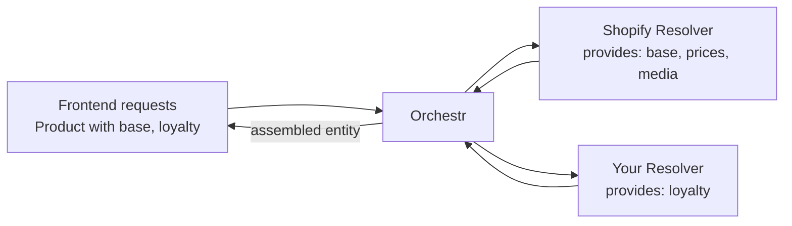

Your shop system provides product names, prices, and images. But what if you need loyalty points from your CRM, or stock levels from your ERP? Component resolvers let you attach data from any source to any entity, without modifying existing code.

## How It Works

Every entity in Laioutr is composed of **components** — named slices of data, each with a typed schema. A component resolver tells Orchestr: "I can provide these components for this entity type." When the frontend requests an entity, Orchestr calls the relevant resolvers and assembles the result.



Multiple resolvers can serve the same entity type. Each resolver declares which components it **provides**, and Orchestr routes requests accordingly.

## Defining a Component Token

Before writing a resolver, define the **component token** — the name and schema of the data your component will hold. Tokens use [Zod](https://zod.dev/) for runtime validation and type inference.

```ts
// src/runtime/shared/tokens/product-loyalty.ts
import { z } from 'zod/v4';
import { defineEntityComponentToken } from '@laioutr-core/core-types/orchestr';

export const ProductLoyalty = defineEntityComponentToken('loyalty', {
  entityType: 'Product',
  schema: z.object({
    /** Loyalty points earned when purchasing this product. */
    points: z.number(),
    /** Customer tier required for bonus points. */
    tier: z.enum(['bronze', 'silver', 'gold']).optional(),
  }),
});
```

The first argument (`'loyalty'`) becomes the component name — the key the frontend uses when requesting this data. The `entityType` ties it to the `Product` entity.

::tip
If you are building a [Laioutr app](/apps/app-development/app-starter), place tokens in `src/runtime/shared/` so both server and client code can import them.
::

## Writing a Component Resolver

A component resolver is a file in your app's `orchestr/` directory. Orchestr auto-discovers all handlers in that directory.

Here is a minimal resolver that provides the `loyalty` component:

```ts
// src/runtime/server/orchestr/Product/loyalty.resolver.ts
import { ProductLoyalty } from '../../shared/tokens/product-loyalty';

interface LoyaltyProduct {
  id: string;
  loyaltyPoints: number;
  loyaltyTier?: 'bronze' | 'silver' | 'gold';
}

export default defineComponentResolver({
  label: 'Loyalty Points Resolver',
  entityType: 'Product',
  provides: [ProductLoyalty],
  resolve: async ({ entityIds, $entity }) => {
    // Fetch loyalty data from your API
    const response = await $fetch<{ products: LoyaltyProduct[] }>(
      'https://loyalty-api.example.com/products',
      { method: 'POST', body: { ids: entityIds } },
    );

    return {
      entities: response.products.map((product) =>
        $entity({
          id: product.id,
          loyalty: () => ({
            points: product.loyaltyPoints,
            tier: product.loyaltyTier,
          }),
        }),
      ),
    };
  },
});
```

`defineComponentResolver` is auto-imported from `#imports` — no import statement needed.

### Resolver arguments

| Argument | Description |
|---|---|
| `entityIds` | The IDs of the entities being resolved. Your resolver should return data for these IDs. |
| `requestedComponents` | Which of your `provides` components the frontend actually needs. Use this to skip expensive work. |
| `$entity` | A helper for type-safe entity construction. Returns its input unchanged — it only provides type checking. |
| `passthrough` | Access data passed from query or link handlers. See [passthrough](#using-passthrough-data). |

### Returning component data

Each entity in the `entities` array must have an `id` and one or more component values. Component values can be plain objects or **functions** (lazy evaluation — the function is only called if the component was requested):

```ts
// Eager: always computed
$entity({
  id: 'product-123',
  loyalty: { points: 100, tier: 'gold' },
})

// Lazy: only computed when requested
$entity({
  id: 'product-123',
  loyalty: () => ({ points: 100, tier: 'gold' }),
})
```

Prefer the lazy form when computing the value is expensive.

## Using App Middleware

If your resolver needs an API client or shared configuration, use Orchestr's **middleware** pattern to set up context once and reuse it across all your handlers:

```ts
// src/runtime/server/middleware/defineMyApp.ts
import { defineOrchestr } from '#imports';

export const defineMyApp = defineOrchestr
  .meta({
    app: 'my-loyalty-app',
    label: 'Loyalty App',
  })
  .extendRequest(async () => {
    const client = createLoyaltyClient(useRuntimeConfig().loyaltyApiKey);
    return { context: { loyaltyClient: client } };
  });

export const defineMyAppComponentResolver = defineMyApp.componentResolver;
```

Then use the app-specific helper in your resolver:

```ts
// src/runtime/server/orchestr/Product/loyalty.resolver.ts
import { ProductLoyalty } from '../../shared/tokens/product-loyalty';
import { defineMyAppComponentResolver } from '../../middleware/defineMyApp';

export default defineMyAppComponentResolver({
  label: 'Loyalty Points Resolver',
  entityType: 'Product',
  provides: [ProductLoyalty],
  resolve: async ({ entityIds, context, $entity }) => {
    const data = await context.loyaltyClient.getPoints(entityIds);

    return {
      entities: data.map((item) =>
        $entity({
          id: item.productId,
          loyalty: () => ({
            points: item.points,
            tier: item.tier,
          }),
        }),
      ),
    };
  },
});
```

## Caching

Component resolvers support TTL-based caching. You can set a default TTL and override it per component:

```ts
export default defineComponentResolver({
  entityType: 'Product',
  label: 'Product Connector',
  provides: [ProductBase, ProductPrices],
  cache: {
    ttl: '1 day',
    components: {
      prices: { ttl: '15 minutes' },
    },
  },
  resolve: async ({ entityIds, $entity }) => {
    // ...
  },
});
```

Volatile data like prices or stock can use a shorter TTL while stable data like product names benefits from longer caching. See [Caching](/frontend/orchestr/caching) for the full caching reference.

## Using Passthrough Data

When a **query handler** or **link handler** already fetched raw data from the backend, it can pass that data to component resolvers via **passthrough** — avoiding a redundant API call.

```ts
// In your resolver
resolve: async ({ entityIds, passthrough, $entity }) => {
  // Try to use data already fetched by the query handler
  const cached = passthrough.get(myDataToken);

  // Fall back to a direct API call if not available
  const products = cached ?? await fetchProducts(entityIds);

  return {
    entities: products.map((p) => $entity({ id: p.id, /* ... */ })),
  };
}
```

This is an optimization — your resolver should always handle the case where passthrough data is not available.

## Creating a New Entity Type

Component resolvers also work for entirely new entity types. Define your tokens and resolver the same way — just use a new `entityType`:

```ts
export const StoreLocationBase = defineEntityComponentToken('base', {
  entityType: 'StoreLocation',
  schema: z.object({
    name: z.string(),
    address: z.string(),
    latitude: z.number(),
    longitude: z.number(),
  }),
});
```

Once a query handler returns IDs with this entity type, Orchestr will call your resolver to populate the components.

## File Organization

All files inside the `orchestr/` directory registered with [`registerLaioutrApp`](/apps/app-development/app-starter) are auto-loaded — every exported handler is automatically discovered and registered. No special file suffixes are required.

The existing Laioutr apps use a `.resolver.ts` suffix by convention to make the handler type obvious at a glance:

```text
src/runtime/server/orchestr/
├── Product/
│   ├── base.resolver.ts      # provides base, media, prices, ...
│   └── loyalty.resolver.ts   # provides loyalty
├── StoreLocation/
│   └── base.resolver.ts      # provides base
└── plugins/
    └── zodFix.ts
```

The directory structure and file names are purely organizational — use whatever makes sense for your team.
