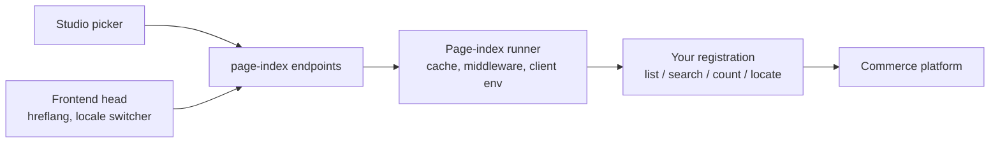

::since-version{version="0.38.0" packages="@laioutr-core/orchestr, @laioutr-core/core-types" changelog="orchestr"}
::

An editor opens a link field in Studio and wants to point a banner at one specific product. Studio knows a Product Detail Page exists at `/products/:slug`, but nothing tells it which slugs are real. The editor has to leave, find the handle in the shop admin, come back, and type it by hand.

A **page index** closes that gap. It is one registration per dynamic [page type](/frontend/features/pagetypes) that owns the whole page-space of that type: it can walk every page, search it, count it, and resolve one page back to the entity behind it.

```ts [server/orchestr/product/detail-page.page-index.ts]
export default definePageIndex({
  for: ProductDetailPage,
  label: 'Shopify Product',
  list: ({ batchSize }) => paginate(async ({ cursor }) => {
    const page = await storefront.products({ first: batchSize, after: cursor });
    return {
      entries: page.nodes.map((product) => ({
        params: { slug: product.handle },
        subject: { type: 'Product', id: product.id },
        meta: { title: product.title, previewImage: product.featuredImage?.url },
      })),
      nextCursor: page.pageInfo.hasNextPage ? page.pageInfo.endCursor : undefined,
    };
  }),
});
```

That is enough for the Studio link menu to list products, for the preview-data selector to name the product on screen, and for the search box above the list to work.

## What a page index answers

A registration exposes up to four capabilities. Only `list` is required.

| Capability | Question it answers | Who asks |
|---|---|---|
| `list` | Which pages of this type exist, in stable order? | Studio's link menu and preview-data selector, your own server code |
| `search` | Which pages best match this term? | The search box above those lists |
| `count` | How many pages are there in total? | Totals and chunked exports; consumers degrade when it is missing |
| `locate` | Which entity is this URL about, and what is its slug in every other locale? | Studio's preview, the frontend's [hreflang alternates and locale switcher](/frontend/features/multi-language-support#seo-hreflang-and-canonical) |



The runner sits between the endpoints and your handlers. It resolves the [client environment](/frontend/orchestr/client-env), runs your app middleware, caches what comes back, and bounds the results. Your handlers only talk to the platform.

## Registering a page index

`definePageIndex` is auto-imported from `#imports`, like the other handler builders. If your app has a [middleware builder](/frontend/orchestr/middleware), use its `pageIndex` shortcut instead so your handlers receive the app context:

```ts [server/middleware/defineMyApp.ts]
export const defineMyApp = defineOrchestr
  .meta({ app: 'my-recipes', label: 'Recipes' })
  .extendRequest(() => ({ context: { client: createRecipeClient() } }));

export const defineMyAppPageIndex = defineMyApp.pageIndex;
```

```ts [server/orchestr/recipe/detail-page.page-index.ts]
import { RecipeDetailPage } from '../../shared/pageTypes/recipe-detail.pagetype';
import { defineMyAppPageIndex } from '../../middleware/defineMyApp';

export default defineMyAppPageIndex({
  for: RecipeDetailPage,
  label: 'Recipe',
  batchSize: 50,
  cache: { ttl: '6h', search: { ttl: '5m' }, locate: { ttl: '1 day' } },

  list: ({ context, clientEnv, batchSize }) =>
    paginate(async ({ cursor }) => {
      const page = await context.client.recipes({
        limit: batchSize,
        cursor,
        locale: clientEnv.language.code,
      });
      return {
        entries: page.items.map((recipe) => ({
          params: { slug: recipe.slug },
          subject: { type: 'Recipe', id: recipe.id },
          meta: {
            title: recipe.title,
            previewImage: recipe.heroImageUrl,
            lastModified: recipe.updatedAt,
          },
        })),
        nextCursor: page.nextCursor,
      };
    }),

  search: async ({ context, clientEnv, term, take }) => {
    const hits = await context.client.searchRecipes({
      query: term,
      limit: take,
      locale: clientEnv.language.code,
    });
    return hits.map((recipe) => ({
      params: { slug: recipe.slug },
      subject: { type: 'Recipe', id: recipe.id },
      meta: { title: recipe.title },
    }));
  },

  count: ({ context }) => context.client.countRecipes(),
});
```

Register the file the same way as every other handler: everything under the `orchestr/` directory passed to [`registerLaioutrApp`](/apps/app-development/app-starter) is auto-discovered. The `.page-index.ts` suffix is a convention, not a requirement.

### Registration fields

| Field | Type | Description |
|---|---|---|
| `for` | `PageTypeToken` | The page type this index owns. One registration wins per token. |
| `label` | `string` | Name shown in Studio pickers, for example `'Shopify Product'`. Falls back to the providing app's name, then the page type's name. |
| `batchSize` | `number` | How many entries your platform serves in one request. Bounds both the walk's page size and a search's `take`. Default `100`. |
| `list` | function | Full enumeration in stable order. Required. |
| `search` | function | Relevance-ordered top-N for a term. Optional. |
| `count` | function | Cheap total. Optional. |
| `locate` | function | Point lookup from route params back to the entity. Optional. |
| `cache` | object | Per-tier TTLs. See [Caching](#caching). |
| `order` | `number` | Breaks ties when two apps register for the same page type. Higher wins; equal orders go to the last registration. Default `0`. |

Every handler also receives `event`, `context`, `clientEnv`, and `tokenMeta`, exactly like a query handler. Scope your platform reads with `clientEnv.market.id` and `clientEnv.language.code`: those are the same values the runner keys its caches by, so a handler that ignores them will serve one market's pages under another market's key.

## Entries

Every capability that returns pages returns `PageIndexEntry` objects.

| Field | Type | Description |
|---|---|---|
| `params` | `Record<string, string>` | The route params for this page. Keys match the page type's `pathConstraints.requiredParams`. Catch-all segments are joined with `/`. |
| `subject` | `{ type, id }` | The entity the page is about. Used for cache-tag invalidation, for correlating entries across locales, and for recognising which entry a picker currently has selected. Omit it for computed routes such as date archives, which then fall back to TTL-only invalidation. |
| `meta.title` | `string` | What the picker shows. Without it, the picker falls back to the param values. |
| `meta.description` | `string` | Optional longer text. |
| `meta.previewImage` | `string` | An absolute, publicly reachable image URL. Not a `Media` object: the picker and other consumers run outside the Nuxt image pipeline and cannot resolve provider-relative sources. |
| `meta.lastModified` | `string` | ISO 8601 timestamp. |
| `meta.noindex` | `boolean` | The page renders but should stay out of discovery surfaces such as sitemaps. Editorial surfaces (the Studio picker, link fields) ignore the flag and still list the page. |

## Enumerating with `list`

`list` walks the entire page-space in stable order and returns either an array or an async iterable. It receives `batchSize` and never a `take`: a walk that stopped early would cache a truncated enumeration and every later reader would believe the catalogue ends there. Bounding is the runner's job.

For a cursor-paged platform API, `paginate()` turns the fetch into a lazy async iterable so you never write `async function*` yourself:

```ts
list: ({ context, batchSize }) =>
  paginate(async ({ cursor }) => {
    const page = await context.client.recipes({ limit: batchSize, cursor });
    return { entries: page.items.map(toEntry), nextCursor: page.nextCursor };
  }),
```

The cursor is opaque to Orchestr. Pass whatever your platform hands back: a GraphQL `endCursor`, a stringified page number, an offset. Returning `nextCursor: undefined` ends the walk; an empty string is still treated as a valid continuation.

::tip
Stable order matters more than any particular order. The runner writes the walk to the cache in chunks and resumes from a chunk boundary, so a list whose order changes between calls produces duplicated or skipped entries.
::

## Searching with `search`

`search` receives the `term` plus a `take` that is already clamped to your `batchSize`, so you can hand `take` straight to the platform as its limit.

It is optional. Without it, a page type still answers search terms: the runner scans the first 1000 enumerated entries and keeps the ones whose title or param values contain every whitespace-separated part of the term. So "blue towel" finds "Towel, blue", and pasting a slug finds its own page.

What implementing `search` buys you is relevance ordering and coverage past that scan. If the scan hits its 1000-entry limit without filling `take`, Orchestr logs a warning naming the page type.

## Counting with `count`

`count` returns a single number and takes no input beyond the request context. Keep it cheap: most platforms answer it with a `limit: 1, totalCount: true` read. Consumers treat a missing `count` as "unknown" rather than zero.

## Locating with `locate`

`locate` runs in the other direction. Given the route params of a page in the current locale, it returns the entity behind that page and, where the connector can afford it, the params for the same page in every other locale.

```ts
locate: async ({ context, params, clientEnv }) => {
  const recipe = await context.client.recipeBySlug(params.slug, clientEnv.language.code);
  if (!recipe) return undefined;

  return {
    subject: { type: 'Recipe', id: recipe.id },
    meta: { title: recipe.title },
    locales: Object.fromEntries(
      recipe.translations.map((t) => [t.locale, { params: { slug: t.slug } }]),
    ),
  };
},
```

Returning `undefined` means "no page here", and the lookup resolves to no alternates. A `locate` that throws is caught, logged, and treated the same way: this lookup runs during SSR, so it can never fail a page.

`meta` is the located page's metadata in the locale the lookup was made in. It is optional, unlike on an entry. A connector that would need an extra platform request for a title should leave it out; Studio then falls back to showing the route params.

::caution
`locales` is a promise about completeness. When you return it, it must list **every** locale in which the page exists, and a locale missing from it means the page genuinely has no counterpart there, so consumers drop that alternate instead of guessing a URL.

If your platform can only resolve the locale you were called in, omit `locales` entirely. A single-key map would assert absence for every locale you never looked up, silently deleting those hreflang alternates. Omitted means "unknown", and consumers keep filling alternates from the current locale's params.
::

The Shopify and Shopware connectors both take that second route. Resolving a product's slug in every language costs one translated read per language on both platforms, so they return `subject` and `meta` and omit `locales`.

## Caching

The runner caches each capability on its own tier, all under the internal orchestr cache namespace.

| Tier | What is cached | Default TTL | Config |
|---|---|---|---|
| Enumerate | The walk, in chunks of 250 entries | `1h` | `cache.ttl` |
| Search | One entry list per term and take | `5m` | `cache.search.ttl` |
| Locate | One result per page type, market, and param set | `1 day` | `cache.locate.ttl` |
| Count | The total | `1h` | `cache.ttl` |

Enumerate, search, and locate serve stale and refresh in the background: once 80% of the TTL has elapsed, a read still returns the cached value and schedules a refresh behind a lock, so concurrent requests trigger one upstream walk rather than many. A count expires outright and is fetched again on the next read.

Enumerate and search keys carry the resolved market and locale, taken from the `clientEnv` the runner resolved. That is also why your handlers must scope their platform reads to the same values.

Every cached chunk writes a **subject tag** for each entry that carries one. When an entity changes, drop the chunks referencing it:

```ts [server/routes/webhooks/product-updated.post.ts]
export default defineEventHandler(async (event) => {
  const payload = await readBody(event);
  const { removed } = await invalidateEntity('Product', { id: payload.id });
  return { removed };
});
```

Entries without a `subject` cannot be tagged, so they expire on TTL alone.

## Reading a page index from your own code

Five server utilities are auto-imported. Each takes the page type token plus the resolved `clientEnv` from the handler or endpoint you are in.

| Utility | Returns | Notes |
|---|---|---|
| `listPages(token, { clientEnv, take? })` | `PageIndexEntryStream` | Full walk in stable order unless `take` bounds it. |
| `searchPages(token, { clientEnv, term, take })` | `PageIndexEntryStream` | `take` is required and clamped to `batchSize`. |
| `countPages(token, { clientEnv })` | `Promise<number \| undefined>` | `undefined` when the type has no registration or no `count`. |
| `locatePage(token, { clientEnv, params })` | `Promise<PageIndexLocateResult \| null>` | `null` on any failure, by design. |
| `invalidateEntity(type, { id })` | `Promise<{ removed }>` | Drops every cached value tagged with that subject. |

A `PageIndexEntryStream` is an async iterable with a `toArray()` convenience method. Iterate it when the page-space is large, because the walk is lazy and stops when you stop reading:

```ts [server/orchestr/recipe/related.query.ts]
export default defineMyAppQuery(RelatedRecipesQuery, async ({ clientEnv, input }) => {
  const ids: string[] = [];

  for await (const entry of listPages(RecipeDetailPage, { clientEnv, take: 200 })) {
    if (entry.subject && entry.params.slug !== input.slug) {
      ids.push(entry.subject.id);
    }
  }

  return { ids, total: ids.length };
});
```

Calling `toArray()` twice starts two separate walks. Collect once and reuse the array.

## Endpoints

| Path | Auth | Used by |
|---|---|---|
| `POST /api/laioutr/orchestr/page-index/list` | Project secret | Studio's link menu, preview-data selector |
| `POST /api/laioutr/orchestr/page-index/locate` | Project secret | Studio's preview-data selector |
| `POST /api/orchestr/page-index/locate` | None | The frontend's own hreflang and locale-switcher lookup |

The public `locate` route exists because the frontend performs that lookup during client-side navigation as well as during SSR, so it can never hold the [project secret](/cockpit/settings/project-secret-key). It discloses only the per-locale route params that the rendered hreflang tags publish anyway.

::caution
If you put a reverse proxy or an edge rule in front of the app that restricts its API paths, allow `POST /api/orchestr/page-index/locate`. Blocking it does not break rendering, but every page falls back to filling its alternates from the current locale's params.
::

The `list` endpoint validates each enumerated entry on its own and drops the ones that fail, with a warning naming the page type. One malformed entry (a platform field typed non-null that arrives `null`) costs one page rather than the whole catalogue. A handler that throws is not swallowed: the endpoint fails so the editor sees an error state instead of an empty catalogue that looks real.

## Where the index shows up

- **Link fields in Studio.** Picking a dynamic page type opens a second level listing its pages. Selecting one stores the entry's params on the link. "Enter params manually" stays available above the list, so an index that is empty or unreachable never blocks the editor.
- **Preview data.** For an enumerable dynamic page, the page properties panel gains a **Preview Data** selector naming the instance currently rendered in the preview. The choice lives in the Studio session and is never written to the project configuration.
- **Locale-correct SEO.** Where `locate` reports a complete `locales` map, hreflang alternates, `og:locale:alternate`, `x-default`, and the locale switcher each use their own locale's slug.

Studio learns all of this from reflection: the reflected `pageIndex` map is keyed by page-type token, the presence of a key means the type is enumerable, and `locate` marks the point-lookup capability. The `label`, `appLabel`, and `logoUrl` on each record are what the picker shows as the source of the list.

## Page types without a registration

Nothing is required. A page type with no `pageIndex` behaves exactly as it did before:

- `listPages` and `searchPages` return an empty stream and log one warning.
- `countPages` resolves to `undefined` without warning, since consumers already degrade without a total.
- `locatePage` resolves to `null` without warning, because it runs for whatever page the route resolved to, including static and system pages that no connector enumerates.

Studio falls back to manual param entry, and the frontend fills alternates from the current locale's params.

## Related

::card-group
  :::card{title="Page Types" to="/frontend/features/pagetypes"}
  Defining the dynamic page types a page index enumerates.
  :::

  :::card{title="Client Environment" to="/frontend/orchestr/client-env"}
  The market, language, and preview state every page-index handler receives.
  :::

  :::card{title="Multi-Language Support" to="/frontend/features/multi-language-support"}
  How `locate` feeds hreflang alternates and the locale switcher.
  :::

  :::card{title="Caching" to="/frontend/orchestr/caching"}
  The cache layers around queries, links, components, and page indexes.
  :::
::
