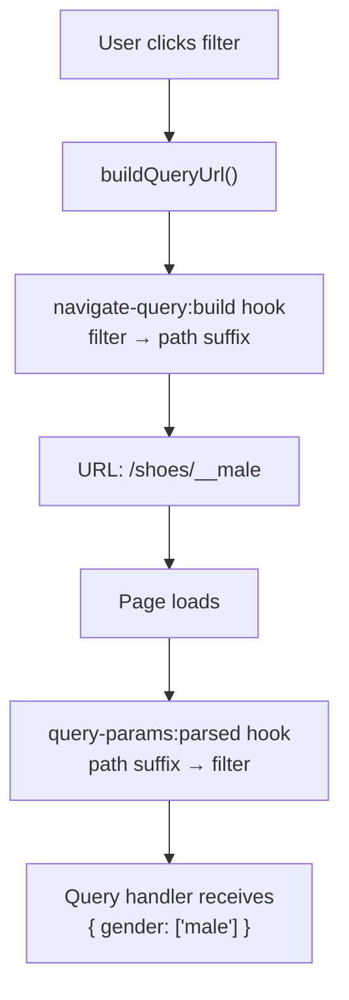

A customer lands on your category page, applies a color filter, sorts by price, and clicks to page 3. The URL now reads `/shoes?products[p]=3&products[s]=price:asc&products[f][color]=red`. If they share that link, the next visitor sees the same filtered, sorted, page-3 view. Orchestr handles this mapping between URL query strings and the wire request sent to your query handlers.

## How parameters are structured

Each query on a page gets its own **prefix** in the URL. The prefix acts as a namespace so multiple queries on the same page (a product listing and a review listing, for example) can maintain independent pagination, sorting, and filters.

Parameters use bracket notation under the prefix, with four reserved keys:

| Key | Purpose                         | Example                  |
| --- | ------------------------------- | ------------------------ |
| `p` | Page number                     | `products[p]=3`          |
| `l` | Results per page (limit)        | `products[l]=20`         |
| `s` | Sort key                        | `products[s]=price:asc`  |
| `f` | Filters (nested by filter name) | `products[f][color]=red` |

### Multiple queries on one page

When a page has multiple queries, each uses its own prefix. Parameters from one query never affect another:

:orchestr-url{url="/shop?products[p]=2&products[f][color]=red&reviews[s]=date:desc"}

### Root queries

For pages with a single primary query, you can drop the prefix entirely by marking the query as a **root query**. This produces cleaner URLs:

:orchestr-url{url="/shoes?p=3&s=price:asc&f[color]=red"}

Root queries set `isRoot: true` on the query identity. See [Query URL Identity](#query-url-identity) below.

### Link prefixes

When a query has [links](/frontend/orchestr/queries#links) (e.g. a product with reviews), each link gets its own prefix nested under the parent query. The prefix is the query prefix plus the link token (or link alias, if one exists).

Link prefixes support the same four keys as query prefixes: pagination (`p`), limit (`l`), sorting (`s`), and filters (`f`).

:orchestr-url{url="/product/sneaker?products[reviews][p]=3&products[reviews][s]=date:desc"}

Link params are read from the URL during the wire request and forwarded to the link handler on the server. When generating URLs with `buildQueryUrl`, pass the link's entity set directly:

```ts
// Access the link's entity set from the parent entity
const reviewsLink = productEntity.links['ecommerce/product/reviews'];

// Build a URL for page 2 of reviews
const url = buildQueryUrl(reviewsLink, { page: 2 });
// → /product/sneaker?products[reviews][p]=2
```

## Filter types

Filters appear under the `f` key and support three value types. This section describes the URL encoding; for the shape your query handler receives and returns (including the `availableFilters` response), see [Filters](/frontend/orchestr/filters).

### List filters (multi-select)

Select one or more string values. Repeated keys encode multiple selections:

:orchestr-url{url="?products[f][color]=red&products[f][color]=blue"}

This produces the filter `{ color: ['red', 'blue'] }` in your query handler.

### Boolean filters

Toggle a filter on or off:

:orchestr-url{url="?products[f][inStock]=true"}

Produces `{ inStock: true }`.

### Range filters

Set a numeric min, max, or both:

:orchestr-url{url="?products[f][price][min]=10&products[f][price][max]=50"}

Produces `{ price: { min: 10, max: 50 } }`. When setting only `min` or `max`, the other side stays undefined.

## Query URL Identity

Every query declares its URL behavior through a `QueryUrlIdentity` object:

```ts
interface QueryUrlIdentity {
  urlQueryPrefix: string;
  urlQueryAcceptedPrefixes: string[];
  isRoot?: boolean;
}
```

::field-group
  :::field{name="urlQueryPrefix" :required="true" type="string"}
  The canonical prefix used when **writing** parameters to the URL.
  :::

  :::field{name="urlQueryAcceptedPrefixes" :required="true" type="string[]"}
  All prefixes that should be **read** when parsing the URL. The first entry is typically the same as `urlQueryPrefix`. Additional entries let you accept old or alternative prefixes for backward compatibility.
  :::

  :::field{name="isRoot" type="boolean"}
  When `true`, parameters are written without a prefix (`?p=2` instead of `?products[p]=2`). Accepted prefixes still work for reading, so existing prefixed URLs continue to resolve.
  :::
::

### Prefix normalization

When multiple accepted prefixes exist, Orchestr **normalizes** on navigation: it reads params from all accepted prefixes, deletes them all, and rewrites under the canonical prefix only. This lets you rename a query's URL prefix without breaking existing bookmarks.

```text
# User visits an old URL with the internal query ID:
/shoes?cp17r0j24ts002324tv2[p]=2

# After normalization (canonical prefix is "products"):
/shoes?products[p]=2
```

Page 1 is also stripped during normalization since it is the default state.

## Building URLs with `buildQueryUrl`

The `buildQueryUrl` function builds a new URL from the current route with your modifications applied. It does not perform the navigation itself; it returns the URL string for you to pass to `router.push()` or use in a link.

```ts
import { buildQueryUrl } from '#imports';

const query: QueryUrlIdentity = {
  urlQueryPrefix: 'products',
  urlQueryAcceptedPrefixes: ['products'],
};

// Set page
const url = buildQueryUrl(query, { page: 3 });
// → /shoes?products[p]=3

// Sort (page resets automatically)
const url = buildQueryUrl(query, { sort: 'price:asc' });
// → /shoes?products[s]=price:asc

// Add a list filter
const url = buildQueryUrl(query, { addFilter: { color: ['red'] } });
// → /shoes?products[f][color]=red

// Add a range filter
const url = buildQueryUrl(query, { addFilter: { price: { min: 10, max: 50 } } });
// → /shoes?products[f][price][min]=10&products[f][price][max]=50

// Remove a filter
const url = buildQueryUrl(query, { removeFilter: 'color' });

// Clear all filters
const url = buildQueryUrl(query, { resetFilters: true });
```

### Modifier reference

::field-group
  :::field{name="page" type="number"}
  Set the page number. Page 1 is omitted from the URL.
  :::

  :::field{name="limit" type="number"}
  Set results per page. Resets the page to 1.
  :::

  :::field{name="resetLimit" type="boolean"}
  Remove the limit parameter, reverting to the query's default. Resets the page to 1. Takes precedence over `limit`.
  :::

  :::field{name="sort" type="string"}
  Set the sort key. Resets the page to 1.
  :::

  :::field{name="resetSort" type="boolean"}
  Remove the sort parameter, reverting to the default order. Resets the page to 1. Takes precedence over `sort`.
  :::

  :::field
  ---
  name: addFilter
  type: Record<string, QueryWireRequestFilterValue | string>
  ---
  Add filters. List filters **append** to existing values rather than replacing them. Range filters replace the previous range. Plain strings are wrapped as `[value]`. Resets the page to 1.
  :::

  :::field{name="removeFilter" type="string | string[]"}
  Remove one or more filters by name. Resets the page to 1.
  :::

  :::field{name="resetFilters" type="boolean"}
  Remove all filters. Resets the page to 1.
  :::

  :::field{name="preventPageReset" type="boolean"}
  When `true`, changes to sort, limit, or filters do not reset the page. Use this when you need to apply modifications while preserving the current page.
  :::
::

### Automatic page reset

Changing the sort, limit, or filters resets the page to 1 (by removing the `p` parameter). This prevents users from landing on an empty page after narrowing results. Set `preventPageReset: true` to disable this behavior.

For the typical block or section pattern (reading current state from the resolved query field and dispatching changes through `buildQueryUrl`), see [Consuming Query Fields](/apps/app-development/consuming-query-fields).

## Hooks

Two hooks let you customize how Orchestr reads parameters from the URL and how it generates URLs. Both run synchronously.

### `orchestr:query-params:parsed`

Fires after the URL query string is parsed, before Orchestr reads pagination, sorting, and filters from it. Use this hook to inject filters from non-standard URL structures (path segments, custom query params) into the standard filter system.

```ts
'orchestr:query-params:parsed': (ctx: {
  params: QueryParams;
  queryPrefixes: string[];
  route: RouteLocationNormalizedLoaded;
}) => void
```

| Argument        | Description                                                                                                         |
| --------------- | ------------------------------------------------------------------------------------------------------------------- |
| `params`        | The parsed `QueryParams` instance. Mutate it to inject or transform parameters before they reach the query handler. |
| `queryPrefixes` | Accepted prefixes for this query. `queryPrefixes[0]` is the canonical prefix.                                       |
| `route`         | The current Vue Router route object.                                                                                |

Register this hook in a Nuxt plugin:

```ts [app/plugins/gender-from-path.ts]
export default defineNuxtPlugin((nuxtApp) => {
  nuxtApp.hook('orchestr:query-params:parsed', ({ params, queryPrefixes, route }) => {
    // Extract gender from a path suffix like /shoes/__male
    const match = route.path.match(/\/__(\w+)$/);
    if (match) {
      params.addFilter(queryPrefixes[0], 'gender', [match[1]]);
    }
  });
});
```

After this hook runs, `getFilters()` returns `{ gender: ['male'] }` alongside any filters already in the query string. Your query handler receives the injected filter just like any URL-based filter.

### `orchestr:navigate-query:build`

Fires at the end of `buildQueryUrl()`, after all modifications and normalization are applied, but before the final URL string is returned. Use this hook to transform standard filters into custom URL formats (path segments, shorthand params).

```ts
'orchestr:navigate-query:build': (ctx: {
  params: QueryParams;
  query: QueryUrlIdentity;
  path: string;
  queryString: string;
}) => void
```

| Argument      | Description                                                                     |
| ------------- | ------------------------------------------------------------------------------- |
| `params`      | The `QueryParams` instance. You can read, remove, or modify filters.            |
| `query`       | The query's URL identity.                                                       |
| `path`        | The route path. Mutate `ctx.path` to append path segments.                      |
| `queryString` | The serialized query string. Mutate `ctx.queryString` to add or replace params. |

```ts [app/plugins/gender-to-path.ts]
export default defineNuxtPlugin((nuxtApp) => {
  nuxtApp.hook('orchestr:navigate-query:build', (ctx) => {
    const filters = ctx.params.getFilters(ctx.query.urlQueryPrefix);
    const gender = filters.gender;

    if (gender && Array.isArray(gender)) {
      // Move gender filter from query string to path suffix
      ctx.params.removeFilter(ctx.query.urlQueryPrefix, 'gender');
      ctx.path = `${ctx.path}/__${gender[0]}`;
      ctx.queryString = ctx.params.serialize();
    }
  });
});
```

With both hooks registered, `buildQueryUrl(query, { addFilter: { gender: ['male'] } })` produces `/shoes/__male` instead of `/shoes?products[f][gender]=male`. When a user visits that URL, the parsed hook re-injects the gender filter from the path.

### Using hooks together

The two hooks are complementary. The `navigate-query:build` hook transforms filters into custom URL formats when generating links. The `query-params:parsed` hook reverses that transformation when reading the URL. Always register both when using custom URL formats.



You can also use the build hook to append arbitrary parameters like tracking or view-mode flags:

```ts [app/plugins/tracking-params.ts]
export default defineNuxtPlugin((nuxtApp) => {
  nuxtApp.hook('orchestr:navigate-query:build', (ctx) => {
    const qs = ctx.queryString;
    ctx.queryString = [qs, 'utm_source=listing'].filter(Boolean).join('&');
  });
});
```

## The data flow

To summarize how URL parameters flow through the system:

**Reading** (URL to query handler):

1. User visits a URL
2. Orchestr parses the query string from `route.fullPath`
3. Registers the query identity (prefix, accepted prefixes)
4. `orchestr:query-params:parsed` hook fires (inject custom params)
5. Reads page, limit, sort, and filters from the parsed params
6. For each link, reads page, limit, sort, and filters from `[queryPrefix][linkToken]`
7. Builds the wire request and sends it to the query and link handlers

**Writing** (user action to URL):

1. User interaction triggers `buildQueryUrl(query, modifiers)`
2. Orchestr parses the current URL and registers the query identity
3. Normalizes params from accepted prefixes to canonical prefix
4. Applies modifiers (page, sort, filters) with automatic page resets
5. Normalizes again, stripping page 1
6. `orchestr:navigate-query:build` hook fires (transform to custom URL format)
7. Returns the final URL string
