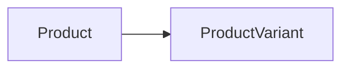

## Overview

- Entity Name: `Product`

**Product:** A buyable good or service that can be offered in an e-commerce store. A Product only holds general informations. It is not buyable by itself. Instead each Product acts as an aggregation. You can use the link to the [ProductVariant](/api-reference/canonical-types/entities/product-variant) entity to retrieve detailed product data.

## Components

### Product Base

- Component Token: `base`
- Token path: `Product.base`

#### Properties

| Name   | Type     | Description                                                                     |
| ------ | -------- | ------------------------------------------------------------------------------- |
| `name` | `string` | Name of the base-product. Variants may also have names for further description. |
| `slug` | `string` | Slug for usage in URLs.                                                         |

## Queries

- [ProductBySlug](/api-reference/core-types/ecommerce/variables/productbyslugquery) - Retrieve a single product by its slug.
- [ProductsByCategorySlug](/api-reference/core-types/ecommerce/variables/productsbycategoryslugquery) - Retrieve multiple products by a category slug.
- [ProductsSearch](/api-reference/core-types/ecommerce/variables/productssearch) - Search for products using a given query string.

## Links

- [ProductBreadcrumb](/api-reference/core-types/ecommerce/variables/productcanonicalmenuitemlink) `BreadcrumbItem` `multi`{color="info"} - Used for displaying a breadcrumb on the pdp.
- [ProductReviews](/api-reference/core-types/ecommerce/variables/productreviewslink) `Review` `multi`{color="info"} - User generated product reviews.
- [ProductVariants](/api-reference/core-types/ecommerce/variables/productvariantslink) `ProductVariant` `multi`{color="info"} - Link to the actual buyable good or service. A Product must always link to at least one ProductVariant.

## Related actions

- [CreateReview](#) - Create a new user review for a product.

:entity-component-meta{component="base" entity="Product"}

:entity-component-meta{component="description" entity="Product"}

:entity-component-meta{component="flags" entity="Product"}

:entity-component-meta{component="info" entity="Product"}

:entity-component-meta{component="media" entity="Product"}

:entity-component-meta{component="prices" entity="Product"}

:entity-component-meta{component="rating" entity="Product"}

:entity-component-meta{component="seo" entity="Product"}
