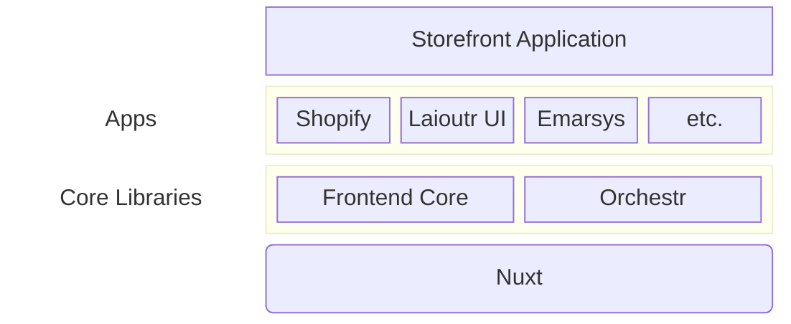
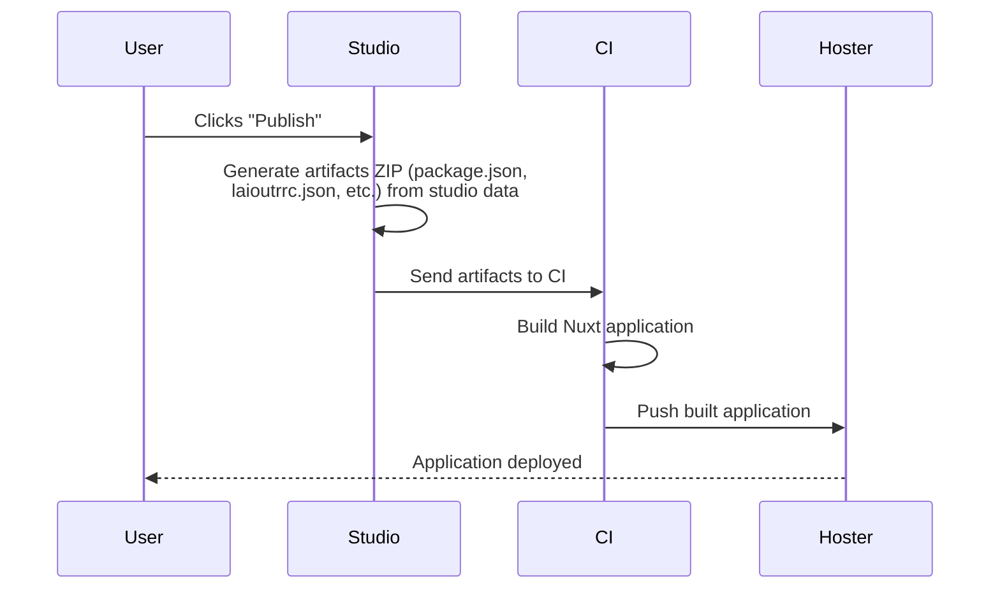

Laioutr lets non-developers build and manage their e-commerce frontend using a visual editor called Studio. The output of the Studio is an website that can be hosted or run locally.

## Storefront Application

A Laioutr project is a Nuxt 3 application which runs in combination with Laioutr's core modules. On top of that, the installed apps add all the necessary UI components, logic and integrations to the storefront application.

## Project data

The Nuxt application is generated from a project configuration file called `laioutrrc.json`. This file is located in the root of the project and contains the configuration for the project. In the Studio, clicking on "Publish" will generate this file from the Studio's data, install required dependencies, build the application and deploy to your hosting provider.

All data your storefront application needs, lives in this file. All other data comes from external systems which are connected through apps via the [Orchestr API](/orchestr/introduction).

## Apps

Apps are the building blocks of your project.

From a technical perspective, each app is a Nuxt module that has been published to the either the public [npm registry](https://www.npmjs.com/) or the private Laioutr npm registry.

1. They are responsible for fetching data like products, categories, and other entities from external systems.
2. They integrate third-party systems like newsletters, accounts, etc.
3. They provide UI components, sections and blocks that can be configured in the Studio.
4. They let the Studio connect to external media libraries for selecting images and videos.
5. And much more!

Each app can provide one or more of the above features. For example, the Shopify app provides product-data and more from Shopify, integrates with Shopify's account system and lets the Studio connect to Shopify's media library. The *UI app* provides sections and blocks that can be configured in the Studio and filled with data from the e.g. the *Shopify app*.

All core Laioutr packages are published to the private registry.

::card{title="Create your own app" to="/developer-guide/setup"}
A short guide on how to create your own app for Laioutr.
::

## Orchestr

Orchestr is the powerful data-composition framework at the heart of Laioutr. It is designed to be a flexible and powerful tool for building scalable data layer applications with a focus on type safety, data composition, and modular architecture.

::card{title="Learn more about Orchestr" to="/orchestr/introduction"}
How to use Orchestr to connect to external systems and compose data for your storefront application.
::

## Nuxt

Nuxt is the framework that powers the storefront application. It is a Vue-based framework that provides a lot of features out of the box, such as server-side rendering, static site generation, and more. When building Laioutr apps, knowing the basics of Nuxt can be very helpful.

::card{title="Learn more about Nuxt" to="https://nuxt.com"}
How to use Nuxt to build your storefront application.
::
