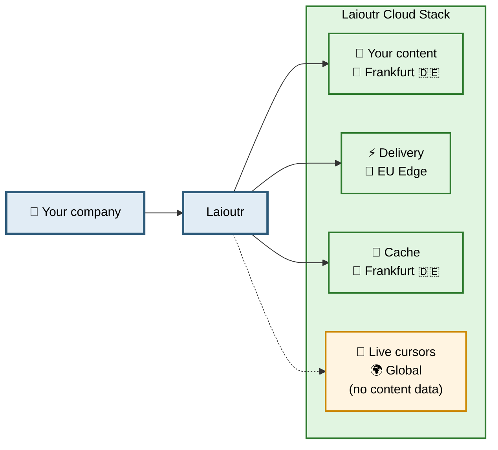

Security, privacy and compliance are the foundation of our product. This Trust Center documents transparently how Laioutr handles your data, what technical and organisational measures are in place, and which artefacts we provide for your security reviews.

## At a glance

Laioutr is a agentic frontend management platform for composable commerce headquartered in Germany. We process customer data exclusively as a processor (Art. 28 GDPR). Our production infrastructure runs in EU regions on certified cloud providers.

- **Company:** Laioutr GmbH, Münchweilersteig 5, 12559 Berlin
- **Products:** Laioutr Cloud, Laioutr Cockpit, Laioutr Frontend
- **Hosting region:** European Union (Frankfurt, Germany)
- **Applicable law:** GDPR, BDSG, German law
- **Security & privacy contact:** security@laioutr.com
- **Live status:** [laioutr.statuspage.io](https://laioutr.statuspage.io/)

## Where your data lives

The diagram below shows the high-level data flow for Laioutr customers. All content data stays in the EU. Only live cursor positions for real-time collaboration in the Cockpit are processed globally — without any reference to your content or end-customer data.

## Explore the Trust Center

::card-group
  :::card{target="_self" title="Data Protection (GDPR)" to="/offering/trust-center/data-protection"}
  Our role under the GDPR, Data Processing Agreement, DPO contact, and international data transfers.
  :::

  :::card{target="_self" title="Subprocessors" to="/offering/trust-center/subprocessors"}
  The full list of subprocessors, their purpose, processing location and certifications.
  :::

  :::card{target="_self" title="Infrastructure & Hosting" to="/offering/trust-center/infrastructure"}
  Architecture, primary subprocessors (Vercel, Supabase, Upstash, Liveblocks) and how we keep your content in the EU.
  :::

  :::card{target="_self" title="Security Measures" to="/offering/trust-center/security-measures"}
  Technical and organisational measures (TOMs) under Art. 32 GDPR — public summary.
  :::

  :::card{target="_self" title="Incident Response" to="/offering/trust-center/incident-response"}
  How we handle security incidents and how to report a vulnerability.
  :::

  :::card{target="_self" title="Compliance & Certifications" to="/offering/trust-center/compliance"}
  Laioutr's certification status and the inherited certifications of our infrastructure stack.
  :::

  :::card{target="_self" title="FAQ" to="/offering/trust-center/faq"}
  Common questions on data residency, exports, availability, access, and contracts.
  :::
::

## Documents available on request

Under a signed mutual NDA we provide:

- Data Processing Agreement (DPA / AVV)
- Technical and Organisational Measures (TOMs)
- Subprocessor list with executed DPAs
- Transfer Impact Assessments (TIAs) for US-based subprocessors

**Request a document or send a security questionnaire:** security@laioutr.com

## Contact & resources

| Topic | Contact / link |
|-------|----------------|
| General security questions | security@laioutr.com |
| Data protection | datenschutz@laioutr.com |
| Vulnerability disclosure | security@laioutr.com |
| Customer support (S3 / S4) | [support.laioutr.com](https://support.laioutr.com) |
| Incident reporting (S1 / S2) | incident@laioutr.com |
| Live platform status | [laioutr.statuspage.io](https://laioutr.statuspage.io/) |

---

*Last updated: 2026-05-25 · Version 1.0*
