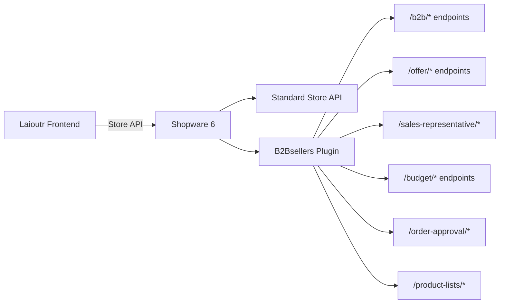

::callout{type="warning"}
This app is **planned** and currently under development. The feature set described below reflects the intended scope based on the B2Bsellers Store API. APIs and capabilities may change before release.
::

## Overview

The **@laioutr-app/b2bsellers** package integrates the [B2Bsellers Suite](https://www.b2b-sellers.com/) into a Laioutr-powered Nuxt app. B2Bsellers is a modular Shopware 6 plugin that transforms a standard shop into a full-featured B2B e-commerce platform — covering employee management, role-based permissions, order approval workflows, offer management, budgets, cost centers, sales representative tools, and more.

This app connects to the **B2Bsellers Store API** endpoints that the plugin adds to Shopware's existing Store API. All endpoints use the same authentication mechanism as the standard Shopware Store API (`sw-context-token` header).

**Key capabilities at a glance:**

- **Employee & role management** with fine-grained permissions
- **Order approval workflows** with multi-approver support
- **Offer creation and negotiation** including document generation
- **Budget management** with period-based spending limits
- **Cost center** assignment and tracking
- **Product lists** (wishlists, shopping lists, reorder lists)
- **Sales representative** tools for managing customers, orders, and activities
- **Customer-specific pricing** and custom product numbers

For detailed property-level API reference, see the official [B2Bsellers Store API documentation](https://docs.b2b-sellers.com/b2b-platform/api-reference/store-api).

## Architecture

The B2Bsellers plugin extends Shopware's Store API with additional `/b2b/*` endpoints. Laioutr communicates with these endpoints through the same Shopware storefront connection that the `@laioutr-app/shopware` package establishes.

All B2Bsellers endpoints are authenticated via the `sw-context-token` header — the same session token that the Shopware base app manages. No separate authentication is required.

## Store API Feature Overview

The B2Bsellers Store API is organized into a **core plugin** and several **addon modules**. Each addon can be enabled independently depending on your B2B requirements.

### Employee Management (Core)

Manage company employees, their roles, and permissions. Employees are users within a B2B customer account that can have individual access rights.

| Capability | Endpoints | Description |
|------------|-----------|-------------|
| **CRUD** | `POST/GET/PATCH/DELETE /b2b/employee/{id}` | Create, read, update, and delete employees |
| **List** | `POST /b2b/employees` | Fetch all employees with optional filtering |
| **Add to company** | `POST /b2b/employee/add` | Assign an existing employee to a company |
| **Import/Export** | `POST /b2b/employee-import`, `POST /b2b/employee-export` | Bulk import employees via CSV or export all employees |
| **Password recovery** | `POST /b2b/employee/recovery-password` | Trigger a password reset email for an employee |

### Roles & Permissions (Core)

Define roles with granular permissions to control what employees can see and do.

| Capability | Endpoints | Description |
|------------|-----------|-------------|
| **Manage roles** | `POST/PATCH/DELETE /b2b/employee-roles/{id}` | Create, update, and delete employee roles |
| **List roles** | `POST /b2b/employee-roles` | Fetch all available roles |
| **Permissions** | `POST /b2b/employee-permissions` | Fetch all available permissions |
| **Permission groups** | `POST /b2b/employee-permission-groups` | Fetch permission groups for organizing permissions |

### Invitations (Core)

Invite new employees to join the company account via email.

| Capability | Endpoints | Description |
|------------|-----------|-------------|
| **List invitations** | `GET /b2b/employee-invitations` | View all pending invitations |
| **Get/Delete** | `GET/DELETE /b2b/employee-invitation/{id}` | View or cancel a specific invitation |
| **Create** | `POST /create-invitation` | Generate and send an invitation |
| **Register** | `POST /invitation-employee/{hash}` | Register as employee from an invitation link |

### Authentication & Access (Core)

Additional login methods and account management beyond standard Shopware authentication.

| Capability | Endpoints | Description |
|------------|-----------|-------------|
| **Passwordless login** | `POST /passwordless-login`, `POST /passwordless-login/{hash}` | Request and authenticate via a login link sent by email |
| **Login targets** | `GET /login-targets` | Retrieve available login targets for the current context |
| **Account request** | `POST /account-request` | Request a new B2B account (company registration) |

### Sales Representative (Core)

Tools for sales reps to manage their assigned customers, view orders, and track activities.

| Capability | Endpoints | Description |
|------------|-----------|-------------|
| **Profile** | `GET/PATCH /sales-representative/{id}` | View and update the current sales rep's profile |
| **Customers** | `POST /sales-representative/customers`, `POST /sales-representative/customer-search` | List and search assigned customers |
| **Employees** | `POST /sales-representative/employees` | List employees of assigned customers |
| **Orders** | `POST /sales-representative/orders`, `POST /sales-representative/customer-orders/{customerId}` | View all orders or orders for a specific customer |
| **Statistics** | `POST /sales-representative/sales-statistics`, `POST /sales-representative/customer-sales-ranking` | Sales metrics and customer rankings |

#### Customer Activity Tracking

Sales reps can log and track customer interactions (calls, visits, emails, etc.).

| Capability | Endpoints | Description |
|------------|-----------|-------------|
| **Activity types** | `GET /sales-representative/customer-activity-type` | List available activity types |
| **CRUD activities** | `POST/PUT/GET/DELETE /sales-representative/customer-activity/{id}` | Create, update, view, and delete activity records |
| **List activities** | `GET /sales-representative/customer-activity/list` | List all activities with filtering |

### Customer Features (Core)

| Capability | Endpoints | Description |
|------------|-----------|-------------|
| **Customer pricing** | `POST /customer-prices` | Retrieve customer-specific prices |
| **Documents** | `POST /customer-documents/`, `GET /customer-document/{fileName}` | List and download customer documents |
| **Employee orders** | `POST /b2b/employee-orders`, `GET /b2b/employee-order/{id}` | List orders placed by employees |
| **Employee customers** | `POST /b2b/employee-customers` | Get customers assigned to an employee |

### Product Catalog & Ordering (Core)

| Capability | Endpoints | Description |
|------------|-----------|-------------|
| **Fast order search** | `POST /b2b/fast-order-product-search` | Quick product search for fast ordering |
| **Product details** | `POST /b2b/product-details` | Retrieve detailed product information |
| **Ordered products** | `POST /ordered-products` | Fetch previously ordered items for reordering |
| **Product table listing** | `POST /product-table-listing` | Tabular product listing view |
| **Price calculation** | `POST /product-price/{id}/{quantity}` | Calculate pricing for a specific product and quantity |
| **Add to cart** | `POST /b2b/add-to-cart` | Add items to the shopping cart |
| **Express checkout** | `GET/PATCH /express-checkout-setting` | Retrieve or update express checkout configuration |

### Order Approval (Addon)

A multi-step approval workflow for orders. Employees can submit their cart for approval, and designated approvers can review, modify, approve, or decline.

| Capability | Endpoints | Description |
|------------|-----------|-------------|
| **Create approval** | `POST /order-approval/create` | Create a new order approval from the current cart |
| **List approvals** | `POST /order-approval/list` | List all approvals for the logged-in customer |
| **View details** | `GET /b2b/order-approval/{id}` | Get detailed information about an approval |
| **Approve/Decline** | `POST /b2b/order-approval/{id}/approve`, `POST /b2b/order-approval/{id}/decline` | Approve or decline an order approval request |
| **Execute** | `POST /b2b/order-approval/{id}/execute` | Convert an approved order into a real Shopware order |
| **Edit line items** | `PATCH/DELETE /b2b/order-approval/{id}/line-items/{lineItemId}` | Update quantity or remove line items from an approval |
| **Refresh prices** | `POST /b2b/order-approval/{id}/refresh` | Recalculate prices and check stock availability |
| **Reminders** | `POST /b2b/order-approval/{id}/remind`, `POST /b2b/order-approval/{id}/remind/all` | Send reminder emails to pending approvers |
| **Activity history** | `GET /b2b/order-approval/{id}/activity` | View the full history of actions on an approval |
| **Approvers** | `GET /b2b/order-approval/{id}/approvers` | View approver status and decisions |
| **Settings** | `GET/POST /b2b/order-approval/customer-settings` | Configure approval mode (e.g. which employees are approvers) |
| **Pending count** | `GET /b2b/order-approval/settings/count-pending` | Count pending approvals |

### Offers (Addon)

Create, manage, and negotiate offers (quotes). Offers can be converted into orders once accepted.

| Capability | Endpoints | Description |
|------------|-----------|-------------|
| **Create offer** | `POST /offer/` | Create a new offer |
| **List offers** | `GET /offer/`, `POST /offer/list` | List all offers with optional filtering |
| **View/Update** | `GET/PUT /offer/{id}` | View or update a specific offer |
| **Request offer** | `POST /offer-request`, `POST /offer-item-request` | Request an offer (empty or with specific line items) |
| **Convert to order** | `POST /offer-order/{id}` | Convert an accepted offer into a Shopware order |
| **Add products** | `POST /offer-add-products/{offerId}` | Add products to an existing offer |
| **Clone** | `POST /sales-representative/clone-offer/{id}` | Duplicate an offer (sales rep) |
| **Delete** | `DELETE /sales-representative/offer/{id}` | Delete an offer (sales rep) |
| **Documents** | `GET /offer-document/{id}` | Download the offer document (PDF) |
| **Mail** | `GET/POST /offer-mail/{id}` | Preview or send an offer email |
| **Extend validity** | `POST /offer/{id}/request-validity-extension` | Request to extend an offer's validity period |
| **Offer states** | `POST /offer-states` | List available offer states |
| **Reference products** | `GET /b2b/offer-reference-product/{productId}` | Get a product referenced in an offer |

### Budgets (Addon)

Define spending budgets with configurable periods. Track spending against budgets and require approval when limits are exceeded.

| Capability | Endpoints | Description |
|------------|-----------|-------------|
| **CRUD** | `POST/GET/PUT/PATCH/DELETE /budget/{id}` | Create, read, update, and delete budgets |
| **List** | `POST /budget/list` | List budgets with optional filtering |
| **Period types** | `POST /budget-period-types` | Retrieve available budget period types (monthly, quarterly, etc.) |
| **Approval employees** | `GET /budget-approval-employees` | List employees eligible for budget approval |
| **Employee budgets** | `GET /b2b/employee-budget` | Retrieve all budgets for the current employee |
| **Budget orders** | `GET/POST /budget/{budgetId}/orders` | List orders charged against a specific budget |

### Cost Centers (Addon)

Assign cost centers to employees and track spending by organizational unit.

| Capability | Endpoints | Description |
|------------|-----------|-------------|
| **CRUD** | `POST/GET/PUT/PATCH/DELETE /b2b/cost-center/{id}` | Create, read, update, and delete cost centers |
| **List** | `POST /b2b/cost-center/list` | List cost centers with optional filtering |

### Product Lists (Addon)

Manage reusable product lists (shopping lists, wishlists, reorder lists) that employees can share within the organization.

| Capability | Endpoints | Description |
|------------|-----------|-------------|
| **Create** | `GET/POST /product-lists/create` | Create a new product list |
| **View/Update/Delete** | `GET/PATCH/DELETE /product-lists/{id}` | Manage a specific product list |
| **List all** | `POST /product-lists`, `POST /product-list/list` | Retrieve all product lists |
| **Manage items** | `POST/PUT/PATCH/DELETE /product-lists/{id}/items` | Add, update, or remove products from a list |
| **Remove single product** | `DELETE /product-lists/{id}/product/{productId}` | Remove a specific product from a list |
| **View items** | `POST /product-list/{id}/items`, `GET /product-list-item/{id}` | List items or get a specific item |

### Customer Product Numbers (Addon)

Let customers define their own product numbers (custom SKUs) for easier ordering and ERP integration.

| Capability | Endpoints | Description |
|------------|-----------|-------------|
| **Create** | `POST /b2b/customer-product-number` | Create a new custom product number |
| **Delete** | `DELETE /b2b/customer-product-number/{id}` | Delete a custom product number |
| **List** | `POST /b2b/customer-product-numbers` | List all custom product numbers with filtering |
| **Import** | `POST /b2b/customer-product-number-import` | Bulk import custom product numbers via CSV |

### Sales Representative Fast Order (Addon)

Allows sales reps to place orders on behalf of customers in a single API call.

| Capability | Endpoints | Description |
|------------|-----------|-------------|
| **Create fast order** | `POST /sales-representative/fast-order` | Place a complete order with billing/shipping addresses, payment/shipping methods, and line items in one request |

### PDP Variant List (Addon)

Retrieve a tabular list of product variants for use on product detail pages.

| Capability | Endpoints | Description |
|------------|-----------|-------------|
| **List variants** | `POST /store-api/variant-list/{productId}` | Get all variants for a product with optional filtering |

### Spare Parts (Addon)

Find similar or related products based on shared properties.

| Capability | Endpoints | Description |
|------------|-----------|-------------|
| **Similar products** | `POST /b2b/property-similar-products/{productId}` | Get products with similar properties |

### Product Request (Addon)

Allow visitors or customers to request information about products that may not be directly purchasable.

| Capability | Endpoints | Description |
|------------|-----------|-------------|
| **Request product** | `POST /product-request/{productId}/send` | Submit a product inquiry with contact details |

## Integration with Laioutr

### Prerequisites

The B2Bsellers app requires the **@laioutr-app/shopware** package to be installed and configured, as it relies on the Shopware Store API connection and session management (`sw-context-token`).

### Extending B2Bsellers features

Developers can interact with B2Bsellers endpoints through the Laioutr orchestr by registering custom queries and actions. Since B2Bsellers endpoints follow the same Shopware Store API conventions (authentication, criteria filtering, entity responses), you can use the existing Shopware API client infrastructure to call them.

**Typical extension points:**

- **Custom queries** — Wrap B2Bsellers endpoints as orchestr queries to make B2B data available to your sections and blocks.
- **Custom actions** — Register orchestr actions for B2B operations (e.g. creating an offer, approving an order) so they can be triggered from your UI components.
- **Section/Block definitions** — Build custom sections that display B2B-specific data (employee dashboards, approval lists, budget overviews, offer management).

### Filtering and pagination

Most list endpoints accept a **Criteria** object in the request body for filtering, sorting, and pagination — the same format used by the standard Shopware Store API. Refer to the [Shopware Criteria documentation](https://developer.shopware.com/docs/resources/references/core-reference/dal-reference/filters-reference.html) for the full filter syntax.

## Reference

- [B2Bsellers Store API Reference](https://docs.b2b-sellers.com/b2b-platform/api-reference/store-api) — Full endpoint documentation with request/response schemas
- [B2Bsellers Platform Documentation](https://docs.b2b-sellers.com/b2b-platform) — General platform documentation
- [B2Bsellers Website](https://www.b2b-sellers.com/) — Product overview and pricing

## Changelog

All changelogs are managed in **`CHANGELOG.md`** in the package’s GitHub repository. This app does not currently have a [public repository under the Laioutr organization](https://github.com/orgs/laioutr/repositories?q=&type=public); when it is published there, use that repo’s **`CHANGELOG.md`** for release notes.
