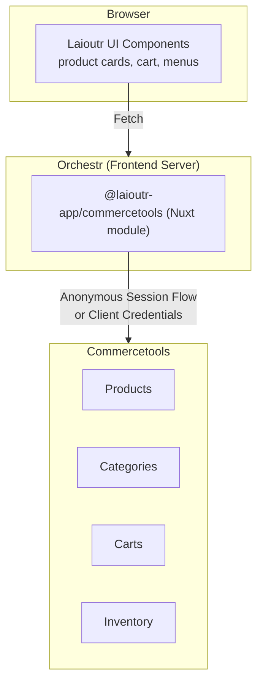

## Overview

**Compatibility:** Laioutr Core 0.19.3 and up

The **@laioutr-app/commercetools** package integrates a Laioutr-powered Nuxt app with [Commercetools](https://commercetools.com/). It uses the **Commercetools Platform API** (products, categories, cart, product search with facets and sortings). The package registers with the Laioutr orchestr (queries, actions, links, component resolvers), and maps Commercetools images to the canonical media shape with provider `commercetools` for use with Nuxt Image.

Auth is either **anonymous session** (when a `ctp-anon-token` cookie is present) or **client credentials** (server-side only). The package creates or reuses the active cart per request and exposes canonical ecommerce capabilities so your UI can stay backend-agnostic.

## Architecture



**Data flow:**

1. UI components call `useOrchestr()` with canonical queries (e.g. `ProductBySlugQuery`)
2. Orchestr routes the query to the Commercetools app handler on the Nuxt server
3. The app authenticates via anonymous session (if cookie present) or client credentials
4. Commercetools API returns data; the app maps it to canonical types
5. UI receives backend-agnostic data shapes it can render without Commercetools knowledge

## Installation

Install the Commercetools app into your project via the **Laioutr Cockpit**:

1. Open your project in the Laioutr Cockpit
2. Navigate to **Apps** in the sidebar
3. Find **Commercetools** in the app catalog
4. Click **Install** and follow the prompts
5. Configure the required credentials in **App Config** (see [Getting Commercetools credentials](#getting-commercetools-credentials))

The Cockpit will add the module to your project and set up the necessary configuration.

## Getting Commercetools credentials

To connect your Laioutr project to Commercetools, you need API credentials from the Commercetools Merchant Center.

### Step 1: Access Merchant Center

1. Log in to [Commercetools Merchant Center](https://mc.commercetools.com/)
2. Select your organization and project (or create a new project)

### Step 2: Note your project settings

1. Go to **Settings** → **Project settings**
2. Copy the **Project key** (e.g. `my-project`)
3. Note the **API URL** and **Auth URL** for your region:

| Region              | API URL                                                  | Auth URL                                                  |
| ------------------- | -------------------------------------------------------- | --------------------------------------------------------- |
| Europe (AWS)        | `https://api.eu-central-1.aws.commercetools.com`         | `https://auth.eu-central-1.aws.commercetools.com`         |
| North America (AWS) | `https://api.us-central1.gcp.commercetools.com`          | `https://auth.us-central1.gcp.commercetools.com`          |
| Australia (GCP)     | `https://api.australia-southeast1.gcp.commercetools.com` | `https://auth.australia-southeast1.gcp.commercetools.com` |

### Step 3: Create an API client

1. Go to **Settings** → **Developer settings** → **API clients**
2. Click **Create new API client**
3. Name it (e.g. `laioutr-integration`)
4. Select the **Admin client**template, or manually select these scopes:
   - `manage_project:{projectKey}` (required)
   - `manage_my_orders:{projectKey}` (for anonymous cart/checkout)
5. Click **Create API client**
6. **Copy the credentials immediately**— the secret is shown only once:
   - **Client ID**
   - **Client Secret**

### Step 4: Enable anonymous sessions

If you want cart functionality for guest users:

1. Go to **Settings** → **Project settings** → **General**
2. Ensure **Anonymous sessions** is enabled

### Step 5: Configure in Cockpit

1. Return to the Laioutr Cockpit
2. Open **App Config** for the Commercetools app
3. Enter the credentials:
   - API URL
   - Auth URL
   - Project Key
   - Client ID
   - Client Secret

## Configuration reference

Configuration is managed through the **Laioutr Cockpit App Config**. The following options are set automatically when you configure the app. All five options are **required**.

### Module options

| Option             | Type     | Description                                                                                                         |
| ------------------ | -------- | ------------------------------------------------------------------------------------------------------------------- |
| **`apiURL`**       | `string` | Commercetools API base URL (e.g. `https://api.eu-central-1.aws.commercetools.com`). Default: EU Central 1.          |
| **`authURL`**      | `string` | Commercetools Auth URL (e.g. `https://auth.eu-central-1.aws.commercetools.com`). Default: EU Central 1.             |
| **`projectKey`**   | `string` | Commercetools project key. Default: `laioutr-demo`.                                                                 |
| **`clientId`**     | `string` | API client ID with scope `manage_project:{projectKey}` (and anonymous sessions if you use cart/me).                 |
| **`clientSecret`** | `string` | API client secret. Keep this secret and only use it on the server (the module stores it in private runtime config). |

### Manual configuration (advanced)

For advanced setups or local development, you can configure the module directly in `nuxt.config.ts`:

```ts
// nuxt.config.ts
export default defineNuxtConfig({
  modules: ['@laioutr-app/commercetools', '@laioutr-core/orchestr', '@nuxt/image'],
  '@laioutr-app/commercetools': {
    apiURL: process.env.CTP_API_URL ?? 'https://api.eu-central-1.aws.commercetools.com',
    authURL: process.env.CTP_AUTH_URL ?? 'https://auth.eu-central-1.aws.commercetools.com',
    projectKey: process.env.CTP_PROJECT_KEY!,
    clientId: process.env.CTP_CLIENT_ID!,
    clientSecret: process.env.CTP_CLIENT_SECRET!,
  },
});
```

Use environment variables for `clientId` and `clientSecret`; never commit secrets to version control.

### Runtime behavior

- **API client**:br
  The package builds a single Commercetools API client per request via `@commercetools/ts-client` and `@commercetools/platform-sdk`. If the request has the **anonymous token cookie** (`ctp-anon-token`), it uses **anonymous session flow** so cart and `me` endpoints work. Otherwise it uses **client credentials flow** (server-only, no cart/me). The client is passed into the orchestr context as `commercetoolsClient`.
- **Token cache**:br
  For anonymous sessions, the package uses a cookie-based token cache. Tokens are read from and written to `ctp-anon-token` and `ctp-anon-refresh-token` (httpOnly, secure, sameSite: strict, path: /). The first request without a token triggers a token fetch before running orchestr handlers.
- **Facets and sortings**:br
  The orchestr middleware injects a default **facets** config (e.g. Price ranges, In Stock boolean, Color lenum) and **sortings** (e.g. price asc/desc). You can extend these in the middleware; see [Commercetools Product Search facets](https://docs.commercetools.com/api/projects/product-search#facets) and [Search Sortings](https://docs.commercetools.com/api/search-query-language#ctp\:api\:type\:SearchSorting).

## Capabilities

The package implements Laioutr’s canonical ecommerce types via the orchestr. The following lists what is available; for exact types and payloads, refer to `@laioutr-core/canonical-types` and the package source.

### Queries

- **Cart**
  - **GetCurrentCartQuery** – Returns the current cart ID. Uses `me().activeCart()` or creates a new cart with `me().carts().post()` if none exists. Currency comes from `clientEnv.currency`. Returns `{ id: "" }` if neither anonymous nor authenticated session is available.
- **Menu**
  - **MenuByAliasQuery** – Categories as menu. `alias === "root"` returns top-level categories (`parent is not defined`); otherwise looks up category by key and returns that category’s id. Returns `{ ids, total }`.
- **Product**
  - **ProductBySlugQuery** – Product by slug for the current locale (`masterData.current(slug(locale = "…"))`). Returns `{ id }`.
  - **ProductsByCategorySlugQuery** – Product listing by category slug. Resolves category by slug, then runs product search with filter by category, facets, postFilter (from selected filters), and sort. Returns `ids`, `total`, `availableFilters`, `availableSortings`.

### Actions

- **Cart**
  - **CartAddItemsAction** – Adds line items to the active cart. Input items with `type === "product"` are resolved by SKU via product search; then `addLineItem` actions are applied (productId, variantId, quantity). Creates the cart if needed (same as GetCurrentCartQuery).

### Links

- **Product**
  - **ProductVariantsLink** – Resolves product IDs to variant SKUs. Fetches product projections by id and returns `sourceId` (product id) → `targetIds` (master + variant SKUs).

### Component resolvers

- **Cart** – Resolves cart entities by id. Provides **CartBase** (totalQuantity, discountCodes) and **CartCost** (subtotal, total, totalTax, taxesIncluded, etc.). Uses `carts().get()` with expand for discount codes.
- **MenuItem** – Resolves category entities for the menu. Provides **MenuItemBase** (name, reference with type category, slug, id, childIds, parentId). Builds a full category tree (limit 500) to compute children; only requested entity ids are returned.
- **Product** – Resolves product projections by id. Provides **ProductBase**, **ProductDescription**, **ProductInfo**, **ProductMedia**, **ProductPrices**, **ProductSeo**, **ProductFlags**. Maps name, slug, description, brand (from attribute), images (master + variants), price range, compare-at range, SEO meta. Uses `productProjections().get()` with currency from clientEnv.
- **ProductVariant** – Resolves variants by SKU via product search. Provides **ProductVariantBase**, **ProductVariantInfo**, **ProductVariantAvailability**, **ProductVariantPrices**, **ProductVariantQuantityPrices**, **ProductVariantQuantityRule**, **ProductVariantShipping**, **ProductVariantOptions**. Maps price, discounted price, availability, barcode/gtin, variant options from attributes, unit price measurement, quantity rules (min/step/max), and shipping (e.g. requiresShipping attribute).

## Images and media

Product and variant images from Commercetools are mapped to the canonical **MediaImage** type with `provider: "commercetools"` and `sources[].src&#x60; set to the image URL (and optional width/height from \&#x60;dimensions\`). The module installs **@nuxt/image** on prepare; use a Commercetools Nuxt Image provider if your setup requires it to serve or transform these URLs.

## Commercetools project requirements

For the integration to work correctly, your Commercetools project needs:

- **Published products** – Products must be published (not just staged) with slugs defined for each locale you support
- **Categories with keys** – Categories need both `key` and `slug` fields set for menu queries to work
- **Inventory data** – If using stock facets, ensure inventory/availability is configured for your products
- **Searchable attributes** – For faceted search, mark relevant attributes as searchable in your product types

### Default facet configuration

The app configures these facets by default:

| Facet    | Attribute path                         |
| -------- | -------------------------------------- |
| Price    | `variants.prices.centAmount`           |
| In Stock | `variants.availability.isOnStock`      |
| Color    | `variants.attributes.search-color.key` |

To customize facets for your product types, extend the configuration in `defineCommercetools`.

## Cookies and context

| Cookie                     | Purpose                                                                                                                |
| -------------------------- | ---------------------------------------------------------------------------------------------------------------------- |
| **ctp-anon-token**         | Anonymous session access token for Commercetools (me, cart). Set by the token cache when using anonymous session flow. |
| **ctp-anon-refresh-token** | Refresh token for the anonymous session.                                                                               |

Without these cookies, the app uses client credentials only; `GetCurrentCartQuery` and cart actions will not have a customer cart and may return empty id or create one-off carts depending on implementation.

## Troubleshooting

### Cart returns empty ID

**Symptom:** `GetCurrentCartQuery` returns `{ id: "" }`.

**Cause:** No anonymous session cookie is present, and client credentials flow cannot access `me` endpoints.

**Solution:**

- Ensure anonymous sessions are enabled in Commercetools project settings
- Verify the `ctp-anon-token` cookie is being set (check browser DevTools → Cookies)
- Confirm your API client has the required scopes for anonymous sessions

### Authentication errors (401/403)

**Symptom:** API calls fail with unauthorized or forbidden errors.

**Possible causes:**

- Invalid or expired `clientId`/`clientSecret`
- Missing required scopes on the API client
- Project key mismatch between config and Commercetools

**Solution:**

1. Verify credentials in Cockpit App Config match Merchant Center
2. Check API client scopes include `manage_project:{projectKey}`
3. Regenerate the API client secret if it may have been rotated

### Products not appearing

**Symptom:** Product queries return empty results.

**Possible causes:**

- Products not published in Commercetools
- Slugs missing for the current locale
- Category filters not matching

**Solution:**

1. In Merchant Center, verify products are **Published** (not just staged)
2. Check products have slugs defined for your locale (e.g. `en-US`)
3. Verify categories have keys and slugs set

### Facets not working

**Symptom:** `availableFilters` is empty or missing expected facets.

**Cause:** Default facet configuration doesn't match your product type attributes.

**Solution:**

- Review facet config in the middleware
- Ensure attribute names match your product type (e.g. `variants.attributes.search-color.key`)
- Check that attributes are marked as searchable in Commercetools

### Token refresh issues

**Symptom:** Users are logged out unexpectedly or carts reset.

**Cause:** Refresh token expired or cookie not persisting.

**Solution:**

- Check cookie settings (httpOnly, secure, sameSite) align with your deployment
- Verify the domain allows cookies to be set
- Check for cookie size limits if storing large tokens

## Changelog

Version history is maintained in [`CHANGELOG.md`](https://github.com/laioutr/app-commercetools/blob/main/CHANGELOG.md) in the public repository [**laioutr/app-commercetools**](https://github.com/laioutr/app-commercetools).
