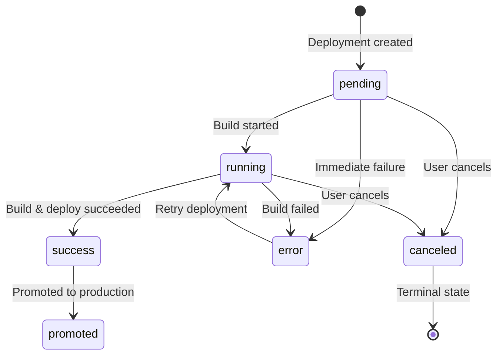

# General

Integrate your own hosting solution into Laioutr by setting up a webhook. Cockpit will call this webhook for every deployment-related action:

- Deployments
- Status Updates
- Deployment Cancellation
- Deployment Promotion
- Rollbacks

You provide a URL that Cockpit will call for each of these actions.

# Laioutr BYOS Agent (reference implementation)

For most setups you do not need to build your own webhook handler from scratch.  
We provide an open‑source **BYOS deployment agent** that:

- Verifies Standard Webhooks signatures.
- Maps BYOS events to **shell scripts** on your server.
- Streams deployment files to a temporary directory.
- Sends **status callbacks** back to Cockpit (running, success, promoted, error, canceled).

Use this as a **reference implementation** or as a starting point for your own handler:

- [laioutr/byos-agent](https://github.com/laioutr/byos-agent) (MIT)

```bash
# Install globally
npm install -g @laioutr/byos-agent

# Start the agent (listens on :4000 by default)
laioutr-byos-agent
```

The agent reads configuration from `byos-agent.config.ts` (or `.js` / `.json`) in the working directory.  
Configuration includes:

- `signingSecret` (required): your BYOS webhook signing secret (`whsec_…`).
- `baseUrl`: default deployment URL used by Studio previews.
- `scripts`: mapping from BYOS events (for example `hosting.deployment.created`) to shell scripts or inline commands.
- Runtime options like `port`, `shell`, `timeout`, `tempDir`, and `logLevel`.

Each script receives environment variables such as:

- `LAIOUTR_PROJECT` – `<organization-slug>/<project-slug>`
- `LAIOUTR_EVENT` – event name (for example `hosting.deployment.created`)
- `LAIOUTR_DEPLOYMENT_ID`, `LAIOUTR_ENVIRONMENT`, `LAIOUTR_CALLBACK_URL`, `LAIOUTR_FILES_DIR`, `LAIOUTR_PAYLOAD_FILE` for deployment events

On `hosting.deployment.created` the script runs in `LAIOUTR_FILES_DIR` and can:

- Build and deploy the frontend from the provided files.
- Print a final line containing a URL (used as deployment URL).
- Optionally include the word `promoted` in the final line to mark the deployment as promoted.

The repository contains **ready‑made examples** that you can copy to your own servers:

- **Docker + Traefik** – build Docker images for Laioutr frontends and let Traefik route preview and production domains using container labels.  
  See `examples/docker-traefik/` in the repository for a `Dockerfile.nuxt`, example scripts (`deploy.sh`, `promote.sh`, `delete.sh`) and a `byos-agent.config.ts` tailored to Traefik.

- **PM2 (bare metal)** – run multiple preview and production Nuxt processes using PM2 on a single machine.  
  See `examples/pm2/` in the repository for scripts that:
  - Derive deterministic preview ports from the deployment ID.
  - Start Nuxt builds under PM2 for each deployment.
  - Promote a preview deployment by re‑wiring which PM2 process serves the production port.

Use these examples as:

- Drop‑in configurations for your own BYOS host.
- Blueprints for building custom deployment flows that still speak the standard BYOS webhook protocol.

# Authentication (Standard Webhooks)

All requests from Cockpit are signed using the [Standard Webhooks](https://www.standardwebhooks.com/) specification. When you configure your webhook, you'll receive a signing secret (prefixed with `whsec_`) that you must use to verify incoming requests.

Each request includes these headers:

| Header              | Description                                        |
| ------------------- | -------------------------------------------------- |
| `webhook-id`        | Unique identifier for this webhook delivery        |
| `webhook-timestamp` | Unix timestamp (seconds) when the request was sent |
| `webhook-signature` | HMAC-SHA256 signature in format `v1,{base64}`      |

To verify a request:

1. Concatenate `{webhook-id}.{webhook-timestamp}.{body}` (body is the raw request body)
2. Remove the `whsec_` prefix from your signing secret
3. Base64-decode the remaining string to get the raw secret bytes
4. Compute HMAC-SHA256 over the signed content using the decoded secret bytes
5. Base64-encode the result and compare with the signature after the `v1,` prefix (timing-safe comparison)
6. Reject requests older than 5 minutes to prevent replay attacks

Most languages have Standard Webhooks libraries available. See [standardwebhooks.com](https://www.standardwebhooks.com/) for implementations.

# Request Format

All requests are `POST` with `Content-Type: application/json`. Every request includes:

| Field       | Type   | Description                                                                                  |
| ----------- | ------ | -------------------------------------------------------------------------------------------- |
| `event`     | string | The event type (e.g., `hosting.deployment.created`)                                          |
| `timestamp` | string | ISO 8601 timestamp (UTC, e.g., `2025-01-30T12:00:00.000Z`) of when the http-request was sent |
| `project`   | string | Project identifier as `org-slug/project-slug`                                                |
| `data`      | object | Event-specific payload (optional)                                                            |

```json
{
  "event": "hosting.deployment.created",
  "timestamp": "2025-01-30T12:00:00.000Z",
  "project": "acme-corp/storefront",
  "data": { ... }
}
```

## TypeScript Types

TypeScript definitions for all webhook events and responses are available in the `@laioutr/webhook-types` package:

```bash
npm install @laioutr/webhook-types
```

Usage example:

```typescript
import type { ByosWebhookEvent, ByosDescribeResponse, ByosWebhookResponse } from '@laioutr/webhook-types/byos';

function handleWebhook(event: ByosWebhookEvent): ByosWebhookResponse {
  if (event.event === 'hosting.describe') {
    return {
      ok: true,
      data: {
        name: 'My CI/CD System',
        url: 'https://storefront.example.com',
        capabilities: {
          /* ... */
        },
      },
    } satisfies ByosDescribeResponse;
  }
  if (event.event === 'hosting.deployment.created') {
    const { deploymentId, callbackUrl, files } = event.data;
    startBuild(deploymentId, files, callbackUrl);
  }
  return { ok: true, data: {} };
}
```

## Delivery Behavior

### Retries

Cockpit retries failed webhook deliveries with the following policy:

| Parameter           | Value                                            |
| ------------------- | ------------------------------------------------ |
| Max attempts        | 3                                                |
| Per-attempt timeout | 7 seconds                                        |
| Total time budget   | 25 seconds                                       |
| Retry delay         | Exponential backoff (1s, 2s, 4s) with 30% jitter |

A delivery is considered failed if:

- The endpoint returns a non-2xx HTTP status
- The JSON payload is not valid
- The request times out
- A network error occurs

Returning `{ "ok": false, "error": "..." }` will not trigger a retry.

If the retries did not succeed, the event will be discarded.

### Idempotency

The `webhook-id` header serves as an idempotency key. **The same `webhook-id` is used across all retry attempts** for a given event. Your endpoint should use this to deduplicate requests if needed.

```text
First attempt:  webhook-id: evt_abc123
Retry 1:        webhook-id: evt_abc123  (same)
Retry 2:        webhook-id: evt_abc123  (same)
```

You can track `webhook-id` values to skip duplicates.

# Response Format

Your endpoint must respond with JSON in this format:

```json
{
  "ok": true,
  "data": { ... }
}
```

Or on failure:

```json
{
  "ok": false,
  "error": "Human-readable error message"
}
```

Return appropriate HTTP status codes:

- `200` for successful processing
- `400` for invalid requests
- `401` for authentication failures
- `500` for server errors

# Events

## `hosting.describe`

Cockpit sends this event to discover your system's capabilities. This is called during initial setup and periodically to refresh capabilities.

### Request

```json
{
  "event": "hosting.describe",
  "timestamp": "2025-01-30T12:00:00.000Z",
  "project": "acme-corp/storefront"
}
```

### Response

```json
{
  "ok": true,
  "data": {
    "name": "Your CI/CD System",
    "url": "https://storefront.example.com",
    "capabilities": {
      "statusUpdates": true,
      "cancelDeployment": false,
      "promoteDeployment": false,
      "rollbackDeployment": false,
      "deleteDeployment": false
    }
  }
}
```

### Fields

| Field          | Description                                                                                                       |
| -------------- | ----------------------------------------------------------------------------------------------------------------- |
| `name`         | Display name for your hosting provider (shown in Cockpit UI)                                                      |
| `url`          | Base URL where the project is hosted (e.g., `https://storefront.example.com`). Will be used in the studio preview |
| `capabilities` | Object describing which actions your system supports                                                              |

### Capabilities

| Capability           | Description                                                                                                                                           |
| -------------------- | ----------------------------------------------------------------------------------------------------------------------------------------------------- |
| `statusUpdates`      | Your system will call back with deployment status updates. If this capability is not supported, the Cockpit deployment status will be set to unknown. |
| `cancelDeployment`   | Your system can cancel in-progress deployments                                                                                                        |
| `promoteDeployment`  | Your system can promote deployments to production                                                                                                     |
| `rollbackDeployment` | Your system can rollback to previous deployments                                                                                                      |
| `deleteDeployment`   | Your system can delete deployments                                                                                                                    |

Set capabilities to `true` only for actions your system supports. Cockpit will only send those event types if you indicate support.

## `hosting.connected`

Sent when a project successfully connects to your webhook. Use this to set up any resources you need for the project.

### Request

```json
{
  "event": "hosting.connected",
  "timestamp": "2025-01-30T12:00:00.000Z",
  "project": "acme-corp/storefront"
}
```

### Response

```json
{
  "ok": true,
  "data": {}
}
```

## `hosting.disconnected`

Sent when a project disconnects from your webhook. Use this to clean up any resources.

### Request

```json
{
  "event": "hosting.disconnected",
  "timestamp": "2025-01-30T12:00:00.000Z",
  "project": "acme-corp/storefront"
}
```

### Response

```json
{
  "ok": true,
  "data": {}
}
```

## `hosting.deployment.created`

Sent when a user triggers a deployment. Contains all files needed to build and deploy the project.

### Request

```json
{
  "event": "hosting.deployment.created",
  "timestamp": "2025-01-30T12:00:00.000Z",
  "project": "acme-corp/storefront",
  "data": {
    "deploymentId": "dep_abc123",
    "environment": "production",
    "callbackUrl": "https://cockpit.laioutr.cloud/api/webhook/hosting/dep_abc123?secret=cbsec_xxx",
    "files": {
      "package.json": "{ \"name\": \"storefront\", ... }",
      "nuxt.config.ts": "export default defineNuxtConfig({ ... })",
      "laioutrrc.json": "{ ... }",
      "app.vue": "<template>...</template>"
    }
  }
}
```

### Fields

| Field          | Description                                                            |
| -------------- | ---------------------------------------------------------------------- |
| `deploymentId` | Unique identifier for this deployment                                  |
| `environment`  | Either `"production"` or `"staging"`                                   |
| `callbackUrl`  | URL to POST status updates (see [Status Callbacks](#status-callbacks)) |
| `files`        | Map of filename to file contents                                       |

### Response

Acknowledge receipt immediately. Don't wait for the build to complete.

```json
{
  "ok": true,
  "data": {}
}
```

## `hosting.deployment.cancel`

Sent when a user requests to cancel an in-progress deployment. Only sent if you indicated `cancelDeployment: true` in capabilities.

### Request

```json
{
  "event": "hosting.deployment.cancel",
  "timestamp": "2025-01-30T12:00:00.000Z",
  "project": "acme-corp/storefront",
  "data": {
    "deploymentId": "dep_abc123"
  }
}
```

### Response

```json
{
  "ok": true,
  "data": {}
}
```

## `hosting.deployment.promote`

Sent when a user wants to promote a staging deployment to production. Only sent if you indicated `promoteDeployment: true` in capabilities.

### Request

```json
{
  "event": "hosting.deployment.promote",
  "timestamp": "2025-01-30T12:00:00.000Z",
  "project": "acme-corp/storefront",
  "data": {
    "deploymentId": "dep_abc123"
  }
}
```

### Response

```json
{
  "ok": true,
  "data": {}
}
```

## `hosting.deployment.rollback`

Sent when a user wants to rollback to a previous deployment. Only sent if you indicated `rollbackDeployment: true` in capabilities.

### Request

```json
{
  "event": "hosting.deployment.rollback",
  "timestamp": "2025-01-30T12:00:00.000Z",
  "project": "acme-corp/storefront",
  "data": {
    "deploymentId": "dep_abc123",
    "fromDeploymentId": "dep_xyz789"
  }
}
```

### Fields

| Field              | Required | Description                                |
| ------------------ | -------- | ------------------------------------------ |
| `deploymentId`     | Yes      | Deployment to roll back TO                 |
| `fromDeploymentId` | No       | Currently active deployment being replaced |

### Response

```json
{
  "ok": true,
  "data": {}
}
```

## `hosting.deployment.delete`

Sent when a user wants to delete a deployment. Only sent if you indicated `deleteDeployment: true` in capabilities.

### Request

```json
{
  "event": "hosting.deployment.delete",
  "timestamp": "2025-01-30T12:00:00.000Z",
  "project": "acme-corp/storefront",
  "data": {
    "deploymentId": "dep_abc123"
  }
}
```

### Response

```json
{
  "ok": true,
  "data": {}
}
```

# Status Callbacks

If you set `statusUpdates: true` in your capabilities, you should POST status updates to the `callbackUrl` provided in the deployment request.

## Callback URL

The callback URL is provided in the `hosting.deployment.created` event:

```text
https://cockpit.laioutr.cloud/api/webhook/hosting/{deploymentId}?secret={secret}
```

The `deploymentId` is embedded in the URL path. The `secret` parameter (prefixed with `cbsec_`) authenticates your request. No additional headers or signatures are required.

## Deployment Status State Machine

The following diagram shows the valid deployment status transitions:



**State Transition Rules:**

- `canceled` is a terminal state - no transitions are allowed after cancellation
- Same status updates are ignored (no-op)
- All other transitions are allowed, including recovery from `error` back to `running`
- Invalid transitions are silently accepted but not applied

## Status Events

Send a `POST` request with `Content-Type: application/json`.

**Note:** Status callbacks do not include the `project` field. The deployment is identified by the `deploymentId` in the callback URL path.

### Running

Indicate that the deployment is in progress:

```json
{
  "event": "hosting.deployment.status",
  "timestamp": "2025-01-30T12:05:00.000Z",
  "data": {
    "status": "running"
  }
}
```

### Success

Indicate that deployment succeeded. The `url` field is **required** and must be a valid URL:

```json
{
  "event": "hosting.deployment.status",
  "timestamp": "2025-01-30T12:10:00.000Z",
  "data": {
    "status": "success",
    "url": "https://storefront.example.com"
  }
}
```

### Error

Indicate that the deployment failed. The `error` field is **required**:

```json
{
  "event": "hosting.deployment.status",
  "timestamp": "2025-01-30T12:10:00.000Z",
  "data": {
    "status": "error",
    "error": "Build failed: npm install returned exit code 1"
  }
}
```

### Cancelled

Indicate that the deployment was canceled:

```json
{
  "event": "hosting.deployment.status",
  "timestamp": "2025-01-30T12:08:00.000Z",
  "data": {
    "status": "canceled"
  }
}
```

### Promoted

Indicate that a deployment was promoted to production. The `url` field is optional:

```json
{
  "event": "hosting.deployment.status",
  "timestamp": "2025-01-30T12:15:00.000Z",
  "data": {
    "status": "promoted",
    "url": "https://storefront.example.com"
  }
}
```

## Callback Response

Cockpit responds with:

```json
{
  "ok": true,
  "data": {}
}
```

Or on error:

```json
{
  "ok": false,
  "error": "Deployment not found"
}
```

### Callback HTTP Status Codes

| Status | Meaning                            |
| ------ | ---------------------------------- |
| 200    | Status update accepted             |
| 400    | Invalid payload format             |
| 401    | Missing or invalid callback secret |
| 404    | Deployment not found               |
| 500    | Server error                       |

**Note:** Invalid status transitions (e.g., updating a canceled deployment) return `200` with `{ "ok": true }` but are silently ignored.

## Retry Recommendations

If Cockpit is temporarily unavailable when sending status callbacks:

- Use exponential backoff (e.g., 1s, 2s, 4s, 8s, up to 5 minutes)
- Repeated identical status updates are safe (idempotent)
- After extended failures, consider logging the issue for manual review

# Setup in Cockpit

1. Go to **Project** → **Hosting**
2. Click **Connect custom hosting**
3. Enter your webhook endpoint URL
4. Copy the signing secret (starts with `whsec_`) and configure it in your system
5. Click **Test connection** to verify everything works
6. Click **Confirm** to save the configuration

Your webhook will now receive events for all deployment actions.

# Troubleshooting

## Signature verification fails

- Ensure you're using the raw request body for verification, not a parsed JSON object
- Remove the `whsec_` prefix from the secret
- Base64-decode the secret before using it as the HMAC key (this is required by Standard Webhooks)
- The signature format is `v1,{base64}` - extract the base64 part after `v1,` for comparison
- Check that your signing secret matches exactly (no extra whitespace)
- Verify the timestamp is within 5 minutes of the current time
- Consider using a Standard Webhooks library for your language - see [standardwebhooks.com](https://www.standardwebhooks.com/)

## Not receiving events

- Check that your endpoint is publicly accessible
- Verify your endpoint returns `200` status codes
- Check your server logs for errors

## Deployment stuck in "running"

- Ensure you're calling the callback URL with status updates
- Verify the callback URL secret (`cbsec_` prefix) is included in the query string
- Check that your status payload matches the expected format
- The `url` field is required for `success` status - invalid URLs are rejected with `400`
