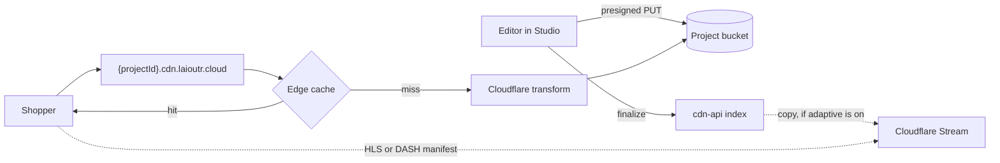

::since-version{version="0.35.0" packages="@laioutr-app/cms, @laioutr-core/frontend-core" changelog="frontend"}
::

A product page wants a 20-second demo clip. A hero wants a muted loop behind the headline. A campaign page wants a vertical feed of short clips that plays as the shopper scrolls. All three are the same job for the platform: an editor picks a video in Studio, and the storefront plays it fast enough that nobody waits.

The Laioutr CDN handles that job on the same storage, hostname, and cache path it uses for images. This page describes what that path does, where it stops, and which seams exist for video that needs more than it offers.

## The delivery path



Uploads go from the browser straight to the project's bucket through a short-lived presigned URL. Nothing is written to the index until the object has landed, so an abandoned upload leaves nothing behind. Delivery runs through the project's own hostname with the edge cache in front, and the origin is only touched on a miss.

There is no transcoding queue and no processing state to poll. A video is playable as soon as it is finalized, because every derived variant is produced on request by the transform layer, not ahead of time.

Where [adaptive delivery](#adaptive-delivery) is on, finalize also registers a copy to Cloudflare Stream, which transcodes in the background. That does not add a wait either: the progressive source is on the value from the first moment, so the clip plays while the ladder is still being built.

## The upload envelope

Video is accepted only inside a fixed envelope. The limits come from the transform layer, and the CDN rejects an out-of-envelope file at the moment upload targets are requested rather than accepting it and degrading to an untransformable raw file.

| Constraint | Value |
| --- | --- |
| Container and codecs | MP4 with H.264 video and AAC or MP3 audio |
| File size | 100 MB |
| Duration | 10 minutes |
| Output | Progressive MP4, plus HLS and DASH manifests where [adaptive delivery](#adaptive-delivery) is on |

A rejected file comes back as a per-file `too_large` or `unsupported_type` outcome, so one bad file in a batch does not sink the rest. The limits are enforced server-side; a client-side hint in the picker is a convenience, not the boundary.

::note
This envelope is the short-form profile: product clips, hero loops, feed items. Adaptive bitrate happens inside it; see [Adaptive delivery](#adaptive-delivery). Long-form video and files past 100 MB are still outside it, which is what [Beyond the envelope](#beyond-the-envelope) is for.
::

## Delivery URLs and caching

A finalized video is served from the project's delivery host at a key minted once for that upload:

```
https://{projectId}.cdn.laioutr.cloud/{key}.mp4
```

Two properties of that URL matter when you build on it.

**A key is never reused.** Each upload mints a fresh key, and the bytes behind a key never change. Replacing a video writes a new key and repoints the reference; it does not overwrite the old object.

**Responses are cached for a year, immutably.** A successful delivery carries `cache-control: public, max-age=31536000, immutable`. That is what makes a repeat view free, and it is also why keys are immutable: a browser cache cannot be purged, so a swapped object would keep serving the old bytes to returning visitors for as long as the entry lives. Error responses are excluded from that header.

A branded delivery hostname (`cdn.example.com`) can replace the default. It changes the host in the URL and nothing else about this section. Adaptive manifests are the one exception, because they are served from Cloudflare Stream's own host rather than the project's; see [What playback looks like](#what-playback-looks-like).

## Transformations

Derived variants are produced at the edge from the stored MP4 by prefixing the key with a transform path:

```
https://{projectId}.cdn.laioutr.cloud/cdn-cgi/media/{options}/{key}.mp4
```

| Mode | Produces | Typical use |
| --- | --- | --- |
| `mode=video` | Re-encoded progressive MP4 at a requested `width`, `height`, and `fit` | Serving a smaller rendition to a small element |
| `mode=frame` | A single JPEG frame at a given `time` | Poster images and picker thumbnails |
| `mode=spritesheet` | A grid of frames | Scrub previews on a timeline |

Each distinct transform URL is cached like any other object, so a variant is generated once and then served from cache.

Posters are wired up for you. A video picked from the Laioutr CDN carries a `poster` whose sources use the `laioutrCmsPoster` Nuxt Image provider, which rebuilds a `mode=frame` URL at whatever width the layout asks for. The poster therefore gets responsive widths in the same way an image does.

::warning
The progressive source is delivered at its stored size today. The `mode=video` width ladder is available on the delivery host but is not yet applied automatically by the built-in player, so upload video at the size you intend to serve. A browser that plays the HLS source gets Stream's own bitrate ladder instead.
::

## Rendering video in the storefront

An asset picked from the CDN is a canonical [`MediaVideo`](/frontend/api-reference/common-types/media#mediavideo) value, so it renders through the same component as any other video:

```vue
<template>
  <Media :media="section.clip" playback="background" />
</template>
```

The parts of that already have their own pages:

- [`Media`](/laioutr-ui/ui-kit/general/media) dispatches on `media.type`, plays video with a built-in native player, and holds video back from fetching until it is within a screen of the viewport.
- `playback="interactive"` gives a native player with controls; `playback="background"` gives the muted autoplay loop, with autoplay suppressed under reduced motion.
- [`MediaSourceVideo`](/frontend/api-reference/common-types/media#mediasourcevideo) carries the source URL, dimensions, optional focal point, and the `streaming` discriminator described below.
- [Media and Media Library](/frontend/features/media) covers the picker, the connector contract, and staged uploads.

## Adaptive delivery

Inside that same envelope, a project can serve every video as adaptive HLS and DASH as well. Uploads are copied to Cloudflare Stream during finalize, and the asset then carries three sources instead of one:

| Order | Source | `streaming` | `format` |
| --- | --- | --- | --- |
| 1 | HLS manifest (`video.m3u8`) | `hls` | `application/vnd.apple.mpegurl` |
| 2 | DASH manifest (`video.mpd`) | `dash` | `application/dash+xml` |
| 3 | Progressive MP4 | `progressive` | the uploaded MIME type |

That order is what makes adaptive playback work with no player library at all. A browser plays the first `<source>` whose `type` it claims to support, and no browser claims either manifest type. Safari takes the HLS source and plays it natively with adaptive bitrate. Chrome and Firefox skip both manifests and play the MP4, exactly as they did before. No call site changes, and no renderer has to be registered.

Registering a renderer is how Chrome and Firefox get adaptive bitrate too. A player built on `hls.js`, `dash.js`, or Vidstack reads `media.sources`, picks the source whose `streaming` is `hls` or `dash`, and drives MSE itself. See [The player is a registration, not a fork](#the-player-is-a-registration-not-a-fork).

Every source carries an explicit `format`, so a player never has to infer the type from a four-character file extension.

### Turning it on

Adaptive delivery is a per-project switch, and it is off by default. There is no control for it in Cockpit yet, so ask Laioutr support to enable it for a project.

Enabling it changes what happens to videos uploaded from that point on. Videos already sitting in the media library keep their single progressive source until an operator runs a backfill over them. A video already picked into a page keeps the sources it was picked with, because a picked `Media` value is stored verbatim in the page configuration; re-pick it in Studio to pull in the adaptive ones.

### What playback looks like

Manifests are served from Cloudflare Stream's shared account host, not from the project's delivery hostname:

```
https://customer-{code}.cloudflarestream.com/{uid}/manifest/video.m3u8
```

Stream has no custom playback domain for video on demand, so a branded per-project URL is not available for the manifests. The poster and the progressive MP4 stay on the project's own host, so only the manifest URL shows a Cloudflare hostname in page source.

R2 stays the file of record. Stream is an added delivery path over the same stored object rather than a second storage backend, so keys, caching, and the transform layer are unaffected.

::note
A transcode that fails after the copy is not detected. Its manifest returns 404, the browser falls through to the MP4, and the visitor still sees the video.
::

## What the CDN meters

Delivered bytes are counted per project, off the request path, and rolled up daily and monthly. Image traffic and progressive video traffic share that one line.

Adaptive delivery is metered on its own, because it never touches the project's bucket. Two quantities are recorded: the streaming minutes delivered, summed over the month, and the size of the stored video library, kept as the month's peak rather than a sum. A library that held 40 hours for two weeks is recorded at 40 hours, whatever it holds today.

Metering is record-only. Passing the volume included in your plan raises a notification and an upgrade conversation; it does not throttle delivery and it does not break media on a live storefront. Enforcement is reserved for abuse, not for ordinary overage.

## Beyond the envelope

Long-form video, DRM, and per-video analytics are outside what this path does, and so is adaptive bitrate for anything too big for the envelope. The platform does not pretend otherwise, and it does not require a migration to get them: the contract and the render path were built with the seams already open, so a third-party video provider is a per-asset choice rather than a platform switch.

### The source already declares its streaming format

`MediaSourceVideo.streaming` is part of the canonical type, not an extension:

```ts
interface MediaSourceVideo {
  provider: string;
  src: string;
  width: number;
  height: number;
  streaming?: 'progressive' | 'hls' | 'dash';
  // ...
}
```

The Laioutr CDN produces a `progressive` source for every video, with an `hls` and a `dash` source beside it where [adaptive delivery](#adaptive-delivery) is on. A source produced by a third-party backend points `src` at its own manifest and sets the same discriminator. All of them are valid `MediaVideo` values, all are stored the same way, and they can sit side by side in one project. See [Streaming formats](/frontend/api-reference/common-types/media#streaming-formats) for what each value tells a renderer.

### The player is a registration, not a fork

The built-in `<video>` element plays progressive sources, and HLS wherever the browser handles it natively. Adaptive playback everywhere else needs a JavaScript player, and `<Media>` takes one through `provideMediaRenderers`. A renderer registered for `video` replaces the built-in for every video in the app, with no change at any call site:

```ts [plugins/media-renderers.ts]
import { provideMediaRenderers } from '#ui-kit/components/Media/MediaRenderersProvider';
import StreamingVideo from '~/components/StreamingVideo.vue';

export default defineNuxtPlugin((nuxtApp) => {
  provideMediaRenderers(nuxtApp.vueApp, {
    video: StreamingVideo,
  });
});
```

The renderer receives the narrowed `media` object and the playback props, reads `media.sources` and `media.streaming`, and decides whether a source plays natively or needs the player's engine. That is where a Mux, Bunny, Cloudflare Stream, or Vidstack player goes. See [Overriding with a custom renderer](/laioutr-ui/ui-kit/general/media#overriding-with-a-custom-renderer) for the full contract and a worked example.

### The library is a connector

An external video service can appear in Studio as its own picker alongside the Laioutr CDN. That is the media-library connector interface: declare capabilities, answer `list`, and optionally handle uploads. Your `list` maps the provider's assets onto `MediaVideo` values with `streaming: 'hls'` and a poster URL, and every downstream consumer keeps working, because the shape is canonical.

The full contract, including staged uploads and the transient `processing` state a transcoding backend needs, is in [Media and Media Library](/frontend/features/media).

### What changes when video leaves the Laioutr CDN

Adaptive providers buy capability at a cost that is worth naming before you commit:

- **Delivery hostname.** Managed streaming services usually serve from a shared, account-wide playback domain. A branded per-project delivery host is a property of the Laioutr CDN path and does not carry over.
- **Isolation.** On the Laioutr CDN, one project's stored objects are in one bucket bound to one hostname. On a shared streaming account, separation depends on tagging and identifier secrecy instead. The built-in adaptive path already sits on that weaker footing for the manifests alone, while the bucket stays the boundary for everything else.
- **Metering.** Streaming services bill stored and delivered minutes, and that traffic never touches the Laioutr CDN, so it does not appear in the delivered-bytes rollup. It is a separate line on a separate bill.
- **Upload shape.** Presigned single-PUT uploads are what the Laioutr CDN does. Resumable and multipart protocols used by streaming services are a different upload path, and the connector's finalize step waits for a transcode instead of confirming an object.

A useful middle path keeps the file in the project's bucket as the source of truth and lets the streaming provider pull from it, so storage and delivery stay separable. That is the shape [adaptive delivery](#adaptive-delivery) uses.

## Not on this path today

Stated plainly, so nothing is inferred from silence. The Laioutr CDN video path does not provide:

- Adaptive bitrate in Chrome or Firefox without a registered player; the built-in element falls back to the MP4 there
- A branded hostname for the adaptive manifests, which are served from Cloudflare Stream's shared host
- Signed or expiring delivery URLs, hotlink restrictions, or DRM; delivery is public by design, as storefront media is public content
- Watermarking, automatic content tagging, or a hosted player skin
- Transcode webhooks or a processing-status API; a failed Stream transcode is not surfaced anywhere
- Asset deletion from the picker
