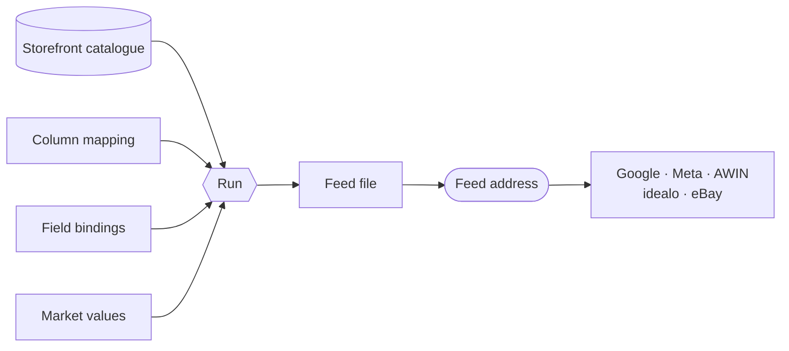

## Distributr

**Distributr** turns your catalogue into the file a marketing channel expects and publishes it at an address that never changes. You configure a **feed** per channel and market; Cockpit reads your storefront on a schedule, writes the file, and the channel fetches it whenever it likes. Open **Distributr** from the project sidebar.

Nothing is exported from a commerce platform directly. A feed reads the **same storefront a visitor sees**, so a product that is hidden, out of stock or priced differently for a market is that way in the feed too.

### How it fits together

The mapping says which column carries what, the bindings say where this shop keeps each value, and the market values supply what is a decision rather than a catalogue fact.

### Channels

Each channel ships as a **template** — the columns that channel documents, spelled the way it reads them, in the order it expects.

| Channel | File | One row per |
| --- | --- | --- |
| Google Shopping | Tab-separated | Variant |
| Meta Commerce | CSV | Product |
| AWIN | CSV | Variant |
| idealo | CSV | Variant |
| eBay File Exchange | Tab-separated | Variant |

Templates follow each channel's own published specification, including the spellings that are wrong on purpose — idealo reads `decription`, and correcting it breaks the import.

::callout{type="info"}
Some channels are also offered in an older **legacy** shape, kept for accounts already configured against it. New feeds should use the specification template: it is the one held to the channel's current documentation.
::

### Creating a feed

**Create feed** asks for the essentials, and the feed is created with its channel's mapping already in place — it can generate before you change anything.

::field-group{title="Feed settings"}
  :::field{required name="Channel" type="string"}
  Decides the columns, the file format and whether a row is a product or a variant.
  :::

  :::field{required name="Market" type="string"}
  The market whose catalogue, prices and currency the feed reads.
  :::

  :::field{required name="Storefront endpoint" type="url"}
  Where the catalogue is read from, for example `https://shop.example.com`.
  :::

  :::field{name="Locale" type="string"}
  The language the feed carries. Defaults to the market's.
  :::

  :::field{name="Currency" type="ISO 4217"}
  Leave empty to take the market's own.
  :::

  :::field{name="Format" type="csv | tsv"}
  Leave empty to take the channel's own. Only an account configured otherwise needs to disagree.
  :::

  :::field{name="Encoding" type="UTF-8 | ISO-8859-1"}
  UTF-8 unless the channel account expects otherwise.
  :::

  :::field{name="Refresh" type="minutes"}
  How often the schedule regenerates the feed.
  :::
::

### The feed address

Every feed has a public **Feed address**, shown on its page with a copy button. It is stable and answerable **before the first run**, which is the point: a channel account is configured with a URL, and waiting for a generation to learn it is backwards.

The address carries an unguessable token, so it cannot be derived from your project or market names. Each run replaces the file; the URL never moves.

### Column mapping

A feed's page shows its columns as a table you can edit, reorder and extend.

::field-group{title="Per column"}
  :::field{required name="Channel column" type="string"}
  The header the channel reads. Rename only if your account expects something else.
  :::

  :::field{name="Source field" type="string"}
  Which catalogue value fills it.
  :::

  :::field{required name="Transform" type="string"}
  How the value becomes what the channel accepts — a price with its currency, an availability word from that channel's vocabulary, a category path with the right separator.
  :::

  :::field{name="Constant" type="string"}
  A literal written into every row, whatever the product says.
  :::

  :::field{name="Fallback" type="string"}
  Used only when everything above produces nothing.
  :::

  :::field{name="Prefix / suffix" type="string"}
  Wrapped around the result — a unit, a literal marker.
  :::
::

::callout{type="info"}
**A fallback is not a constant.** A constant overwrites the product's own value; a fallback only fills a blank. It is how a catalogue-wide fact your shop has no field for — a marketplace condition code, a delivery time quoted the same for everything — reaches a column while a product that does carry its own value still wins.
::

### Where a field lives

A template asks for a field by name — `gender`, `gtin`, `taxonomy` — and never says where your shop keeps it. That is answered once per project as a **channel input** binding and shared by every feed that asks for it. Cockpit suggests paths taken from what your storefront actually returned for a real product, so you choose among fields that exist and are populated.

A field nobody has bound is not fatal: the feed generates, the column is empty, and the run names it.

### Market values

Some values are a decision rather than a catalogue fact. They belong to the market, and every feed of that market uses them.

| Setting | What it decides |
| --- | --- |
| **Ships to** | The country a shipping offer applies to. Without it the offer is left out — a shipping price with no country applies nowhere. |
| **Service name** | What to call the shipping service, e.g. `Standard`. |
| **Shipping rate**, **Free above** | What delivery costs, and the order value above which it is nothing. |
| **Decimal separator**, **Category separator** | What the channel account expects in a price and in a category path. |
| **New for**, **Top seller from** | The thresholds behind the "new" and "top seller" labels. |
| **Reference** | Dictionaries mapping your shop's words to a channel's vocabulary. A shop says `Damen`; Google takes `female`. |

### Which products go in

A feed can require products to be **in stock** or to **have an image**, set a **minimum price**, and add conditions on any field. Separately, an **exclusion list** removes products by SKU — the answer for the handful of items no rule would ever describe.

Every product a rule removes is counted per rule, so a feed that suddenly halves tells you which rule did it.

### Running a feed

A feed regenerates on its **Refresh** interval, and you can run one by hand from the list or from the feed. A manual run asks for confirmation first: regenerating a large catalogue takes minutes, cannot be stopped once started, and reads a live storefront while it serves buyers.

Runs are **resumable** — an interrupted generation continues where it stopped rather than starting over, and a feed already running refuses a second run instead of publishing two files over each other. The list shows progress in the row, so a long run is distinguishable from a stuck one without opening anything.

When several feeds of one market are due together they **share one read** of the catalogue. Five channels cost one pass over your products, not five.

### What a run tells you

The run log names the unit it is talking about:

- a column the channel **requires** that came out empty;
- a column only your **channel account** can answer — a marketplace's own category id lives in that account, and no catalogue has it. A file is rejected wholesale on first upload for exactly this, and nothing else reports it;
- two rows claiming the **same id**, which a channel reads as one product overwriting the other;
- a **link** that would ship a slug rather than an address;
- which **components** the run asked your storefront for — the first thing to check when a column comes back empty.

A run that had to degrade says so. A run that could not start says why.

### Product links

Most channels need an address for every product. Cockpit builds it from your project's own product page configuration, so it matches what a visitor would land on.

A project whose product pages are not configured in the usual way can state the shape directly in **Product URL** — `https://shop.example.com/p/{slug}` is then used verbatim. Leave it empty and Cockpit derives the address from the storefront endpoint and the page configuration.

### A storefront behind bot protection

A feed is a machine reading your storefront, so a storefront that keeps non-browsers out keeps the feed out too — and a browser passing the challenge in Studio's preview says nothing about it, because Cockpit also reads the catalogue from its own server.

Two credentials answer this, and a read presents both where both apply. The **project secret** the storefront already shares with the platform says the caller is Cockpit; it is sent only to a host the project itself declares — its hosting address or one of its market domains — and never anywhere else, whatever the endpoint says. A **protection bypass key**, entered under **Hosting → Vercel**, answers whatever stands in front of the deployment; that one is settled at the edge, before the storefront application runs, which is why no application-level secret can clear it.

Where neither applies, the run fails immediately and names the protection rather than retrying quietly — a challenge never clears, and a feed that retries forever looks like one still generating.

::callout{type="info"}
Channels crawl the **product pages** as well as fetching the file — Google verifies price and availability on the landing page before approving an item. Protection that blocks those crawlers disapproves the products even when the feed itself is perfect. See [Bot Protection](/frontend/features/bot-protection).
::
