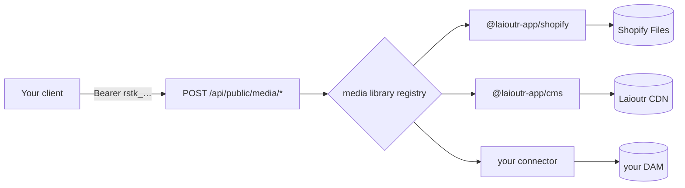

## Assets

A project's storefront exposes five routes that browse and upload assets in whichever media libraries its installed apps registered. One wire contract in front of any number of asset backends: the same call reaches Shopify Files, the Laioutr CDN, or a DAM you connected yourself, and the response shape does not change.

The routes are built for a client that is **not** yours to run — an internal tool, a partner's page, a desktop app, a migration script, an MCP server that sets media on a section. Access is authorized by a **restricted key**: bound to one project, limited to reading or writing assets, and revocable on its own.



::note
This page documents the calling side. To make a new backend appear behind these routes, write a connector: [Media Libraries](/apps/app-development/media-libraries).
::

### Base URL

The routes live on the project's frontend deployment, not on `api.laioutr.cloud`. The base URL is the storefront's own URL, listed under **Hosting** in Cockpit.

```text
POST https://shop.example.com/api/public/media/list
```

Every route is `POST`, including the two that only read. Bodies and responses are JSON, except `media/upload`, which takes `multipart/form-data`.

| Route                              | Purpose                                                | Scope         |
| ---------------------------------- | ------------------------------------------------------ | ------------- |
| `/api/public/media/libraries`      | List the registered libraries and their capabilities   | `media:read`  |
| `/api/public/media/list`           | Browse or search one library, one page at a time       | `media:read`  |
| `/api/public/media/upload-targets` | Staged upload, phase 1: mint signed upload targets     | `media:write` |
| `/api/public/media/finalize`       | Staged upload, phase 2: commit the uploaded refs       | `media:write` |
| `/api/public/media/upload`         | Proxied upload: relay the bytes through the storefront | `media:write` |

A path under `/api/public/` that maps to no scope answers `404`, so a route can never be added without one.

### Getting access

Two things must be true before a call succeeds: the project has opted the route class in by listing an allowed origin, and the caller holds a restricted key with the right scope.

**Allow an origin.** `/api/public/*` answers `404` on every path until the project lists at least one allowed origin under **Allowed origins** in [project settings](https://cockpit.laioutr.cloud/o/_/p/_/settings) — nothing before that confirms the routes exist. An entry is normalized to scheme, host and port, so a pasted `https://admin.example.com/media` is stored as `https://admin.example.com`; anything that is not an `http`/`https` URL is refused, because it could never match an `Origin` header.

**Mint a restricted key.** Create one under **Create key** in [API keys](/cockpit/organisation/api-keys), choosing the **Restricted** key type and the project it should address. The full value is shown once. It carries only the scopes you tick — `media:read` to browse, `media:write` to upload — and reaches `/api/public/media/*` on that one project and nothing else, so it can neither read the project's configuration nor deploy. An organization key presented here is refused, and a restricted key presented to any other route class is refused.

```text
Authorization: Bearer rstk_<...>
```

::warning
**An origin change takes effect on the project's next deploy.** The origins travel to the storefront in its `laioutrrc`, which is baked at build time. Adding an origin in Cockpit does not open it on the running deployment.
::

CORS is the whole origin policy. Every route needs an `Authorization` header, which is not CORS-safelisted, so a cross-origin browser call always preflights — and a disallowed origin gets no `Access-Control-Allow-Origin`, so the browser sends neither the read nor the write.

#### How the gate behaves

1. The project listed no allowed origin — `404`, the whole class.
2. Preflight — answered from the project's origin list, with no credential.
3. A path with no scope mapping — `404`.
4. No bearer credential — `401`.
5. The key is unknown, revoked, expired, or belongs to another project — `401`.
6. The key is valid here but lacks the scope the path needs — `403`.
7. Cockpit unreachable, slow or malformed — `503`. The gate never fails open.

A caller that sends no `Origin` header is not a browser, so the origin list does not apply to it and the key alone authorizes the call. Use that for server-to-server access.

```bash
curl -X POST https://shop.example.com/api/public/media/list \
  -H "Authorization: Bearer $LAIOUTR_RESTRICTED_KEY" \
  -H "Content-Type: application/json" \
  -d '{ "library": "@laioutr-app/cms", "limit": 24 }'
```

#### Before you ship one

- **There is no rate limiting.** Revocation is the whole control surface, which is why the key list shows last use and revokes in one click. Revoking takes effect on the next request; nothing is cached.
- **Expiry is optional on purpose.** A client with no backend cannot renew a key, so a forced expiry only schedules an outage. Set one when the client is short-lived.
- **Treat the key as published** from the moment it reaches a browser. Scope it to `media:read` unless the client genuinely uploads.
- **Proxy through your own backend** when you need per-user rules the scope model cannot express. Hold the key server-side and forward; the hop sends no `Origin`, so no origin needs allowing.

### Discover libraries

`POST /api/public/media/libraries` takes no body and returns one descriptor per registered library. Call it first: the descriptors say which fields the other routes will honour.

::code-group
```bash [curl]
curl -X POST https://shop.example.com/api/public/media/libraries \
  -H "Authorization: Bearer $LAIOUTR_RESTRICTED_KEY"
```

```ts [TypeScript]
const libraries = await $fetch<MediaLibraryDescriptor[]>('/api/public/media/libraries', {
  baseURL: 'https://shop.example.com',
  method: 'POST',
  headers: { Authorization: `Bearer ${restrictedKey}` },
});
```
::

```json
[
  {
    "id": "@laioutr-app/cms",
    "label": "Laioutr",
    "iconSrc": "/app-cms/logo.png",
    "capabilities": {
      "search": true,
      "tags": true,
      "folders": true,
      "sorts": [
        { "key": "createdAt:desc", "label": "Newest" },
        { "key": "createdAt:asc", "label": "Oldest" },
        { "key": "fileSize:desc", "label": "Largest" }
      ],
      "upload": {
        "transfer": "staged",
        "maxBatchSize": 20,
        "maxFileSize": 104857600,
        "accept": ["image/png", "image/jpeg", "image/webp", "image/avif", "image/gif", "image/svg+xml", "video/mp4"]
      },
      "deleteAssets": false
    }
  },
  {
    "id": "@laioutr-app/shopify",
    "label": "Shopify",
    "iconSrc": "/app-shopify/shopify-logo.svg",
    "capabilities": {
      "search": true,
      "folders": false,
      "sorts": [
        { "key": "CREATED_AT:desc", "label": "Newest first" },
        { "key": "CREATED_AT:asc", "label": "Oldest first" }
      ],
      "upload": {
        "transfer": "staged",
        "maxBatchSize": 10,
        "accept": ["image/*", "video/*"]
      }
    }
  }
]
```

#### Capabilities drive the rest of the contract

Capabilities are static. A caller cannot push a connector outside its declared contract.

| Capability     | What it unlocks                                                                               |
| -------------- | --------------------------------------------------------------------------------------------- |
| `search`       | `term` on `media/list`                                                                        |
| `tags`         | `tags` on `media/list`                                                                        |
| `folders`      | `folderId` and `scope` on `media/list`, plus `folders` in the response                        |
| `sorts`        | `sorting` on `media/list`, restricted to the declared `key` values                            |
| `upload`       | `transfer` picks the upload path; `accept`, `maxFileSize` and `maxBatchSize` are client hints |
| `deleteAssets` | Reserved. No route consumes it yet                                                            |

A `sorting` value that is not one of the declared keys is dropped rather than rejected, and the library falls back to its own default order.

#### What the shipped libraries declare

Capabilities differ per backend, so write against the descriptor rather than against a library you have tested by hand. What ships today:

|                | Laioutr CDN                          | Shopify                | Shopware                |
| -------------- | ------------------------------------ | ---------------------- | ----------------------- |
| `id`           | `@laioutr-app/cms`                   | `@laioutr-app/shopify` | `@laioutr/app-shopware` |
| `search`       | ✅                                    | ✅                      | ✅                       |
| `tags`         | ✅                                    | ❌                      | ✅                       |
| `folders`      | ✅                                    | ❌                      | ✅                       |
| `sorts`        | date, name, size                     | date, name             | date, name, size        |
| `upload`       | ✅ staged                             | ✅ staged               | ❌                       |
| `maxBatchSize` | 20                                   | 10                     | n/a                     |
| `maxFileSize`  | per project, 100 MB by default       | not declared           | n/a                     |
| `accept`       | png, jpeg, webp, avif, gif, svg, mp4 | `image/*`, `video/*`   | n/a                     |

### Browse a library

`POST /api/public/media/list` returns one page of one location.

::field-group{title="Request body"}
  :::field
  ---
  required: true
  name: library
  type: string
  ---
  The library `id` from `media/libraries`. An unregistered id answers `404`.
  :::

  :::field
  ---
  required: true
  name: limit
  type: number
  ---
  Page size, between `1` and `100`. There is no default; omitting it fails validation.
  :::

  :::field{name="cursor" type="string"}
  Opaque continuation token from a previous response's `nextCursor`. Omit it for the first page. Pagination is always cursor-based, never offset-based.
  :::

  :::field{name="term" type="string"}
  Free-text search. Requires `capabilities.search`.
  :::

  :::field{name="type" type="('image' | 'video' | 'audio')[]"}
  Restricts results to these media types. Filtering happens in the connector, so an image-only request never pays for video results.
  :::

  :::field{name="tags" type="string[]"}
  Tag filter. Requires `capabilities.tags`.
  :::

  :::field{name="sorting" type="string"}
  One of the `key` values from `capabilities.sorts`.
  :::

  :::field{name="folderId" type="string"}
  Scopes the page to one folder. Omit it for the root. Requires `capabilities.folders`.
  :::

  :::field{name="scope" type="'folder' | 'all'"}
  `folder` (the default) browses the location `folderId` selects. `all` ignores `folderId` and searches the whole library. The distinction matters on backends where the root holds only unfiled assets, so "root" and "everywhere" are different sets. Requires `capabilities.folders`.
  :::
::

```bash
curl -X POST https://shop.example.com/api/public/media/list \
  -H "Authorization: Bearer $LAIOUTR_RESTRICTED_KEY" \
  -H "Content-Type: application/json" \
  -d '{
    "library": "@laioutr-app/cms",
    "limit": 24,
    "term": "hero",
    "type": ["image"],
    "sorting": "createdAt:desc"
  }'
```

The response is a `MediaListResult`:

```ts
interface MediaListResult {
  items: ProviderStudioMediaItem[];
  folders?: MediaFolder[];  // subfolders of the queried location, first page only
  nextCursor?: string;      // absent means end of results
  total?: number;           // optional; many backends cannot count cheaply
}

interface ProviderStudioMediaItem {
  media: Media;             // the canonical Media object that gets stored on a prop
  previewUrl: string;       // thumbnail for a picker grid
  fileName?: string;
  externalId?: string;      // the backend's stable asset id
  status?: 'ready' | 'processing' | 'failed';
  statusMessage?: string;
}

interface MediaFolder {
  id: string;               // pass back as folderId to browse into it
  name: string;
  parentId?: string;
  childCount?: number;
}
```

```json
{
  "items": [
    {
      "media": {
        "type": "image",
        "sources": [
          {
            "provider": "laioutrCms",
            "src": "https://p_2f9k4x.cdn.laioutr.cloud/d1m7q8v3.webp",
            "width": 2400,
            "height": 1350,
            "origin": { "libraryId": "@laioutr-app/cms", "externalId": "d1m7q8v3" }
          }
        ]
      },
      "previewUrl": "https://p_2f9k4x.cdn.laioutr.cloud/cdn-cgi/image/width=400,quality=80,format=auto/d1m7q8v3.webp",
      "fileName": "hero-spring-campaign.webp",
      "externalId": "d1m7q8v3"
    }
  ],
  "folders": [{ "id": "fld_campaigns", "name": "Campaigns", "childCount": 4 }],
  "nextCursor": "eyJzb3J0VmFsdWUiOjE3NTY5MDA4MDAsImlkIjoiZDFtN3E4djMifQ",
  "total": 312
}
```

Three things about that shape catch callers out:

- **`folders` rides the first page only.** A request that carries a `cursor` continues the asset stream and returns no `folders`. Build the folder tree from cursorless requests.
- **`total` is optional.** Do not build a pager that needs a page count. Follow `nextCursor` until it is absent.
- **An absent `status` means ready.** Backends that transcode report `processing` while they work and `failed` when they give up, with an optional `statusMessage`. A `failed` item is listed but is not safe to store on a prop.

### Staged upload

In staged mode the bytes go straight from the client to the asset backend, and the storefront only signs and records. Libraries that declare `capabilities.upload.transfer: 'staged'` take this path.


#### Phase 1: mint targets

`POST /api/public/media/upload-targets` takes file metadata only. No bytes cross this route.

::field-group{title="Request body"}
  :::field
  ---
  required: true
  name: library
  type: string
  ---
  The library `id`. The library must expose staged uploads, or the route answers `400`.
  :::

  :::field
  ---
  required: true
  name: files
  type: UploadFileMeta[]
  ---
  At least one `{ name, mimeType, size }`. Validate against the library's `accept`, `maxFileSize` and `maxBatchSize` first; a backend that rejects the batch will do so here, not politely.
  :::
::

```bash
curl -X POST https://shop.example.com/api/public/media/upload-targets \
  -H "Authorization: Bearer $LAIOUTR_RESTRICTED_KEY" \
  -H "Content-Type: application/json" \
  -d '{
    "library": "@laioutr-app/cms",
    "files": [{ "name": "lookbook-01.jpg", "mimeType": "image/jpeg", "size": 1843200 }]
  }'
```

The response is one `UploadTarget` per file, in the same order:

```ts
interface UploadTarget {
  ref: string;                        // opaque token; hand it back to media/finalize
  url: string;
  method?: 'PUT' | 'POST';            // defaults to PUT
  fields?: Record<string, string>;    // form fields for S3/GCS-style POST targets
  headers?: Record<string, string>;   // send these verbatim with the bytes
}
```

Send the bytes exactly as the target describes:

- Set every entry of `headers` on the request, verbatim.
- With no `fields`, send the raw file as the body (`PUT` unless `method` says otherwise).
- With `fields`, build a `multipart/form-data` body, append every field first, and append the file **last** under the name `file`. S3 and GCS POST policies reject a body whose file part arrives before the policy fields.

Backends pin `Content-Type` and `Content-Length` into the signature, so a request that deviates is rejected, and the failure surfaces at finalize as a missing object rather than at upload time.

::warning
The upload is a cross-origin request from the client to the backend, so the target host must allow it. A bucket without a CORS rule permitting `PUT` from the calling origin fails in the browser with an opaque error while every server-side log looks healthy.
::

#### Phase 2: finalize

`POST /api/public/media/finalize` commits the refs whose bytes landed and returns finished items. Connectors absorb backend processing here, so a returned item is ready to store on a prop.

::field-group{title="Request body"}
  :::field
  ---
  required: true
  name: library
  type: string
  ---
  The library `id`, same as phase 1.
  :::

  :::field
  ---
  required: true
  name: refs
  type: string[]
  ---
  At least one `ref` from the targets you actually uploaded. Skip the ones that failed in transit.
  :::
::

```bash
curl -X POST https://shop.example.com/api/public/media/finalize \
  -H "Authorization: Bearer $LAIOUTR_RESTRICTED_KEY" \
  -H "Content-Type: application/json" \
  -d '{ "library": "@laioutr-app/cms", "refs": ["r_8kd2mq1f"] }'
```

### Proxied upload

In proxied mode the bytes travel through the storefront, which hands them to the connector. Libraries declaring `transfer: 'proxied'` take this path; it suits small files and backends with no signed-upload support.

`POST /api/public/media/upload` is the one route that takes `multipart/form-data`. Send a `library` text field plus one or more file parts. The field name of a file part is ignored, so any name works.

```bash
curl -X POST https://shop.example.com/api/public/media/upload \
  -H "Authorization: Bearer $LAIOUTR_RESTRICTED_KEY" \
  -F "library=@laioutr-app/acme-dam" \
  -F "file=@./lookbook-01.jpg"
```

The response is the same `UploadOutcome[]` finalize returns.

### Upload outcomes

Both upload paths return per-file results, so one bad file never sinks the batch. A request whose files all failed is still `200`.

```ts
type UploadOutcome =
  | { ref: string; ok: true; item: ProviderStudioMediaItem }
  | { ref: string; ok: false; error: { code: UploadErrorCode; message: string } };

type UploadErrorCode = 'too_large' | 'unsupported_type' | 'processing_failed' | 'upload_failed';
```

```json
[
  {
    "ref": "r_8kd2mq1f",
    "ok": true,
    "item": {
      "media": {
        "type": "image",
        "sources": [
          {
            "provider": "laioutrCms",
            "src": "https://p_2f9k4x.cdn.laioutr.cloud/h5r2n9wc.jpg",
            "width": 1600,
            "height": 2400,
            "origin": { "libraryId": "@laioutr-app/cms", "externalId": "h5r2n9wc" }
          }
        ]
      },
      "previewUrl": "https://p_2f9k4x.cdn.laioutr.cloud/cdn-cgi/image/width=400,quality=80,format=auto/h5r2n9wc.jpg",
      "fileName": "lookbook-01.jpg",
      "externalId": "h5r2n9wc"
    }
  },
  {
    "ref": "r_p3xw07ba",
    "ok": false,
    "error": { "code": "too_large", "message": "File exceeds the 100 MB limit" }
  }
]
```

An item that fails the canonical `Media` parse on the way out is converted into an `upload_failed` outcome rather than returned, so a successful outcome always carries a storable `media`.

### Errors

The gate answers first, before any request body is read:

| Status | `statusMessage`       | Cause                                                                                 | Resolution                                                                            |
| ------ | --------------------- | ------------------------------------------------------------------------------------- | ------------------------------------------------------------------------------------- |
| `401`  | `Unauthorized`        | No bearer credential, or a key that is unknown, revoked, expired or another project's | Mint a key for **this** project; a denial never says whether the key exists elsewhere |
| `403`  | `Forbidden`           | The key is valid here but lacks the scope the path requires                           | Add `media:write` to the key, or call a `media:read` path                             |
| `404`  | `Not Found`           | The project has not listed an allowed origin, or the path maps to no scope            | Add an origin in project settings and redeploy; check the path against the route table |
| `503`  | `Service Unavailable` | Cockpit could not be reached, answered slowly, or the storefront's own configuration is incomplete | Transient — retry. If it persists, the storefront's configuration is the problem, not your key |

Past the gate, failures arrive as H3 error bodies: `{ statusCode, statusMessage, message, data? }`.

| Status | `statusMessage`                             | Cause                                                                            | Resolution                                                                         |
| ------ | ------------------------------------------- | -------------------------------------------------------------------------------- | ---------------------------------------------------------------------------------- |
| `400`  | `Validation Error`                          | The body failed schema validation, for example a missing or out-of-range `limit` | Read `data` for the Zod issue list; it names the offending path                    |
| `400`  | `Provider does not support staged uploads`  | `media/upload-targets` or `media/finalize` against a library without them        | Check `capabilities.upload.transfer` and use `media/upload` instead                |
| `400`  | `Provider does not support proxied uploads` | `media/upload` against a staged-only library                                     | Use the `media/upload-targets` and `media/finalize` pair                           |
| `404`  | `Unknown media library: <id>`               | `library` names no registered library                                            | Call `media/libraries`; the app may not be installed on this deployment            |
| `502`  | `Media Library Error`                       | The connector threw                                                              | `data.library` and `data.message` carry the library id and the connector's message |

The `502` exists so a connector failure stays legible. Without it, a raw throw would be masked as an opaque `500` in production and leave the caller with nothing to display.

### Related

::card-group
  :::card
  ---
  icon: i-lucide-shield-check
  title: API keys
  to: /cockpit/organisation/api-keys
  ---
  Mint and revoke the restricted key these routes accept.
  :::

  :::card
  ---
  icon: i-lucide-image
  title: Media and Media Library
  to: /frontend/features/media
  ---
  How the picker, the stored `Media` prop, and the connector contract fit together.
  :::

  :::card
  ---
  icon: i-lucide-plug
  title: Media Libraries
  to: /apps/app-development/media-libraries
  ---
  Write a connector so your own backend appears behind these routes.
  :::

  :::card
  ---
  icon: i-lucide-file-json
  title: Media type reference
  to: /frontend/api-reference/common-types/media
  ---
  The canonical `Media` union every item's `media` is parsed against.
  :::
::
