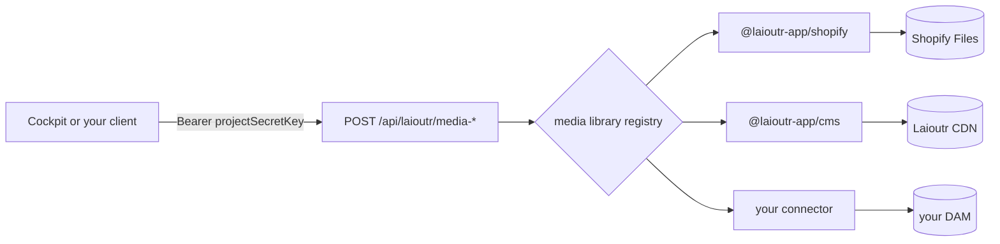
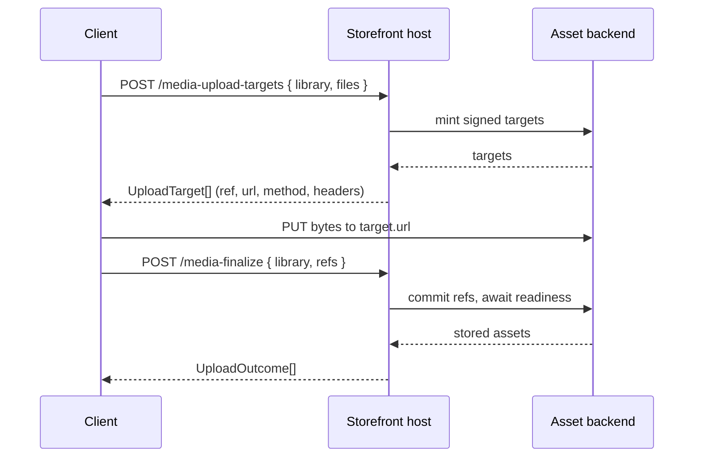

## Assets

When an editor opens the media picker in Studio, Cockpit never talks to Shopify, Shopware, or the Laioutr CDN. It POSTs to five routes on the project's own storefront host, and the storefront dispatches each call to whichever media library an installed app registered. Those five routes are the assets API: one wire contract in front of any number of asset backends.

Anything holding the project secret key can drive them. A migration script that bulk-imports product imagery, a nightly audit of what editors are able to pick, an MCP server that sets media on a section: all of them speak the contract the picker speaks.

The same five operations answer on a second path, `/api/public/media/*`, for a client you would not trust with the project secret — an internal tool, a partner's page, a desktop app. That path takes a **restricted key** instead: scoped to one project, limited to reading or writing assets, and revocable on its own.



::note
This page documents the calling side. To make a new backend appear behind these routes, write a connector: [Media Libraries](/apps/app-development/media-libraries).
::

### Base URL

The routes live on the project's frontend deployment, not on `api.laioutr.cloud`. The base URL is the storefront's own URL, listed under **Hosting** in Cockpit.

```text
POST https://shop.example.com/api/laioutr/media-list
```

Every route is `POST`, including the two that only read. Bodies and responses are JSON, except `media-upload`, which takes `multipart/form-data`.

Each operation answers on two paths. They run the same handler and return the same shapes; only the credential and the scope differ.

| Purpose                                                | Project secret                      | Restricted key                     | Scope         |
| ------------------------------------------------------ | ----------------------------------- | ---------------------------------- | ------------- |
| List the registered libraries and their capabilities   | `/api/laioutr/media-libraries`      | `/api/public/media/libraries`      | `media:read`  |
| Browse or search one library, one page at a time       | `/api/laioutr/media-list`           | `/api/public/media/list`           | `media:read`  |
| Staged upload, phase 1: mint signed upload targets     | `/api/laioutr/media-upload-targets` | `/api/public/media/upload-targets` | `media:write` |
| Staged upload, phase 2: commit the uploaded refs       | `/api/laioutr/media-finalize`       | `/api/public/media/finalize`       | `media:write` |
| Proxied upload: relay the bytes through the storefront | `/api/laioutr/media-upload`         | `/api/public/media/upload`         | `media:write` |

Everything below — request bodies, capabilities, upload flows, response shapes, error bodies — is identical on both paths. Where an example uses `/api/laioutr/…`, the `/api/public/…` equivalent behaves the same.

### Authentication

Two credentials reach these operations. Which one you can use is decided by who holds it.

| | Project secret | Restricted key |
| --- | --- | --- |
| Path | `/api/laioutr/media-*` | `/api/public/media/*` |
| Grants | the whole `/api/laioutr/*` namespace | the scopes you selected, on one project |
| Holder | code you run | a client you do not control |
| Browser origins | Cockpit's, fixed | the project's own list |
| Available by default | yes | no — the project opts in |

#### Project secret

```text
Authorization: Bearer <projectSecretKey>
```

Copy the key from [project settings](https://cockpit.laioutr.cloud/o/_/p/_/settings) in Cockpit; see [Project secret key](/cockpit/settings/project-secret-key) for how it is stored and rotated.

::warning
**The project secret is not a media-scoped credential.** It is the single gate on the whole `/api/laioutr/*` namespace, so anything that can call these five routes can also call the rest of it. That includes `reflect`, which returns the project's entire configuration: every section and block definition, section and block templates, page types, style tokens, installed apps, and the project's markets and languages.
::

Browser clients pass a second check. CORS preflights are answered only for `https://cockpit.laioutr.cloud`, `http://localhost:3001`, and Cockpit preview deployments under `*cockpit.laioutr.vercel.app`. CORS is not the authorization boundary here, so a server-to-server client is unaffected by it.

#### Restricted key

::since-version{version="0.51.0" packages="@laioutr-core/frontend-core" changelog="frontend"}
::

```text
Authorization: Bearer rstk_<...>
```

A restricted key is bound to one project and carries only the scopes you tick. It reaches `/api/public/media/*` and nothing else — presented to `/api/laioutr/*` it is refused, and so is an organization key presented to `/api/public/*`. The two classes share no code path.

Create one in Cockpit under **organization → API Keys → Create key**, choosing the **Restricted** key type and the project it should address. See [API keys](/cockpit/organisation/api-keys). The full value is shown once.

Pick the narrowest scope that works: `media:read` for a picker that only browses, `media:write` only if the client uploads. A key may not mix media scopes with server scopes — that combination cannot be created.

#### Calling from another domain

Cockpit's origin list is fixed in `frontend-core` and no setting extends it, so a browser on your own domain cannot use the project-secret path. Serve it one of two ways.

**Use a restricted key.** This is what the public path is for. The client holds a credential that reads or writes assets on one project and nothing else, so a key read out of devtools costs you the assets it was scoped to — not `reflect` and the whole project configuration. Enable the class, list the origin, mint the key.

**Proxy through your own backend.** Still right when the client must not hold any Laioutr credential, or when you want per-user rules the scope model cannot express. Add a route that authenticates your users however you like, holds the project secret server-side, and forwards to `/api/laioutr/*`. The hop is server-to-server, so no origin needs allowing.

##### Enable the class

`/api/public/*` answers `404` on every path until the project lists at least one allowed origin. Nothing before that confirms the routes exist.

Add the origins under **project settings → Allowed origins** in [Cockpit](https://cockpit.laioutr.cloud/o/_/p/_/settings):


An entry is normalized to scheme, host and port when you save it, so a pasted `https://admin.example.com/media` is stored as `https://admin.example.com`. Anything that is not an `http`/`https` URL is refused rather than stored, because it could never match an `Origin` header.

::warning
**A change takes effect on the project's next deploy.** The origins travel to the storefront in its `laioutrrc`, which is baked at build time. Adding an origin in Cockpit does not open it on the running deployment.
::

##### How the gate behaves

1. No `config.publicApi` — `404`, the whole class.
2. Preflight — answered from the project's origin list, with no credential. A disallowed origin gets no `Access-Control-Allow-Origin`, so the browser sends neither the read nor the write.
3. A path with no scope mapping — `404`.
4. No bearer credential — `401`.
5. The key is unknown, revoked, expired, or belongs to another project — `401`.
6. The key is valid here but lacks the scope the path needs — `403`.
7. Cockpit unreachable, slow or malformed — `503`. The gate never fails open.

A caller that sends no `Origin` header is not a browser, so the origin list does not apply to it and the key alone authorizes the call. Use that for server-to-server access without proxying.

```bash
curl -X POST https://shop.example.com/api/public/media/list \
  -H "Authorization: Bearer $LAIOUTR_RESTRICTED_KEY" \
  -H "Content-Type: application/json" \
  -d '{ "library": "@laioutr-app/cms", "limit": 24 }'
```

##### Before you ship one

::warning
**A storefront behind deployment protection cannot use this class.** A CORS preflight carries no credential by design, so anything that challenges `OPTIONS` — Vercel deployment protection, a password gate, an IP allowlist — fails the request before the key is ever presented. The browser reports it as an opaque `TypeError: Failed to fetch`.
::

- **There is no rate limiting.** Revocation is the whole control surface, which is why the key list shows last use and revokes in one click. Revoking takes effect on the next request; nothing is cached.
- **Expiry is optional on purpose.** A client with no backend cannot renew a key, so a forced expiry only schedules an outage. Set one when the client is short-lived.
- **Treat the key as published** from the moment it reaches a browser. Scope it to `media:read` unless the client genuinely uploads.

### Discover libraries

`POST /api/laioutr/media-libraries` takes no body and returns one descriptor per registered library. Call it first: the descriptors say which fields the other routes will honour.

::code-group
```bash [curl]
curl -X POST https://shop.example.com/api/laioutr/media-libraries \
  -H "Authorization: Bearer $LAIOUTR_PROJECT_SECRET"
```

```ts [TypeScript]
const libraries = await $fetch<MediaLibraryDescriptor[]>('/api/laioutr/media-libraries', {
  baseURL: 'https://shop.example.com',
  method: 'POST',
  headers: { Authorization: `Bearer ${projectSecret}` },
});
```
::

```json
[
  {
    "id": "@laioutr-app/cms",
    "label": "Laioutr",
    "iconSrc": "/app-cms/logo.png",
    "capabilities": {
      "search": true,
      "tags": true,
      "folders": true,
      "sorts": [
        { "key": "createdAt:desc", "label": "Newest" },
        { "key": "createdAt:asc", "label": "Oldest" },
        { "key": "fileSize:desc", "label": "Largest" }
      ],
      "upload": {
        "transfer": "staged",
        "maxBatchSize": 20,
        "maxFileSize": 104857600,
        "accept": ["image/png", "image/jpeg", "image/webp", "image/avif", "image/gif", "image/svg+xml", "video/mp4"]
      },
      "deleteAssets": false
    }
  },
  {
    "id": "@laioutr-app/shopify",
    "label": "Shopify",
    "iconSrc": "/app-shopify/shopify-logo.svg",
    "capabilities": {
      "search": true,
      "folders": false,
      "sorts": [
        { "key": "CREATED_AT:desc", "label": "Newest first" },
        { "key": "CREATED_AT:asc", "label": "Oldest first" }
      ],
      "upload": {
        "transfer": "staged",
        "maxBatchSize": 10,
        "accept": ["image/*", "video/*"]
      }
    }
  }
]
```

#### Capabilities drive the rest of the contract

Capabilities are static. A caller that bypasses the picker cannot push a connector outside its contract.

| Capability     | What it unlocks                                                                               |
| -------------- | --------------------------------------------------------------------------------------------- |
| `search`       | `term` on `media-list`                                                                        |
| `tags`         | `tags` on `media-list`                                                                        |
| `folders`      | `folderId` and `scope` on `media-list`, plus `folders` in the response                        |
| `sorts`        | `sorting` on `media-list`, restricted to the declared `key` values                            |
| `upload`       | `transfer` picks the upload path; `accept`, `maxFileSize` and `maxBatchSize` are client hints |
| `deleteAssets` | Reserved. No route consumes it yet                                                            |

A `sorting` value that is not one of the declared keys is dropped rather than rejected, and the library falls back to its own default order.

#### What the shipped libraries declare

Capabilities differ per backend, so write against the descriptor rather than against a library you have tested by hand. What ships today:

|                | Laioutr CDN                          | Shopify                | Shopware                |
| -------------- | ------------------------------------ | ---------------------- | ----------------------- |
| `id`           | `@laioutr-app/cms`                   | `@laioutr-app/shopify` | `@laioutr/app-shopware` |
| `search`       | ✅                                    | ✅                      | ✅                       |
| `tags`         | ✅                                    | ❌                      | ✅                       |
| `folders`      | ✅                                    | ❌                      | ✅                       |
| `sorts`        | date, name, size                     | date, name             | date, name, size        |
| `upload`       | ✅ staged                             | ✅ staged               | ❌                       |
| `maxBatchSize` | 20                                   | 10                     | n/a                     |
| `maxFileSize`  | per project, 100 MB by default       | not declared           | n/a                     |
| `accept`       | png, jpeg, webp, avif, gif, svg, mp4 | `image/*`, `video/*`   | n/a                     |

### Browse a library

`POST /api/laioutr/media-list` returns one page of one location.

::field-group{title="Request body"}
  :::field
  ---
  required: true
  name: library
  type: string
  ---
  The library `id` from `media-libraries`. An unregistered id answers `404`.
  :::

  :::field
  ---
  required: true
  name: limit
  type: number
  ---
  Page size, between `1` and `100`. There is no default; omitting it fails validation.
  :::

  :::field{name="cursor" type="string"}
  Opaque continuation token from a previous response's `nextCursor`. Omit it for the first page. Pagination is always cursor-based, never offset-based.
  :::

  :::field{name="term" type="string"}
  Free-text search. Requires `capabilities.search`.
  :::

  :::field{name="type" type="('image' | 'video' | 'audio')[]"}
  Restricts results to these media types. Filtering happens in the connector, so an image-only request never pays for video results.
  :::

  :::field{name="tags" type="string[]"}
  Tag filter. Requires `capabilities.tags`.
  :::

  :::field{name="sorting" type="string"}
  One of the `key` values from `capabilities.sorts`.
  :::

  :::field{name="folderId" type="string"}
  Scopes the page to one folder. Omit it for the root. Requires `capabilities.folders`.
  :::

  :::field{name="scope" type="'folder' | 'all'"}
  `folder` (the default) browses the location `folderId` selects. `all` ignores `folderId` and searches the whole library. The distinction matters on backends where the root holds only unfiled assets, so "root" and "everywhere" are different sets. Requires `capabilities.folders`.
  :::
::

```bash
curl -X POST https://shop.example.com/api/laioutr/media-list \
  -H "Authorization: Bearer $LAIOUTR_PROJECT_SECRET" \
  -H "Content-Type: application/json" \
  -d '{
    "library": "@laioutr-app/cms",
    "limit": 24,
    "term": "hero",
    "type": ["image"],
    "sorting": "createdAt:desc"
  }'
```

The response is a `MediaListResult`:

```ts
interface MediaListResult {
  items: ProviderStudioMediaItem[];
  folders?: MediaFolder[];  // subfolders of the queried location, first page only
  nextCursor?: string;      // absent means end of results
  total?: number;           // optional; many backends cannot count cheaply
}

interface ProviderStudioMediaItem {
  media: Media;             // the canonical Media object that gets stored on a prop
  previewUrl: string;       // thumbnail for the picker grid
  fileName?: string;
  externalId?: string;      // the backend's stable asset id
  status?: 'ready' | 'processing' | 'failed';
  statusMessage?: string;
}

interface MediaFolder {
  id: string;               // pass back as folderId to browse into it
  name: string;
  parentId?: string;
  childCount?: number;
}
```

```json
{
  "items": [
    {
      "media": {
        "type": "image",
        "sources": [
          {
            "provider": "laioutrCms",
            "src": "https://p_2f9k4x.cdn.laioutr.cloud/d1m7q8v3.webp",
            "width": 2400,
            "height": 1350,
            "origin": { "libraryId": "@laioutr-app/cms", "externalId": "d1m7q8v3" }
          }
        ]
      },
      "previewUrl": "https://p_2f9k4x.cdn.laioutr.cloud/cdn-cgi/image/width=400,quality=80,format=auto/d1m7q8v3.webp",
      "fileName": "hero-spring-campaign.webp",
      "externalId": "d1m7q8v3"
    }
  ],
  "folders": [{ "id": "fld_campaigns", "name": "Campaigns", "childCount": 4 }],
  "nextCursor": "eyJzb3J0VmFsdWUiOjE3NTY5MDA4MDAsImlkIjoiZDFtN3E4djMifQ",
  "total": 312
}
```

Four things about that shape catch callers out:

- **`folders` rides the first page only.** A request that carries a `cursor` continues the asset stream and returns no `folders`. Build the folder tree from cursorless requests.
- **`total` is optional.** Do not build a pager that needs a page count. Follow `nextCursor` until it is absent.
- **An absent `status` means ready.** Backends that transcode report `processing` while they work and `failed` when they give up, with an optional `statusMessage`. A `failed` item is listed but is not safe to store on a prop.

### Staged upload

In staged mode the bytes go straight from the client to the asset backend, and the storefront only signs and records. Libraries that declare `capabilities.upload.transfer: 'staged'` take this path.



#### Phase 1: mint targets

`POST /api/laioutr/media-upload-targets` takes file metadata only. No bytes cross this route.

::field-group{title="Request body"}
  :::field
  ---
  required: true
  name: library
  type: string
  ---
  The library `id`. The library must expose staged uploads, or the route answers `400`.
  :::

  :::field
  ---
  required: true
  name: files
  type: UploadFileMeta[]
  ---
  At least one `{ name, mimeType, size }`. Validate against the library's `accept`, `maxFileSize` and `maxBatchSize` first; a backend that rejects the batch will do so here, not politely.
  :::
::

```bash
curl -X POST https://shop.example.com/api/laioutr/media-upload-targets \
  -H "Authorization: Bearer $LAIOUTR_PROJECT_SECRET" \
  -H "Content-Type: application/json" \
  -d '{
    "library": "@laioutr-app/cms",
    "files": [{ "name": "lookbook-01.jpg", "mimeType": "image/jpeg", "size": 1843200 }]
  }'
```

The response is one `UploadTarget` per file, in the same order:

```ts
interface UploadTarget {
  ref: string;                        // opaque token; hand it back to media-finalize
  url: string;
  method?: 'PUT' | 'POST';            // defaults to PUT
  fields?: Record<string, string>;    // form fields for S3/GCS-style POST targets
  headers?: Record<string, string>;   // send these verbatim with the bytes
}
```

Send the bytes exactly as the target describes:

- Set every entry of `headers` on the request, verbatim.
- With no `fields`, send the raw file as the body (`PUT` unless `method` says otherwise).
- With `fields`, build a `multipart/form-data` body, append every field first, and append the file **last** under the name `file`. S3 and GCS POST policies reject a body whose file part arrives before the policy fields.

Backends pin `Content-Type` and `Content-Length` into the signature, so a request that deviates is rejected, and the failure surfaces at finalize as a missing object rather than at upload time.

::warning
The upload is a cross-origin request from the client to the backend, so the target host must allow it. A bucket without a CORS rule permitting `PUT` from the calling origin fails in the browser with an opaque error while every server-side log looks healthy.
::

#### Phase 2: finalize

`POST /api/laioutr/media-finalize` commits the refs whose bytes landed and returns finished items. Connectors absorb backend processing here, so a returned item is ready to store on a prop.

::field-group{title="Request body"}
  :::field
  ---
  required: true
  name: library
  type: string
  ---
  The library `id`, same as phase 1.
  :::

  :::field
  ---
  required: true
  name: refs
  type: string[]
  ---
  At least one `ref` from the targets you actually uploaded. Skip the ones that failed in transit.
  :::
::

```bash
curl -X POST https://shop.example.com/api/laioutr/media-finalize \
  -H "Authorization: Bearer $LAIOUTR_PROJECT_SECRET" \
  -H "Content-Type: application/json" \
  -d '{ "library": "@laioutr-app/cms", "refs": ["r_8kd2mq1f"] }'
```

### Proxied upload

In proxied mode the bytes travel through the storefront, which hands them to the connector. Libraries declaring `transfer: 'proxied'` take this path; it suits small files and backends with no signed-upload support.

`POST /api/laioutr/media-upload` is the one route that takes `multipart/form-data`. Send a `library` text field plus one or more file parts. The field name of a file part is ignored, so any name works.

```bash
curl -X POST https://shop.example.com/api/laioutr/media-upload \
  -H "Authorization: Bearer $LAIOUTR_PROJECT_SECRET" \
  -F "library=@laioutr-app/acme-dam" \
  -F "file=@./lookbook-01.jpg"
```

The response is the same `UploadOutcome[]` finalize returns.

### Upload outcomes

Both upload paths return per-file results, so one bad file never sinks the batch. A request whose files all failed is still `200`.

```ts
type UploadOutcome =
  | { ref: string; ok: true; item: ProviderStudioMediaItem }
  | { ref: string; ok: false; error: { code: UploadErrorCode; message: string } };

type UploadErrorCode = 'too_large' | 'unsupported_type' | 'processing_failed' | 'upload_failed';
```

```json
[
  {
    "ref": "r_8kd2mq1f",
    "ok": true,
    "item": {
      "media": {
        "type": "image",
        "sources": [
          {
            "provider": "laioutrCms",
            "src": "https://p_2f9k4x.cdn.laioutr.cloud/h5r2n9wc.jpg",
            "width": 1600,
            "height": 2400,
            "origin": { "libraryId": "@laioutr-app/cms", "externalId": "h5r2n9wc" }
          }
        ]
      },
      "previewUrl": "https://p_2f9k4x.cdn.laioutr.cloud/cdn-cgi/image/width=400,quality=80,format=auto/h5r2n9wc.jpg",
      "fileName": "lookbook-01.jpg",
      "externalId": "h5r2n9wc"
    }
  },
  {
    "ref": "r_p3xw07ba",
    "ok": false,
    "error": { "code": "too_large", "message": "File exceeds the 100 MB limit" }
  }
]
```

An item that fails the canonical `Media` parse on the way out is converted into an `upload_failed` outcome rather than returned, so a successful outcome always carries a storable `media`.

### Errors

Failures arrive as H3 error bodies: `{ statusCode, statusMessage, message, data? }`.

| Status | `statusMessage`                             | Cause                                                                            | Resolution                                                                         |
| ------ | ------------------------------------------- | -------------------------------------------------------------------------------- | ---------------------------------------------------------------------------------- |
| `400`  | `Validation Error`                          | The body failed schema validation, for example a missing or out-of-range `limit` | Read `data` for the Zod issue list; it names the offending path                    |
| `400`  | `Provider does not support staged uploads`  | `media-upload-targets` or `media-finalize` against a library without them        | Check `capabilities.upload.transfer` and use `media-upload` instead                |
| `400`  | `Provider does not support proxied uploads` | `media-upload` against a staged-only library                                     | Use the `media-upload-targets` and `media-finalize` pair                           |
| `401`  | `Unauthorized`                              | Missing or wrong bearer token                                                    | Compare `data.projectSlug` with the project whose secret you sent                  |
| `404`  | `Unknown media library: <id>`               | `library` names no registered library                                            | Call `media-libraries`; the app may not be installed on this deployment            |
| `502`  | `Media Library Error`                       | The connector threw                                                              | `data.library` and `data.message` carry the library id and the connector's message |

On `/api/public/media/*` the gate answers before any of the above:

| Status | `statusMessage`       | Cause                                                                        | Resolution                                                                     |
| ------ | --------------------- | ---------------------------------------------------------------------------- | ------------------------------------------------------------------------------ |
| `401`  | `Unauthorized`        | No bearer credential, or a key that is unknown, revoked, expired or another project's | Mint a key for **this** project; a denial never says whether the key exists elsewhere |
| `403`  | `Forbidden`           | The key is valid here but lacks the scope the path requires                  | Add `media:write` to the key, or call a `media:read` path                       |
| `404`  | `Not Found`           | The project has not listed an allowed origin, or the path maps to no scope   | Add an origin in project settings and redeploy; check the path against the route table |
| `503`  | `Service Unavailable` | Cockpit could not be reached, answered slowly, or the storefront is missing its own project secret | Transient — retry. If it persists, the storefront's configuration is the problem, not your key |

The `502` exists so a connector failure stays legible. Without it, a raw throw would be masked as an opaque `500` in production and leave the caller with nothing to display.

### Related

::card-group
  :::card
  ---
  icon: i-lucide-image
  title: Media and Media Library
  to: /frontend/features/media
  ---
  How the picker, the stored `Media` prop, and the connector contract fit together.
  :::

  :::card
  ---
  icon: i-lucide-plug
  title: Media Libraries
  to: /apps/app-development/media-libraries
  ---
  Write a connector so your own backend appears behind these routes.
  :::

  :::card
  ---
  icon: i-lucide-file-json
  title: Media type reference
  to: /frontend/api-reference/common-types/media
  ---
  The canonical `Media` union every item's `media` is parsed against.
  :::

  :::card
  ---
  icon: i-lucide-key-round
  title: Project secret key
  to: /cockpit/settings/project-secret-key
  ---
  Where the bearer token comes from and how to rotate it.
  :::

  :::card
  ---
  icon: i-lucide-shield-check
  title: API keys
  to: /cockpit/organisation/api-keys
  ---
  Mint and revoke a restricted key for the public path.
  :::
::
